<!-- PROJECT LOGO -->
<br />
<div align="center">
  <a href="https://github.com/alifiroozi80/CKA/tree/main/CKA">
    
  </a>

<h3 align="center">CKA Codes</h3>

  <p align="center">
    The code review and content of CKA exam...
  </p>
</div>
<br>
<div id="top">
<!-- TABLE OF CONTENTS -->
<details>
  <summary>Table of Contents</summary>
  <ol>
  <li>
      What is Kubernetes?
      <ul>
        <li><a href="#What-is-Kubernetes-What-Problems-Kubernetes-solves">What Problems Kubernetes solves?</a></li>
        <li><a href="#What-is-Kubernetes-What-features-orchestration-tools-offer">What features orchestration tools offer?</a></li>
      </ul>
  </li>
  <li>
      Kubernetes Architecture
      <ul>
        <li><a href="#Kubernetes-Architecture-Node-Processes">Node Processes</a></li>
        <li><a href="#Kubernetes-Architecture-Master-Processes">Master Processes</a></li>
      </ul>
  </li>
  <li>
      Manage K8s Compoenents - kubectl & Config File
      <ul>
        <li><a href="#kubectl-Config-File-Kubernetes-CLI">Kubernetes CLI</a></li>
        <li><a href="#kubectl-Config-File-K8s-Configuration-file">K8s Configuration file</a></li>
        <li><a href="#kubectl-Config-File-Imperative-vs-Declarative">Imperative vs Declarative</a></li>
      </ul>
  </li>
  <li>
      Kubernetes Installation Steps
      <ul>
        <li><a href="#Kubernetes-Installation-Steps-What-we-need-to-install">What we need to install</a></li>
        <li><a href="#Kubernetes-Installation-Steps-Static-Pods">Static Pods</a></li>
        <li><a href="#Kubernetes-Installation-Steps-Certificates">Certificates</a></li>
        <li><a href="#Kubernetes-Installation-Steps-Kubeadm">Kubeadm</a></li>
      </ul>
  </li>
    <li>
        Preparing Servers
      <ul>
        <li><a href="#disable-memory-swap">Disable memory swap</a></li>
        <li><a href="#edit-hosts-file">Edit hosts file</a></li>
        <li><a href="#edit-hosts-names">Edit machine names</a></li>
        <li><a href="#prepare-installing-container-runtime">Prepare installing container runtime</a></li>
        <li><a href="#install-containerd">Install Containerd</a></li>
        <li><a href="#install-3k">Install kubelet, kubeadm, kubectl</a></li>
        <li><a href="#kubeadm-init">kubeadm init</a></li>
      </ul>
    </li>
  <li>
      Working with kubectl
      <ul>
        <li><a href="#important-dir">Important Directories to check</a></li>
        <li><a href="#cfg-kubectl">Configure kubectl command</a></li>
      </ul>
  </li>
  <li>
    Kubernetes Networking
    <ul>
      <li>
            K8s Namespaces
        <ul>
            <li><a href="#networking-What-is-a-Namespace">What is a Namespace?</a>
            <li><a href="#networking-Why-use-Namespaces">Why use Namespaces?</a>
            <li><a href="#networking-kube-system-Namespaces">kube-system Namespaces?</a>
        </ul>
      </li>
      <li><a href="#container-communication">Container Communication</a></li>
      <li><a href="#pod-solve-port-allocation">Pods - Solving the port allocation problem</a></li>
      <li><a href="#Multiple-containers-in-a-pod">Multiple containers in a pod</a></li>
      <li><a href="#pause containers">Pause Containers</a></li>
      <li><a href="#Container-network-interface">Container Network Interface</a></li>
      <li><a href="#Pod-to-Pod-communication">Pod to Pod communication</a></li>
      <li><a href="#CNI-Plugins">CNI Plugins</a></li>
    </ul>
  </li>
  <li>
      Finishing Cluster Bootstrapping...
      <ul>
        <li><a href="#intro-to-Finishing-Cluster-Bootstrapping">Intro</a></li>
        <li><a href="#Configuring-Networking">Configuring Networking - Weave Net</a></li>
        <li><a href="#Add-Worker-Nodes">Add Worker Nodes</a>
          <ul>
            <li><a href="#kubeadm-join-phases">Kubeadm join phases</a></li>
            <li><a href="#Configure-weave-net">Configure weave-net</a></li>
          </ul>
        </li>
      </ul>
  </li>
  <li>
      Labels & Selectors + Service Networking
      <ul>
        <li><a href="#Deploy-and-test-an-App">Deploy & test an App!</a>
          <ul>
            <li><a href="#How-requests-are-forwarded-from-Service-to-Pod">How requests are forwarded from Service to Pod</a></li>
          </ul>
        </li>
        <li><a href="#Scaling-Recording-kubectl-commands">Scaling & Recording kubectl commands</a></li>
        <li><a href="#Connect-to-nginx-Pod">Connect to nginx Pod</a></li>
        <li><a href="#DNS-in-kubernetes">DNS in kubernetes</a>
          <ul>
            <li><a href="#Service-Fully-Qualified-Domain-Name">Service - Fully Qualified Domain Name (FQDN)</a></li>
          </ul>
        </li>
        <li><a href="#Configure-Service-IP-Address">Configure Service IP Address</a>
          <ul>
            <li><a href="#Where-is-Service-IP-Range-configured">Where is Service IP Range configured?</a></li>
            <li><a href="#Change-Default-CIDR-IP-Range">Change Default CIDR IP Range</a></li>
          </ul>
        </li>
        <li><a href="#Demo-Custom-Load-Balancing">Demo: Custom Load Balancing</a></li>
        <li><a href="#Networking-Summary">Summary</a></li>
      </ul>
  </li>
    <li>
      Make the application accessible from outside the cluster
      <ul>
        <li><a href="#NodePort-Service-Type">NodePort Service Type</a></li>
          <ul>
            <li><a href="#What-is-NodePort-How-does-it-work">What is NodePort? How does it work?</a></li>
          </ul>
        </li>
        <li>
            Loadbalancer Service Type
          <ul>
            <li><a href="#Why-Loadbalancer">Why Loadbalancer?</a></li>
            <li><a href="#How-Loadbalancer-works">How Loadbalancer works?</a></li>
            <li><a href="#Create-Loadbalancer">Create Loadbalancer</a></li>
            <li><a href="#Access-Application-Loadbalancer">Access Application</a></li>
          </ul>
        </li>
        <li>
            HAProxy as LoadBalancer
          <ul>
            <li><a href="#HAProxy-as-LoadBalancer-What-is-HAProxy">What is HAProxy and why should we use that?</a></li>
            <li><a href="#HAProxy-as-LoadBalancer-Setup-HAProxy">Setup HAProxy</a></li>
            <li><a href="#HAProxy-as-LoadBalancer-Configure-HAProxy">Configure HAProxy</a></li>
          </ul>
        </li>
        <li>
            External Access with Ingress
          <ul>
            <li><a href="#Why-Ingress">Why Ingress?</a></li>
            <li><a href="#How-Ingress-works">How Ingress works?</a></li>
            <li><a href="#How-to-configure-Ingress">How to configure Ingress?</a></li>
            <li><a href="#Ingress-More-Use-Cases">More Use Cases</a></li>
            <li><a href="#Configuring-TLS-Certificate">Configuring TLS Certificate</a></li>
          </ul>
        </li>
        <li>
            Setup Ingress
          <ul>
            <li><a href="#Deploy-Ingress-Controller">Deploy Ingress Controller</a></li>
            <li><a href="#Configure-Routing-with-Ingress">Configure Routing with Ingress</a></li>
            <li><a href="#Create-Apply-Ingress-Config-File">Create & Apply Ingress Config File</a></li>
            <li><a href="#Configure-Multiple-Paths">Configure Multiple Paths</a></li>
            <li><a href="#Some-Notes-on-ingress-controller">Some Notes</a></li>
          </ul>
        </li>
        <li>
          SSL & Ingress
          <ul>
            <li><a href="#SSL-and-Ingress-Intro">Intro</a></li>
            <li><a href="#SSL-and-Ingress-Deploy-Cert-Manger">Deploy Cert-Manger</a></li>
            <li><a href="#SSL-and-Ingress-Configure-a-Lets-Encrypt-Issuer">Configure a Let's Encrypt Issuer</a></li>
            <li><a href="#SSL-and-Ingress-Create-a-SSL-on-a-Ingress-Resource">Create a SSL on a Ingress Resource</a></li>
          </ul>
        </li>
      </ul>
  </li>
  <li>
      Users & Permissions
      <ul>
        <li>User & Groups in Kubernetes
            <ul>
              <li><a href="#Role-Role-Binding">Role & Role Binding</a></li>
              <li><a href="#Cluster-Role-ClusterRole-Binding">Cluster Role & ClusterRole Binding</a></li>
              <li><a href="#User-Groups-in-Kubernetes">User & Groups in Kubernetes</a>
                <ul>
                  <li><a href="#External-Source-for-Authentication">External Source for Authentication</a></li>
                </ul>
              </li>
              <li><a href="#Service-Accounts">Service Accounts</a></li>
              <li><a href="#Example-Configuration-Files-in-rbac">Example Configuration Files</a></li>
              <li><a href="#Creating-Viewing-RBAC-Resources">Creating & Viewing RBAC Resources</a></li>
              <li><a href="#Checking-API-Access-RBAC">Checking API Access</a></li>
              <li><a href="#Wrap-UP-RBAC-1">Wrap UP</a></li>
            </ul>
        </li>
        <li><a href="#Other-Authorization-Modes">Other Authorization Modes</a></li>
        <li><a href="#RBAC-Certificates-in-Kubernetes">Certificates in Kubernetes</a></li>
        <li><a href="#RBAC-Certificates-API">Certificates API</a>
          <ul>
            <li><a href="#Process-of-Certificate-Signing">Process of Certificate Signing</a></li>
          </ul>
        </li>
          <li><a href="#DEMO-Create-User-Account">Create User Account</a>
            <ul>
              <li><a href="#DEMO-Connect-to-K8s-Cluster">Connect to K8s Cluster</a></li>
              <li><a href="#DEMO-Give-User-Permission">Give User Permission (ClusterRole & ClusterRoleBinding)</a>
                <ul>
                  <li><a href="#Create-ClusterRole-RBAC">Create ClusterRole</a></li>
                  <li><a href="#Create-ClusterRoleBinding-RBAC">Create ClusterRoleBinding</a></li>
                  <li><a href="#Checking API Access-RBAC">Checking API Access</a></li>
                </ul>
              </li>
            </ul>
          </li>
          <li><a href="#DEMO-Service-Account-permissions">Service Account & permissions</a>
            <ul>
              <li><a href="#Create-ServiceAccount-RBAC">Create ServiceAccount</a></li>
              <li><a href="#Access-Cluster-with-Service-Account-RBAC">Access Cluster with Service Account</a></li>
              <li><a href="#Give -Permission-Role-RoleBinding-RBAC-SA">Give Permission (Role & RoleBinding)</a></li>
            </ul>
          </li>
      </ul>
  </li>
  <li>
      Troubleshooting In Kubernetes
      <ul>
        <li><a href="#Troubleshoot-Applications-Troubleshooting">Troubleshoot Applications</a></li>
        <li><a href="#Debug-with-temporary-Pods-Busy-Box">Debug with temporary Pods -- Busy-Box</a>
          <ul>
            <li><a href="#Commands-Args-Troubleshooting">Commands & Args</a></li>
          </ul>
        </li>
        <li><a href="#Kubectl-Format-Output-Troubleshoot">Kubectl Format Output</a>
          <ul>
            <li><a href="#Output-Option-JSONPath-Troubleshooting">Output Option: JSONPath</a></li>
          </ul>
        </li>
        <li>
            Troubleshoot Kubelet & Kubectl
          <ul>
            <li><a href="#Troubleshoot-Kubelet-issue">Troubleshoot Kubelet issue</a></li>
            <li><a href="#Troubleshoot-kubectl-connection-issue">Troubleshoot kubectl connection issue</a></li>
          </ul>
        </li>
      </ul>
  </li>
  <li>
      Multiple Containers in a Pod
      <ul>
        <li><a href="#Init-and-Sidecar-Containers">Init and Sidecar Containers</a></li>
        <li>
            Add Sidecar and Init Containers
          <ul>
            <li><a href="#Add-Sidecar-Container">Add Sidecar Container</a></li>
            <li><a href="#Add-Init-Container">Add Init Container</a></li>
          </ul>
        </li>
        <li><a href="#Exposing-Pod-and-Cluster-Vars-to-Containers">Exposing Pod and Cluster Vars to Containers</a></li>
      </ul>
  </li>
  <li>
      Data Persistence
      <ul>
        <li><a href="#Persisting-Data-with-Volumes">Persisting Data with Volumes</a>
          <ul>
            <li><a href="#The-need-for-Volumes">The need for Volumes</a></li>
            <li><a href="#Persistent-Volume">Persistent Volume</a>
              <ul>
                <li><a href="#Persistent-Volume-YAML-Example">Persistent Volume YAML Example</a></li>
                <li><a href="#Local-vs-Remote-Volume-Types">Local vs Remote Volume Types</a>
                <li><a href="#Who-creates-Persistence-Volumes">Who creates Persistence Volumes?</a>
              </ul>
            </li>
            <li><a href="#Persistent-Volume-Claim">Persistent Volume Claim</a></li>
            <li><a href="#Levels-of-Volume-abstractions">Levels of Volume abstractions</a></li>
            <li><a href="#ConfigMap-Secret">ConfigMap & Secret</a></li>
            <li><a href="#Storage-Class">Storage Class</a></li>
          </ul>
        </li>
        <li><a href="#Configure-HostPath-Volume">Configure HostPath Volume</a>
            <ul>
              <li><a href="#HostPath-Create-PersistentVolume">Create PersistentVolume</a></li>
              <li><a href="#HostPath-Create-PersistentVolumeClaim">Create PersistentVolumeClaim</a></li>
              <li><a href="#HostPath-Create-Deployment-to-use-Volume">Create Deployment to use Volume</a></li>
            </ul>
        </li>
        <li><a href="#emptyDir-Volume">emptyDir Volume</a>
            <ul>
              <li><a href="#Configure-emptyDir-Volume">Configure emptyDir Volume</a></li>
            </ul>
        </li>
      </ul>
  </li>
  <li>
      ConfigMap & Secret
      <ul>
        <li><a href="#Demo-Pass-as-Environment-Variables">Demo: Pass as Environment Variables</a>
            <ul>
              <li><a href="#Create-ConfigMap-component-ENV">Create ConfigMap component</a></li>
              <li><a href="#Create-Secret-component-ENV">Create Secret component</a></li>
              <li><a href="#Pass-ata-to-Pod-using-Evironment-Variables">Pass Data to Pod using Evironment Variables</a></li>
            </ul>
        </li>
        <li><a href="#Demo-Pass-as-File-as-Volume">Demo: Pass as File as Volume</a>
            <ul>
              <li><a href="#Create-configuration-file-via-ConfigMap-Secrets">Create configuration file via ConfigMap & Secrets</a></li>
              <li><a href="#Pass-to-Pod-configuration-via-Volume">Pass to Pod configuration via Volume</a></li>
            </ul>
        </li>
        <li><a href="#Note-on-Updating-ConfigMap-or-Secret">Note on Updating ConfigMap or Secret</a></li>
      </ul>
  </li>
  <li>
      Resource Requests & Limits
      <ul>
        <li>What are Resource Requests * Limits?
            <ul>
              <li><a href="#Resource-Requests">Resource Requests</a></li>
              <li><a href="#Resource-Limits">Resource Limits</a></li>
            </ul>
        </li>
        <li><a href="#Configure-Requests-Limits">Configure Requests & Limits</a>
            <ul>
              <li><a href="#Querying-defined-Resources-Limits">Querying defined Resources & Limits</a></li>
              <li><a href="#Resource-Wrap-Up">Wrap Up</a></li>
            </ul>
        </li>
      </ul>
  </li>
  <li>
       Node Affinity, Taints & Tolerations
      <ul>
        <li>
            Assigning Pods to Nodes (Part 1)
          <ul>
            <li><a href="#Assigning-Pods-to-Nodes-Part-1-Node-Name">Node Name</a></li>
            <li><a href="#Assigning-Pods-to-Nodes-Part-1-Node-Selector">Node selector</a></li>
          </ul>
        </li>
        <li>
            Assigning Pods to Nodes (Part 2)
          <ul>
            <li><a href="#Assigning-Pods-to-Nodes-Part-2-Node-Affinity">Node Affinity</a></li>
            <li><a href="#Assigning-Pods-to-Nodes-Part-2-Node-Affinity-Demo">Node Affinity Demo</a></li>
          </ul>
        </li>
        <li><a href="#Taints-Tolerations">Taints & Tolerations</a>
          <ul>
            <li><a href="#Configure-Toleration">Configure Toleration</a></li>
          </ul>
        </li>
        <li><a href="#Inter-Pod-Affinity">Inter-Pod Affinity</a>
          <ul>
            <li><a href="#Configure-Inter-Pod-Affinity">Configure Inter-Pod Affinity</a></li>
            <li><a href="#Inter-Pod-Affinity-Wrap-Up">Wrap Up</a></li>
          </ul>
        </li>
      </ul>
  </li>
  <li>
      Health Checks - Readiness and Liveness Probes
      <ul>
        <li>
            What are Liveness & Readiness Probes?
          <ul>
            <li><a href="#Health-Checks-Liveness-Probe">Liveness Probe</a></li>
            <li><a href="#Health-Checks-Readiness-Probe">Readiness Probe</a></li>
          </ul>
        </li>
        <li><a href="#Configure-Liveness-and-Readiness-Probes">Configure Liveness & Readiness Probes</a></li>
      </ul>
  </li>
  <li>
      Deployment Update Strategies - Rolling Update
      <ul>
        <li><a href="#Deployment-Update-Strategies-What-is-a-ReplicaSet">What is a ReplicaSet?</a></li>
        <li><a href="#Deployment-Update-Strategies-Update-Deployment-Strategies">Update Deployment - Strategies</a>
          <ul>
            <li><a href="#Deployment-Update-Strategies-Rollout-History">Rollout History</a></li>
            <li><a href="#Deployment-Update-Strategies-Rollback">Rollback</a></li>
          </ul>
        </li>
      </ul>
  </li>
  <li>
      Owners and dependents
      <ul>
        <li><a href="#Owners-and-dependents-What-is-the-Owners-and-dependents-concept-in-K8s">What is the Owners and dependents concept in K8s?</a>
            <ul>
                <li><a href="#Owners-and-dependents-Finding-out-the-owners-of-an-object">Finding out the owners of an object</a></li>
                <li><a href="#Owners-and-dependents-Listing-objects-with-their-owners">Listing objects with their owners</a></li>
            </ul>
        </li>
        <li><a href="#Owners-and-dependents-Deletion-policy">Deletion policy</a>
            <ul>
                <li><a href="#Owners-and-dependents-What-happens-when-an-object-is-deleted">What happens when an object is deleted</a></li>
            </ul>
        </li>
        <li><a href="#Owners-and-dependents-Orphaning-pods">Orphaning pods</a>
            <ul>
                <li><a href="#Owners-and-dependents-When-and-why-would-we-have-orphans">When and why would we have orphans?</a></li>
                <li><a href="#Owners-and-dependents-Finding-orphan-objects">Finding orphan objects</a></li>
                <li><a href="#Owners-and-dependents-Deleting-orphan-pods">Deleting orphan pods</a></li>
            </ul>
        </li>
      </ul>
  </li>
  <li>
      ETCD Backup & Restore
      <ul>
        <li><a href="#ETCD-Backup-Restore-What-etcd-stores">What etcd stores?</a></li>
        <li><a href="#ETCD-Backup-Restore-Backing-up-etcd">Backing up etcd</a>
          <ul>
            <li><a href="#ETCD-Backup-Restore-Install-etcdctl">Install etcdctl</a></li>
            <li><a href="#ETCD-Backup-Restore-Create-backup-with-etcdctl">Create backup with etcdctl</a></li>
          </ul>
        </li>
        <li><a href="#ETCD-Backup-Restore-Note-Alternatives-to-manage-etcd">Note: Alternatives to manage etcd</a></li>
        <li>
            Restoring etcd
          <ul>
            <li><a href="#ETCD-Backup-Restore-Losing-Cluster-Data">Losing Cluster Data</a></li>
            <li><a href="#ETCD-Backup-Restore-Restore-from-etcd-backup">Restore from etcd backup</a></li>
          </ul>
        </li>
      </ul>
  </li>
  <li>
      Kubernetes REST API
      <ul>
        <li><a href="#Kubernetes-REST-API-Access-REST-API-with-kubectl-proxy">Access REST API with kubectl proxy</a></li>
        <li><a href="#Kubernetes-REST-API-Access-REST-API-without-kubectl-proxy">Access REST API without kubectl proxy</a>
          <ul>
            <li><a href="#Kubernetes-REST-API-Create-Service-Account">Create Service Account</a></li>
            <li><a href="#Kubernetes-REST-API-Get-and-save-variables">Get and save variables</a></li>
            <li><a href="#Kubernetes-REST-API-Connect-to-REST-API">Connect to REST API</a></li>
            <li><a href="#Kubernetes-REST-API-Interacting-with-K8s-REST-API">Interacting with K8s REST API</a></li>
          </ul>
        </li>
      </ul>
  </li>
  <li>
      Upgrade Kubernetes Cluster
      <ul>
        <li><a href="#Upgrade-Kubernetes-Cluster-How-Cluster-Upgrade-works">How Cluster Upgrade works?</a>
          <ul>
            <li><a href="#How-Cluster-Upgrade-works-Control-Plane-Components-its-versions">Control Plane Components & its versions</a></li>
            <li><a href="#How-Cluster-Upgrade-works-How-to-upgrade-the-k8s-components">How to upgrade the k8s components</a></li>
            <li><a href="#How-Cluster-Upgrade-works-How-to-upgrade-Worker-Nodes">How to upgrade Worker Nodes?</a></li>
            <li><a href="#How-Cluster-Upgrade-works-Draining-Nodes">Draining Nodes</a></li>
            <li><a href="#How-Cluster-Upgrade-works-When-to-upgrade">When to upgrade?</a></li>
          </ul>
        </li>
        <li>
            Demo: Upgrade Cluster
          <ul>
            <li>
                Upgrade Control Plane
              <ul>
                <li><a href="#Demo-Upgrade-Cluster-Upgrade-Kubeadm">Upgrade Kubeadm</a></li>
                <li><a href="#Demo-Upgrade-Cluster-Upgrade-Control-Plane-Components">Upgrade Control Plane Components</a></li>
                <li><a href="#Demo-Upgrade-Cluster-Drain-the-Node">Drain the Node</a></li>
                <li><a href="#Demo-Upgrade-Cluster-Upgrade-Kubelet-and-Kubectl">Upgrade Kubelet & Kubectl</a></li>
                <li><a href="#Demo-Upgrade-Cluster-Uncordon-the-Node">Uncordon the Node</a></li>
              </ul>
            </li>
            <li><a href="#Demo-Upgrade-Cluster-Upgrade-the-Workers">Upgrade the Workers</a></li>
          </ul>
        </li>
      </ul>
  <li>
      Manage multiple clusters with Contexts
    <ul>
      <li><a href="#Manage-multiple-clusters-with-Contexts-Kube-Contexts">Kube Contexts</a>
        <ul>
          <li><a href="#Manage-multiple-clusters-with-Contexts-What-is-a-Contexts">What is a Contexts?</a>
          <li><a href="#Manage-multiple-clusters-with-Contexts-Current-Contexts">Current-Contexts</a>
          <li><a href="#Manage-multiple-clusters-with-Contexts-Add-a-Contexts">Add a Contexts</a>
          <li><a href="#Manage-multiple-clusters-with-Contexts-Namespaces-in-Contexts">Namespaces in Contexts</a>
        </ul>
      </li>
    </ul>
  </li>
  <li>
      K8s Certificate Management
    <ul>
      <li><a href="#K8s-Certificate-Management-Check-Certificate-Expiration">Check Certificate Expiration</a></li>
      <li><a href="#K8s-Certificate-Management-Renew-Certificates">Renew Certificates</a></li>
    </ul>
  </li>
  <li>
      Secure cluster - Network Policies
    <ul>
      <li><a href="#Secure-cluster-Network-Policies-Control-Traffic-with-Network-Policies">Control Traffic with Network Policies</a>
        <ul>
            <li><a href="#Traffic-with-Network-Policies-How-to-configure-Network-Policies">How to configure Network Policies</a>
            <li><a href="#Traffic-with-Network-Policies-podSelector-and-namespaceSelector">podSelector & namespaceSelector</a>
            <li><a href="#Traffic-with-Network-Policies-Define-Ingress-and-Egress-in-1-Policy">Define Ingress & Egress in 1 Policy</a>
            <li><a href="#Traffic-with-Network-Policies-Deny-Allow-All-Traffic">Deny/Allow All Traffic</a>
        </ul>
       </li>
      <li><a href="#Secure-cluster-Network-Policies-Demo-Configure-Network-Policies">Demo: Configure Network Policies</a>
        <ul>
            <li><a href="#Demo-Configure-Network-Policies-Create-3-Deployments">Create 3 Deployments</a>
            <li><a href="#Demo-Configure-Network-Policies-All-Ingress-Egress-allowed">Check Default behavior: All Ingress & Egress allowed</a>
            <li><a href="#Demo-Configure-Network-Policies-Create-Frontend-Network-Policy">Create Frontend Network Policy</a>
            <li><a href="#Demo-Configure-Network-Policies-Create-DB-Network-Policy">Create DB Network Policy</a>
            <li><a href="#Demo-Configure-Network-Policies-Apply-Policies">Apply Policies</a>
        </ul>
      </li>
    </ul>
  </li>
  <li>
      Pro Tips
      <ul>
        <li><a href="#Pro-Tips-Exam-Tips">Exam Tips</a>
          <ul>
            <li><a href="#Pro-Tips-Exam-Tips-Imperative-kubectl-commands">Imperative kubectl commands</a></li>
            <li><a href="#Pro-Tips-Exam-Tips-Use-shortcuts">Use shortcuts</a></li>
            <li><a href="#Pro-Tips-Exam-Tips-Temp-File-when-editing-Deployments">Temp File when editing Deployments</a></li>
            <li><a href="#Pro-Tips-Exam-Tips-Practice-these-commands">Practice these commands</a></li>
            <li><a href="#Pro-Tips-Exam-Tips-Working-with-Root-User">Working with Root User</a></li>
            <li><a href="#Pro-Tips-Exam-Tips-Sessions-and-User">Sessions & Users</a></li>
            <li><a href="#Pro-Tips-Exam-Tips-Multiple-clusters">Multiple clusters</a></li>
            <li><a href="#Pro-Tips-Exam-Tips-K8s-official-documentation">K8s official documentation</a></li>
          </ul>
        </li>
        <li><a href="#Pro-Tips">Debugging</a>
          <ul>
            <li><a href="#Pro-Tips-Networking">Networking</a>
              <ul>
                <li><a href="#Pod-Communication">Pod Communication</a></li>
                <li><a href="#CoreDNS">CoreDNS</a></li>
              </ul>
            </li>
          <li><a href="#Pro-Tips-for-working-with-Kubectl">Pro Tips for working with Kubectl</a>
            <ul>
                <li><a href="#kubectl-Shorthand-alias">kubectl: Shorthand alias</a></li>
                <li><a href="#Creating-K8s-Manifest-Files">Creating K8s Manifest Files</a></li>
              </ul>
          </li>
          </ul>
        </li>
        <li><a href="#Pro-Tips-links">Links</a></li> 
      </ul>
  </li>
  </ol>
</details>
</div>

# What is Kubernetes?

* Open source container `orchestration tool`
* Developed by Google
* Helps to manage containerize applications on `different deployment environments`

## What Problems Kubernetes solves?

<div id="What-is-Kubernetes-What-Problems-Kubernetes-solves">

Need for a container orchestration tool

* Trend from **Monolith** to **Microservice**
* Increase usage of containers
* Deman for a proper way of managing those hundreds of containers

</div> <!-- What Problems Kubernetes solves -->

## What features do orchestration tools offer?

<div id="What-is-Kubernetes-What-features-orchestration-tools-offer">

* **High Availability** or no downtime
* **Scalability** or high performance
* **Disaster recovery** - Backup and restore

</div> <!-- What features orchestration tools offer -->

# Kubernets Architecture

## Node Processes

<div id="Kubernetes-Architecture-Node-Processes">

Worker Machine in K8s Cluster

* Each Node has multiple Pods on it
* Worker Nodes do the actual work
* 3 Processes must be installed on every Node
    * Container runtime
    * Kubelet
        * Kubelet interacts with both the container and node
        * Kubelet starts the Pod with a container inside
    * Kube Proxy
        * Kube Proxy forwards the requests

---

So, how do you interact with this cluster?

* How to:
    * Scheduler Pods?
    * Monitor?
    * re-scheduled/Re-start Pod
    * Join a new Worker?
    * etc
* **Managing processes are done by Master Nodes (The Control Plane)**

</div> <!-- Node Processes -->

## Master Processes

<div id="Kubernetes-Architecture-Master-Processes">

* 4 processes runs on every control plane node
    * Api Server
        * Cluster gateway
        * Acts as the gatekeeper for authentication!
        * [X] Only 1 entrypoint into the cluster
        * Api Server is **load balanced**
    * Scheduler
        * `Scheduler`: Where to put the Pod?
        * Scheduler just decides on which Node new Pod should be scheduled?
        * `Kubelet` actually starts the Pod
    * Controller Manager
        * `Controller Manager`: Detects cluster state changes
    * etcd
        * Etcd is the cluster brain
        * Cluster changes get stored here
        * Application data is NOT stored in etcd!
        * **Distributed storage** across all master nodes

</div> <!-- Master Processes -->

# Manage K8s Compoenents - kubectl & Config File

## Kubernetes CLI

<div id="kubectl-Config-File-Kubernetes-CLI">

* Very powerful way that **enables interaction with the cluster**
* **Limitation** when using those commands
* Best practice: Use `K8s Configuration file`

</div> <!-- Kubernetes CLI -->

## K8s Configuration file

<div id="kubectl-Config-File-K8s-Configuration-file">

* Write the component configuration in a file
* `Apply` configuration file with `kubectl`
    * **Multiple K8s components in 1 file** and apply them with 1 apply command
* `Update` K8s components:
    * Edit the config file and apply it again
* `Delete` K8s components with config file

</div> <!-- K8s Configuration file -->

## Imperative vs Declarative

<div id="kubectl-Config-File-Imperative-vs-Declarative">

* Imperative
    * Telling Kubernetes **WHAT to do**
    * We operate directly on live objects
* Declarative
    * Telling Kubernetes **WHAT we want as the end result** in the config file
    * We operate on object configuration files
    * We don't define the operations, these are **automatically detected by kubectl**

---

Which one to use?

* Imperative
    * Practical when testing
    * Or for quick one-off tasks
    * Or when just getting started
* Declarative
    * History of configurations
    * Infrastructure as Code in Git Repo
    * Collaboration and review processes possible
    * More transparent

</div> <!-- Imperative vs Declarative -->

# Kubernetes Installation Steps

## What we need to install

<div id="Kubernetes-Installation-Steps-What-we-need-to-install">

* On `Control Plane` & `Worker`
    * Container Runtime (Run as regular Linux process)
    * Kubelet (Run as regular Linux process)
    * Kube Proxy (Pod)
* Only on `Control Plane`
    * Api Server (Pod)
    * Scheduler (Pod)
    * Controller Manger (Pod)
    * ETCD (Pod)

</div> <!-- What we need to install -->

## Static Pods

<div id="Kubernetes-Installation-Steps-Static-Pods">

* Master components deployed as Pods
* Pods are deployed by master components
    * Send a request to `API Server`
    * `Scheduler` decides where to place Pod
    * Pod data stored in `etcd` store
* How to schedule the Master Pods then? (The Egg and Chicken Problem!)

---

Static Pods

* Are managed directly by the kubelet daemon
* Without control plane

---

* Regular Pod Scheduling
    * `API Server` gets the request
    * `Scheduler`: which Node?
    * `Kubelet`: schedules Pod
* Static Pod Scheduling
    * `Kubelet`: schedules Pod

---

How does that work?

* Kubelet **watches a specific location** on the Node it is running
    * `/etc/kubernetes/manifests`
* Schedules Pod, when it finds a "Pod" manifest

---

* Why is it called **static** Pod?
* How is it **different**?

* Kubelet (NOT Controller Manager) watches static Pods and restarts them if they fail
* Pod names are **suffixed with the node hostname**

* First step when installing K8s cluster
    * Generate static Pods manifests
    * Put those config files into the correct folder

</div> <!-- Static Pods -->

## Certificates

<div id="Kubernetes-Installation-Steps-Certificates">

Everything needs a certificate...

How does it work?

* Generate self-signed CA certificate for Kubernetes (cluster root CA)
* Sign all client and server certificates with it
* Certificates are stored in: `/etc/kubernetes/pki`
* Each component gets a certificate, **signed by the same certificate authority**
* Proof that components identify and that its part of the same cluster

---

1) Generate a **self-signed CA certificate** for the whole Kubernetes cluster (`cluster root CA`)
2) Sign all client and server certificates with it
    * `Server certificate` for the API server endpoint
    * `Client certificate` for scheduler and controller manager
    * `Server certificate` for Etcd and Kubelet
    * `Client certificate` for API Server to talk to Kubelet and Etcd
    * `Client certificate` for Kubelet to authenticate to API Server

---

Public Key Infrastructure

* Governs the issuance of certificates to:
    * [X] Protect sensitive data
    * [X] Provide unique digital identities for applications, users and devices
    * Secure end-to-end communication

</div> <!-- Certificates -->

## Kubeadm

<div id="Kubernetes-Installation-Steps-Kubeadm">

For a K8s cluster, we need to do all the steps above + some other configuration details we need to provide

But it is complex and time consuming, when doing it manually

---

* Kubeadm
    * Toolkit for bootstrapping a best-practices K8s cluster

* Providing fast paths for creating K8s cluster
* Performs the actions necessary to get a minimum viable cluster
* It cares only about bootstrapping, not about provisioning machines
* [Maintained by Kubernetes](https://kubernetes.io/docs/setup/production-environment/tools/kubeadm/create-cluster-kubeadm/)

</div> <!-- Kubeadm -->

# Preparing the servers

<div id="prepare-servers">  
This is how we prepare our bare-metal servers...
</div>

## Disable memory swap

<div id="disable-memory-swap">

* All
  ```shell
  sudo swapoff -a
  ```

</div>

## Edit hosts file

<div id="edit-hosts-file">

* All
  ```shell
  sudo vim /etc/hosts
  ```

* Add all the server ips and correspond names in `/etc/hosts` file, e.g.
  ```text
  172.31.44.88 master
  172.31.44.219 worker1
  172.31.37.5 worker2
  ```

</div>

## Edit machine names

<div id="edit-hosts-names">

* All
  ```shell
  sudo hostnamectl set-hostname <correspond names e.g. master>
  ```

</div>

## Prepare installing container runtime

<div id="prepare-installing-container-runtime">

* All
  ```shell
  cat <<EOF | sudo tee /etc/modules-load.d/k8s.conf
  overlay
  br_netfilter
  EOF
  sudo modprobe overlay
  sudo modprobe br_netfilter
  cat <<EOF | sudo tee /etc/sysctl.d/k8s.conf
  net.bridge.bridge-nf-call-iptables  = 1
  net.bridge.bridge-nf-call-ip6tables = 1
  net.ipv4.ip_forward                 = 1
  EOF
  sudo sysctl --system
  ```

</div>

## Install Containerd

<div id="install-containerd">

* All
  ```sh
  sudo apt update
  sudo apt install -y containerd
  sudo mkdir -p /etc/containerd
  containerd config default | sudo tee /etc/containerd/config.toml
  sudo systemctl restart containerd
  service containerd status
  ```

</div>

## Install kubelet, kubeadm, kubectl

<div id="install-3k">

* Kubelet
    * Does things like **starting pods** and containers
    * Components that runs on all the machines in your cluster
* Kubeadm
    * Command line tool to **initialize the cluster**
* Kubectl
    * Command line tool to **talk to the cluster**

* All
  ```sh
  sudo apt-get update
  sudo apt-get install -y apt-transport-https ca-certificates curl
  sudo curl -fsSLo /usr/share/keyrings/kubernetes-archive-keyring.gpg https://packages.cloud.google.com/apt/doc/apt-key.gpg
  echo "deb [signed-by=/usr/share/keyrings/kubernetes-archive-keyring.gpg] https://apt.kubernetes.io/ kubernetes-xenial main" | sudo tee /etc/apt/sources.list.d/kubernetes.list
  ```

NOTE-1: Kubelet, Kubeadm and Kubectl MOST be ALL in SAME VERSION...
<br />
NOTE-2: For seeing all available versions, use:

Use the `apt-cache madison kubeadm` to get started.

* All
  ```sh
  sudo apt-get update
  sudo apt-get install -y kubelet=<VERSION> kubeadm=<VERSION> kubectl=<VERSION>
  sudo apt-mark hold kubelet kubeadm kubectl
  ```

</div>

## Kubeadm init

<div id="kubeadm-init">

<h5>kubeadm init phrase</h5>
<ol>
  <li>preflight</li>
    <ul>Checks to validate the system state making any changes</ul>
  <li>certs</li>
    <ul>Generate a self-signed CA to set up identities for each component in the cluster</ul>
  <li>kubeconfig</li>
    <ul>writes kubeconfig files in `/etc/kubernetes`</ul>
</ol>

* Master
  ```sh
  sudo kubeadm init
  ```

</div>


<p align="right">(<a href="#top">back to top</a>)</p>

# Working with kubectl

<div id="working-with-kubectl">
And now we should be able to working with `kubectl` command line...
</div>

## Important Directories to check

<div id="important-dir">

* `/etc/kubernetes`
* `/etc/kubernetes/manifests/*`
* `/var/lib/kubelet`
* `/var/lib/kubelet/pki`
* `/var/lib/kubelet/config.yaml`

</div>

## Configure kubectl command

<div id="cfg-kubectl">

* Now we only can interact with kubectl this way:
  ```shell
  sudo kubectl get nodes --kubeconfig=/etc/kubernetes/admin.conf
  ```

But it's not an efficient way. So we have two options:

1) File passed with `--kubeconfig` flag
2) `KUBECONFIG` environment variable
3) File located in `$HOME/.kube/config` folder

Option `1` is not efficient because everytime you should pass this flag...<br />
Option `2` is not efficient too because its only works in the current session...<br />
But the option number `3` is awesome and actually a bets practise...

* Create `.kube` folder
  ```shell
  mkdir -p ~/.kube
  ```

* Copy `admin.conf` to this folder
  ```shell
  sudo cp -i /etc/kubernetes/admin.conf ~/.kube/config
  ```

* Change owner of this file to ourselves
  ```shell
  sudo chown $(id -u):$(id -g) ~/.kube/config
  ```

* Now everything is good, and we don't have to use `sudo` or `--kubeconfig`
  ```shell
  kubectl get nodes
  ```

</div>

<p align="right">(<a href="#top">back to top</a>)</p>

# Kubernetes Networking

<div id="">
Lets Talk about networking and communication in K8S
</div>

## K8s Namespaces

<div id="networking-K8s-Namespaces">

### What is a Namespace?

<div id="networking-What-is-a-Namespace">

* [Namepsace docs](https://kubernetes.io/docs/concepts/overview/working-with-objects/namespaces/)

What is a Namespace?

* Organise resources in namespaces
* Virtual cluster inside a cluster ("Cluster inside a Cluster")

4 Namespaces per Default:

1) `kube-syatem`
2) `kube-public`
3) `kube-node-lease`
4) `default`

----

Create Namespace:

1) Command-line
    ```shell
    kubectl create namespace <MY_NAMESPACE>
    ```
2) Configuration File
    ```yaml
    apiVersion: ...
    metadata:
      name: ...
      namespace: <MY_NAMESPACE>
    ```

</div> <!-- What is a Namespace? -->

### Why use Namespaces?

<div id="networking-Why-use-Namespaces">

1) Resource grouped in Namespace
2) Conflicts: Many teams, same application
3) Resource Sharing:
    * Staging and Development
    * Blue/Green Deployment
4) Access and Resource Limits on Namespace
    * Each team has its own, isolated environment
    * Limit: CPU, RAM, Storage per NS

---

Use Cases when to use Namespace

1) **Structure** your components
2) **Avoid conflicts** between teams
3) **Share services** between different environment
4) **Access and Resource Limits** on Namespace Level

---

Some other note

* You can't access most resources from another Namespace

---

* There are some components, which can't be created within a Namespace
    * They are live globally in a cluster
    * You can't isolate them

* You can get list of all of those by this command
    ```shell
    kubectl api-resources --namespaced=false
    ```

</div> <!-- Why use Namespaces? -->

### kube-system Namespaces?

<div id="networking-kube-system-Namespaces">

Now that we know what Namespaces are and How they are used,
It's time to jump into these question:

1) What Namespaces do we have in our cluster?
2) What Pods are running in those Namespaces?

---

```shell
kubectl get ns
```

* `default`:
    * For your applications, when you don't create a specific ns
    * The `default` Namespace is used as default when executing `kubectl` commands
    * To get another Namespace: `kubectl get ns -n kube-syatem`
* `kube-system`:
    * Control Plane Pods are located in `kube-system` ns
* `kube-public`:
    * It contains a single ConfigMap object, `cluster-info`, that aids discovery and security bootstrap (basically,
      contains the `CA` for the cluster and such). This object is readable without authentication.
* `kube-node-lease`:
    * It makes node heartbeats significantly cheaper from both scalability and performance perspective.

Sources:

* [Stackoverflow - kube-node-lease](https://stackoverflow.com/a/59660121/15545196)
* [What is a Kubernetes Namespace? by VMWare](https://www.vmware.com/topics/glossary/content/kubernetes-namespace.html)

</div> <!-- kube-system Namespaces? -->
</div> <!-- K8s Namespaces -->

## Container Communication

<div id="container-communication">

* Why is a `Pod abstraction useful?`
* Container vs. Pod
* When are `multiple containers` necessary?
* How `containers communicate in a Pod`?

</div>

## Pods - Solving the port allocation problem

<div id="pod-solve-port-allocation">

### Pod - fundamental concepts

Every Pod has a unique IP address.
<br />
IP address reachable from all other Pods in K8s cluster.
<br />

* Container Port Mapping `WITHOUT Pods`
  <br />
  Bind host port to application port in container (`5432:5432`)

### Pod Abstraction

* Own IP address
* Own Network namespace
* Virtual Ethernet Connection
* Pod is a Host
    - [x] No conflicts...

### Replacing `Container Runtime` easily

If you change the container runtime in k8s, e.g. from `containerd` to `docker`, K8s configuration would stay the same...

</div>

## Multiple Containers `in a Pod`

<div id="Multiple-containers-in-a-pod">

Multiple containers in a Pod

* Hepler or sider application to your main application
* Called `side-car` containers

### How do containers communicate `insude the Pod`?

* containers can talk via `localhost` and `port`

</div>

## Pause Containers

<div id="pause containers">

* `Pause` container in each Pod
* Also called `sandbox` containers
* Reserve and holds network namespace (nets)
* Enables communication between containers

</div>

## Container Network Interface

<div id="Container-network-interface">

Networking `WITHIIN PODS`

</div>

## Pod to Pod communication

<div id="Pod-to-Pod-communication">

* No built-in solution
* Expects you to implement a networking solution
* But impose fundamental requirements on any implementation to be pluggable into kubernetes

### K8s requirements of CNI Plugins

1) Every Pod gets its `Own unique IP address`
2) pods on `same Node` can `Communicate` with `that IP address`
3) pods on different Node can `Communicate` with `that IP address without NAT`(Network Address Translation)

- [ ] k8s doesn't care about the exact IP address

### Network Plugins

Many networking solutions, which implement this module

1) [flannel](https://github.com/flannel-io/flannel)
2) [waveworks](https://www.weave.works/)
3) [cilium](https://github.com/cilium/cilium)
4) VMware NSX

</div>

## How `CNI Plugins` implement it?

<div id="CNI-Plugins">

#### How Pods talk to each other `on same Node`

* Each Node gets an IP address from IP range from VPC

- [X] Pods are isolated with own private network

* On each Node a private network with a `different IP range` is created (Bridge via a CNI plugin e.g. wavework)
    - [X] IP address ranges should `not overlap!`
* Bridge enables Pod communication on the same Node

##### Unique IP `for each Pod`

How do we make sure each Node gets a different set of IP addresses? We need to ensure `unique IP's` --> Because K8S
doesn't care!

* CNI Plugin! (e.g. Wavework)
* Each Node gets an equal subset of this IP range
* `Virtual Private Networks with own sets of IP addresses`

#### How Pods talk to each other `accross Nodes`

* They `can't talk directly`, because of private isolated networks
* Pods can communicate via `Gateways`
* Network Plugin creates `1 large Pod Network`
    1) Why? All Nodes are in the `same network`
    2) Can talk directly via their IPs
* Each Node can access via the virtual pod network on its Node
* K8s requirements for CNI Plugins
    1) Every Pod gets its **own unique IP address**
    2) Pods on **same Node** can **communicate** with **that IP address**
    3) Pods on different Node can **communicate** with **that IP address with out NAT** (Network Address translation)

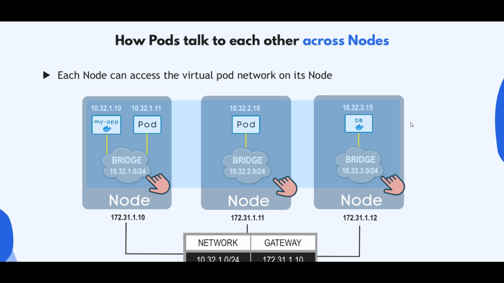

### A more scalable solution-`Agents on Node`

So how to manage thousands of Nodes? we need a more `Automated` & `Scalable` solution...

- [X] CNI Plugins solved this!

* A Weave network consists of `peers` - Weave Net routers reside on the Nodes
* They form a group and can directly talk to each other
  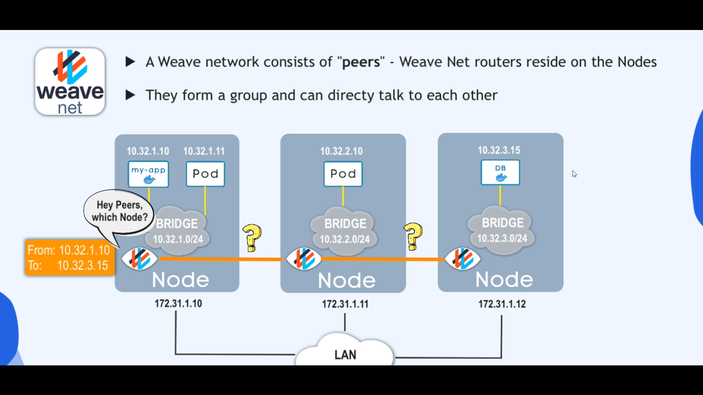

</div>

<p align="right">(<a href="#top">back to top</a>)</p>

# Finishing Cluster Bootstrapping...

<div id="intro-to-Finishing-Cluster-Bootstrapping">

Now is we should do something about master node status, because currently it is in `NotReady` statement... also
the `coredns` pods can't be `Ready` because of our node statement... so we should implement a networking solution to
achieve these goals... the solution is `implenting a CNI Plugin`... In this scenario, we are going with `Weave Net`

* Note: ONLY after this solution we can add `Worker Nodes` to our cluster...

</div>

## Configuring Networking - Weave Net

<div id="Configuring-Networking">

`Pod Network IP Address Range` should not overlap with `Node IP Address Range` --> `VPC IP != Nodes IP`

* the default range that Weave Net would like to use is `10.32.0.0/12` - a **12-bit prefix**, where all addresses start
  with
  the bit pattern `000010100010`, or in decimal everything from `10.32.0.0` through `10.47.255.255`.

* Before installing Weave Net, you should make sure the following ports are not blocked by your firewall: `TCP 6783` and
  `UDP 6783/6784`. For more details, see the [docs](https://www.weave.works/docs/net/latest/kubernetes/kube-addon/).

* Master
  ```shell
  kubectl apply -f https://github.com/weaveworks/weave/releases/download/v2.8.1/weave-daemonset-k8s.yaml
  ```

- [X] You can change the default IP range:

For taht, first download the YAML file, open it and change the IP range. the apply the file.

* Master
  ```shell
  vim weave.yaml
  # Then find:
  # containers:
  #  - name: weave
  #    command:
  #      - /home/weave/launch.sh
  # And add e.g. `- --ipalloc-range=100.32.0.0/12` bellow first command...
  ```

* Master
  ```shell
  kubectl apply -f weave.yaml
  ```

Be sure to check the IP address of `Pods` and `Node` in `kube-system` namespace...

* [docs](https://www.weave.works/docs/net/latest/kubernetes/kube-addon/)
* [configuring-weave](https://www.weave.works/docs/net/latest/tasks/ipam/configuring-weave/)

</div>

## Add Worker Nodes

<div id="Add-Worker-Nodes">

We already installed:

* containerd
* kubeadm
* kubelet
* kubectl
* [X] Now lets joining the worker nodes...

* NOTE: A bidirectional trust needs to be established:
    1) Discovery (Node trust the K8s Control Plane)
    2) TLS bootstrap (K8s Control Plane trust Node)

* master
    ```shell
    kubeadm token create --print-join-command
    ```

Paste the output of this command on **Worker Node(s)**. Note that you can use this output as much as you want.

### Kubeadm join preflight

<div id="kubeadm-join-phases">

* preflight
    * [x] run join pre-flight checks
* kubelet-start
    * [x] write kubelet settings, certificates and (re)starting the kubelet

</div>

### configure weave-net

<div id="Configure-weave-net">

* Now that workers added to the cluster, lets check a weave-net pod logs...

```shell
kubectl logs -n kube-system pod/weave-net-4xtwz -c weave
```

As you can see, there was a connection error that says weave-nets can not reach each other.

We need to open a port on each server for `weave-nets`.

* They listen on port `6783`

* To check the weave-net status
  ```shell
  kubectl exec -n kube-system weave-net-4xtwz -c weave -- /home/weave/weave --local status
  ```

* And now you can deploy a test application
  ```shell
  kubectl run test --image=nginx
  ```

</div>

</div>

<p align="right">(<a href="#top">back to top</a>)</p>

# Labels & Selectors + Service Networking

## Deploy & test an App!

<div id="Deploy-and-test-an-App">

Now let's deploy an Nginx Deployment with 2 Pods and a test Service for it

* Nginx Deployment
    ```yaml
    apiVersion: apps/v1
    kind: Deployment
    metadata:
      name: nginx-deployment
      labels:
        app: nginx
    spec:
      replicas: 2
      selector:
        matchLabels:
          app: nginx
      template:
        metadata:
          labels:
            app: nginx
        spec:
          containers:
          - name: nginx
            image: nginx
            ports:
            - containerPort: 80                 
    ```

* Service
    ```yaml
    apiVersion: v1
    kind: Service
    metadata:
      name: nginx-service
      labels:
        app: nginx
        svc: nginx-test
    spec:
      selector:
        app: nginx
      ports:
      - protocol: TCP
        port: 8080
        targetPort: 80
    ```

* [X] Important commands:

* Check the IP Addresses
    ```shell
    kubectl get all -o wide
    ```

* Check the IP + Endpoints
    ```shell
    kubectl describe svc nginx
    ```

* Check Endpoints
    ```shell
    kubectl get ep
    ```

* Check every label
    ```shell
    kubectl get XXX --show-labels
    ```

* Filter based on labels
    ```shell
    kubectl logs/get/etc -l <label>=<value>
    ```

### How requests are forwarded from Service to Pod

<div id="How-requests-are-forwarded-from-Service-to-Pod">

* Kube Proxy forwards the request
* Responsible for **maintaining a list of Service IPs and corresponding Pod IPs**

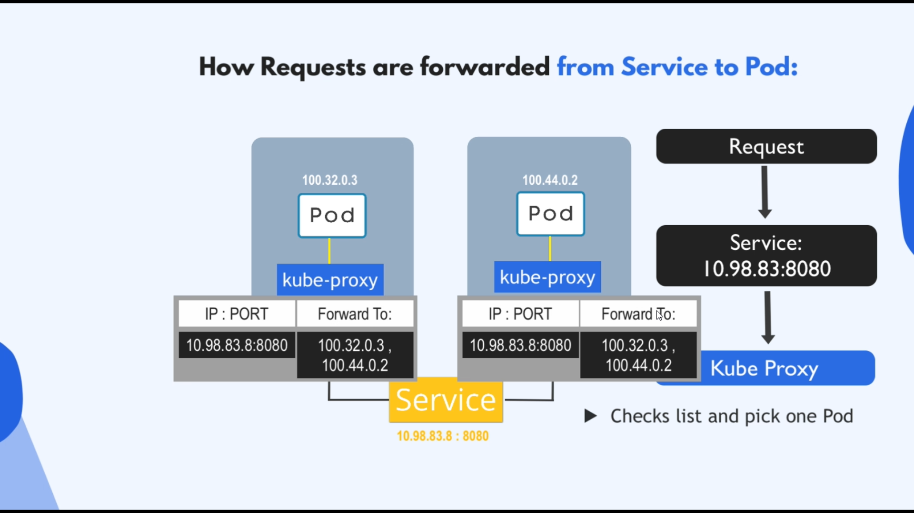

</div>

</div>

## Scaling & Recording kubectl commands

<div id="Scaling-Recording-kubectl-commands">

We can scale our application Up/Down by editing the deployment.yaml file of that deployment. But for quickly testing
something:

```shell
kubectl scale deployment nginx-deployment --replicas=5
```

We can track our changes in cluster via `--record` flag...

* `--record` flag is almost valid for most of the K8s components (scale/create/etc)
    ```shell
    kubectl scale deployment nginx-deployment --replicas=5 --record
    ```

then you see it via:

1) Command line
    ```shell
    kubectl rollout history deployment nginx-deployment
    ```
2) in `annotations`
    ```shell
    kubectl get deployments.apps nginx-deployment -o yaml | less
    ```

</div>

## Connect to nginx Pod

<div id="Connect-to-nginx-Pod">

* We will `curl` to Nginx Service from inside that Pod
* No need for a Deployment Configuration File

```shell
kubectl run test-nginx-svc --image=nginx
```

Then we want to `Get Interactive Terminal`

```shell
kubectl exec -it test-nginx-svc -- bash
```

Then we want to curl the nginx app via its service:

1) IP:PORT
    ```shell
    curl http://<SERVICE-IP>:8080
    ```

2) DNS
    ```shell
    curl http://nginx-service:8080
    ```

</div>

## DNS in kubernetes

<div id="DNS-in-kubernetes">

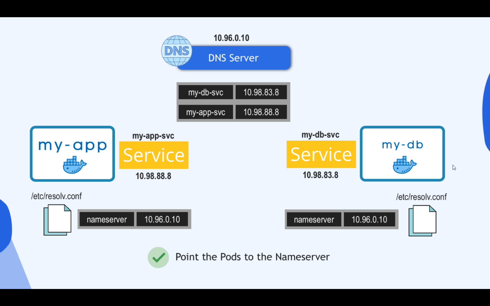

DNS Server is:

* Nameserver in the K8s cluster
* Manage the list of Service Names and their IP addresses
* All Pods point to this nameserver
* DNS Server in Kubernetes is: `CoreDNS`
* CoreDNS Pods run in `kube-system` namespace
* `2 Replicas` in the kube-system namespace
* In the production cluster, `minimum of 2 replicas`

* Check logs of CoreDNS
    ```bash
    kubectl logs -n kube-system -l k8s-app=kube-dns
    ```

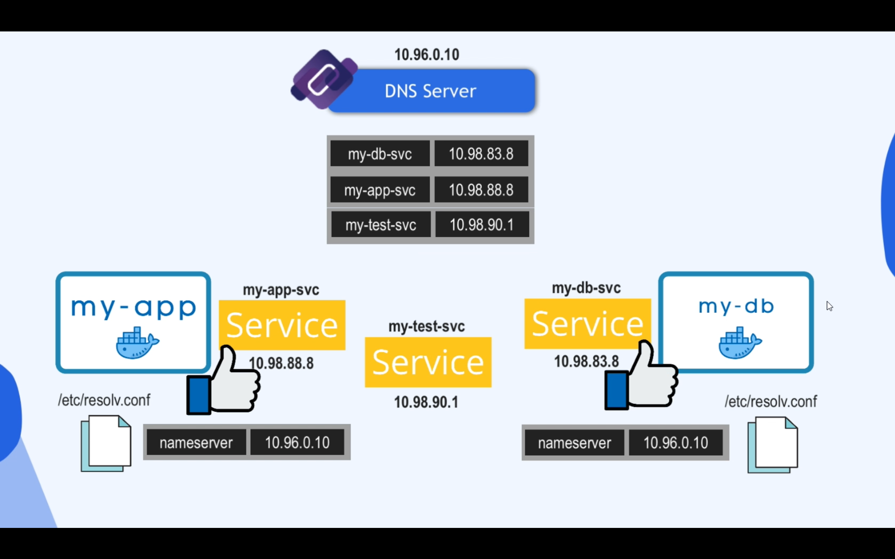

```bash
kubectl run -it test-nginx-svc --image=nginx -- bash
```

Inside that:

```bash
cat /etc/resolv.conf 
```

The result would look like:

```bash
nameserver 10.96.0.10 # IP address of CoreDNS
search default.svc.cluster.local svc.cluster.local cluster.local
options ndots:5
```

* kubelet automatically creates `/etc/resolv.conf` file for each Pod

* You can see the `cluster DNS IP` by: `sudo cat /var/lib/kubelet/config.yaml`

### Service - Fully Qualified Domain Name (FQDN)

<div id="Service-Fully-Qualified-Domain-Name">

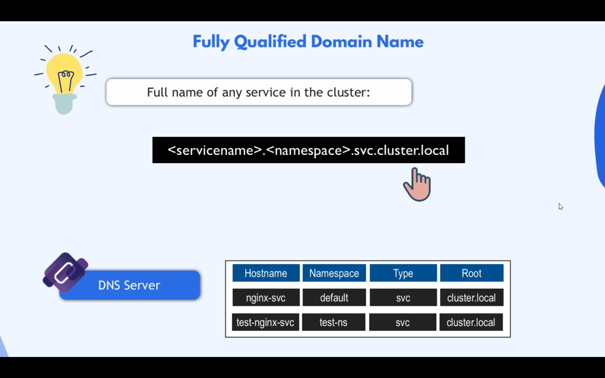

* `<servicename>.<namespace>.svc.cluster.local`
* We don't have to use the fully qualified name
* By default, K8s **research only in the namespace**
    * `Same namespace`: Only the name is sufficient
    * `Different namespaces`: You need to include that namespace

</div> <!-- /Service - Fully Qualified Domain Name (FQDN) -->
</div> <!-- /DNS in kubernetes -->

## Configure Service IP Address

<div id="Configure-Service-IP-Address">

1) As we already know, the Pod IP Addresses come from `CNI`.
2) `Api-server`, `Etcd`, `Kube-Proxy`, `Scheduler`, and `controller-Manager` IP Addresses come from `Server/Node` IP
   Address
3) But how about the Services in K8s (`ClusterIP Type`)?

### Where is Service IP Range configured?

<div id="Where-is-Service-IP-Range-configured">

ClusterIP Type:

* Default Service Type
* Expose the Service on a `cluster-internal IP`
* Service only reachable from `within the cluster`

* [X] IP address range is defined in Kube API Server Configuration

If we check API Configuration, we can see the `- --service-cluster-ip-range=10.96.0.0/12` option in `command` section, A
CIDR notation IP range from which to assign service cluster IPs:

```shell
sudo vim /etc/kubernetes/manifests/kube-apiserver.yaml
```

* See all defaults configurations:
    ```yaml
    # $ kubeadm config print init-defaults
    apiVersion: kubeadm.k8s.io/v1beta3
    bootstrapTokens:
      - groups:
          - system:bootstrappers:kubeadm:default-node-token
        token: abcdef.0123456789abcdef
        ttl: 24h0m0s
        usages:
          - signing
          - authentication
    kind: InitConfiguration
    localAPIEndpoint:
      advertiseAddress: 1.2.3.4
      bindPort: 6443
    nodeRegistration:
      criSocket: unix:///var/run/containerd/containerd.sock
      imagePullPolicy: IfNotPresent
      name: node
      taints: null
    ---
    apiServer:
      timeoutForControlPlane: 4m0s
    apiVersion: kubeadm.k8s.io/v1beta3
    certificatesDir: /etc/kubernetes/pki
    clusterName: kubernetes
    controllerManager: { }
    dns: { }
    etcd:
      local:
        dataDir: /var/lib/etcd
    imageRepository: k8s.gcr.io
    kind: ClusterConfiguration
    kubernetesVersion: 1.24.0
    networking:
      dnsDomain: cluster.local
      serviceSubnet: 10.96.0.0/12
    scheduler: { }
    ```

### Change Default CIDR IP Range

<div id="Change-Default-CIDR-IP-Range">

* You can configure Kube API Server with many different options:

1) when bootstrapping the cluster via `kubeadm init --service-cidr <IP Range>`
2) Change `kube-apiserver` directly (kubelet periodically scans the configurations for changes)
    ```shell
    sudo vim /etc/kubernetes/manifests/kube-apiserver.yaml
    ```

* Note that with option number `2`, you are going to
  get the `The connection to the server IP:6443 was refused - did you specify the right host or port?` error for a
  while, so
  you have to wait a couple of minutes for `kube-apiserver` to start again...
* New CIDR block only applies for **newly** created Services, which means old Services remain in the old CIDR block for
  testing:
    ```shell
    kubectl create service clusterip test-cidr-block --tcp 80:80
    ```

Then Check the newly created Service.

</div> <!-- Change Default CIDR IP Range -->
</div> <!-- Where is Service IP Range configured? -->
</div> <!-- Configure Service IP Address -->

## Demo: Custom Load Balancing

<div id="Demo-Custom-Load-Balancing">

Our goal here is to create a service that **balances connections to two different deployments**. You might use this as a
simplistic way to run two versions of your apps in parallel.

In the real world, you'll likely use a 3rd party load balancer to provide advanced **blue/green** or **canary-style**
deployments. Still, this assignment will help further understand how `service selectors` are used to finding pods to use
as service endpoints.

For simplicity, version 1 of our application will use the `NGINX` image, and version 2 will use the `Apache` image. They
both listen on port `80` by default.

When we connect to the service, we expect to see some requests served by `NGINX` and some by `Apache`.

---

Let's create a clusterIP service

```yaml
apiVersion: v1
kind: Service
metadata:
  labels:
    app: custom-lb
  name: custom-lb
spec:
  type: ClusterIP
  # The selector of that service will need to match the pods created by both deployments.
  selector:
    svc: clb
  ports:
    - protocol: TCP
      port: 8080
      targetPort: 80
```

Then create our Nginx Deployment

```yaml
apiVersion: apps/v1
kind: Deployment
metadata:
  labels:
    app: nginx
  name: nginx
spec:
  replicas: 1
  selector:
    matchLabels:
      app: nginx
  template:
    metadata:
      # We will need to change the deployment specification to add an extra label (svc: clb) to be used solely by the service.
      labels:
        app: nginx
        svc: clb
    spec:
      containers:
        - image: nginx
          name: nginx
          ports:
            - containerPort: 80
```

Then create our Apache Deployment

```yaml
apiVersion: apps/v1
kind: Deployment
metadata:
  labels:
    app: apache
  name: apache
spec:
  replicas: 1
  selector:
    matchLabels:
      app: apache
  template:
    metadata:
      # We will need to change the deployment specification to add an extra label (svc: clb) to be used solely by the service.
      labels:
        app: apache
        svc: clb
    spec:
      containers:
        - image: httpd
          name: httpd
          ports:
            - containerPort: 80
```

---

Apply the files, then use the `curl` command to show yield responses from `NGINX` and `Apache`.

Note: you won't see a perfect round-robin, i.e., NGINX/Apache/NGINX/Apache, etc., but on average, Apache and NGINX
should serve approximately `50%` of the requests each.

</div> <!-- Demo: Custom Load Balancing -->

## Summary

<div id="Networking-Summary">

### Multiple moving parts

* The "**pod-to-pod network**" or "**pod network**":
    * Provides communication between pods and nodes
    * Is generally implemented with CNI plugins
* The "**pod-to-service network**":
    * Provides internal communication and load balancing
    * Is generally implemented with `kube-proxy`
* Network policies:
    * Provide firewalling and isolation
    * Can be bundled with the "**pod network**" or provided by another component
* Inbound traffic can be handled by multiple components:
    * Something like `kube-proxy` (for `NodePort` services) (Don't worry. We're going to go through `NodePort` in the
      next section)
    * Load balancers (ideally, connected to the pod network)
* It is possible to use multiple pod networks in parallel (with "meta-plugins" like CNI-Genie or Multus)

</div> <!-- Summary -->

<p align="right">(<a href="#top">back to top</a>)</p>

# Make application accessible from outside the cluster

## NodePort

<div id="NodePort-Service-Type">

* `ClusterIP` = Internal Service
* `NodePort` = External Service

```yaml
apiVersion: v1
kind: Service
metadata:
  name: nginx-service
  labels:
    app: nginx
    svc: nginx-test
spec:
  type: NodePort # ClusterIP is the default, that's why we didn't need to specify the type before
  selector:
    app: nginx
  ports:
    - protocol: TCP
      port: 8080
      targetPort: 80
      nodePort: 30000
```

### What is NodePort? How does it work?

<div id="What-is-NodePort-How-does-it-work">

* Internal Service accessible on `Service IP address + Port`
* NodePort also creates ClusterIP internal Service
* NodePort, `Opens Port on each Worker Node`
* External traffic has access to a `fixed port` on each Worker Node!
* Range: `30000-32676`
* Sometimes, it's the only available option for external traffic (e.g. most clusters deployed with `kubeadm`
  or `on-premises`)

NodePort Service Accessibility:

* NodePort accessible from outside the cluster
* On IP address of Node + The NodePort
* NodePort accessible from outside the cluster

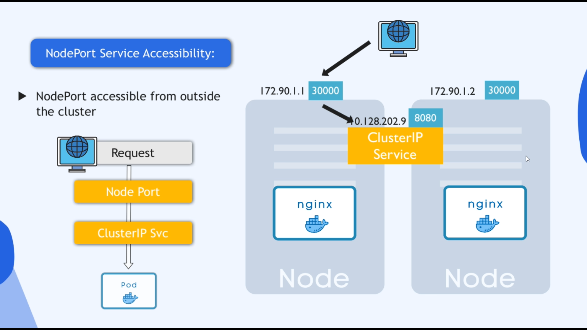

</div> <!-- What is NodePort? How does it work?-->
</div> <!-- NodePort-->

## Loadbalancer Service Type

<div id="Loadbalancer-Service-Type">

### Why Loadbalancer?

<div id="Why-Loadbalancer">

At this point, our application is accessible from the outside, but it has a couple of downgrades:

1) Not user friendly
2) Insecure & messy!

* It is OK for testing
* Better Alternative: Loadbalancer Service Type

```yaml
apiVersion: v1
kind: Service
metadata:
  name: nginx-service
  labels:
    app: nginx
    svc: nginx-test
spec:
  type: LoadBalancer # The configuration of Loadbalancer is exactly like NodePort except for this part...
  selector:
    app: nginx
  ports:
    - protocol: TCP
      port: 8080
      targetPort: 80
      nodePort: 30000 # Notice we still have a nodePort!
```

</div> <!-- Why Loadbalancer?-->

### How Loadbalancer works?

<div id="How-Loadbalancer-works">

How Loadbalancer Type works:

* Loadbalancer `outside of K8s cluster`
* Which accepts traffic as entrypoint
* Loadbalances to 1 of Worker Node on the Nodeport
* Then gets forward to ClusterIP
* Accessible at own IP address & port
* Loadbalancer is not created inside the cluster

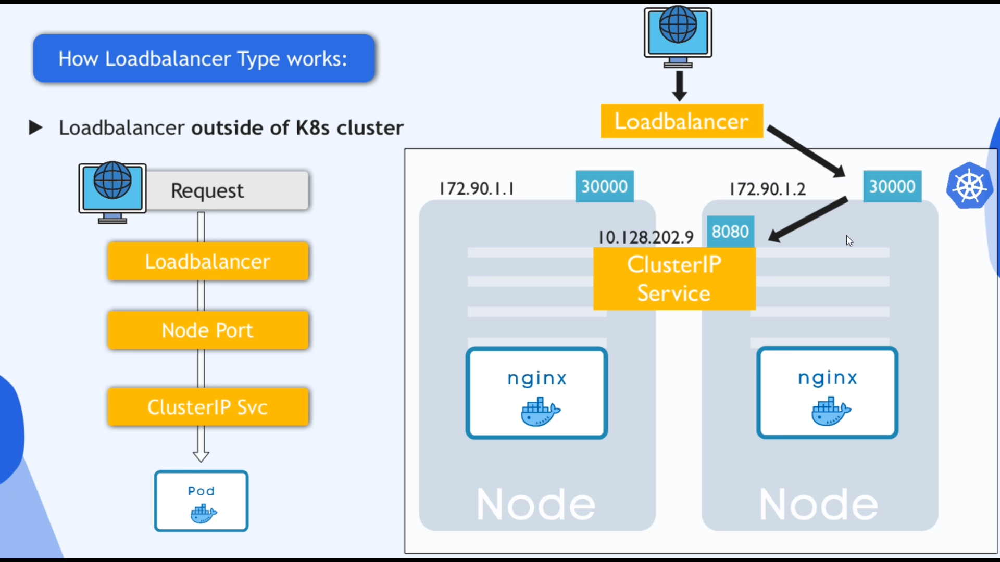

1) Who is responsible for creating the loadbalancer?

* `Cloud providers`, which offer Kubernetes managed services (EKS, AKS, GKE, etc)

2) But, I have a `self-managed K8s cluster`

* No Loadbalancer out-of-the-box... You need to `create your own Loadbalancer`
* Create Loadbalancer for each Service

</div> <!-- How Loadbalancer works?-->

### Create Loadbalancer

<div id="Create-Loadbalancer">

Some notes:

* When using managed K8s Service, like EKS:
* Cloud native loadbalancer will be provisioned for your Service
* Here we are going to create a loadbalancer from scratch on AWS

1) From `EC2 management console` go to `Load Balancing/Load Balancers`
2) Choose `Application Load Balancer`
3) Give it some name (Doesn't matter!)
4) In the `Availibility Zones` section, we should select a zone that our `Worker Nodes` are
5) Then you must select `at least 2 subnets` (Very specific to AWS)
6) In `Configure Routing` (This the part where we decide where does Loadbalancer forward the requests that it gets):

* Select a name
* In the port section, we give it `The nodePort from Service configuration` (In our case 30000)

7) In `Register Targets`, we should specify `Which instances` this are exactly, In our case these are
   the `Worker Nodes` (`Only` the Worker Nodes NOT master) and then Register
8) After a while your Loadbalancer will go from `Provisioning` to an `Active` state

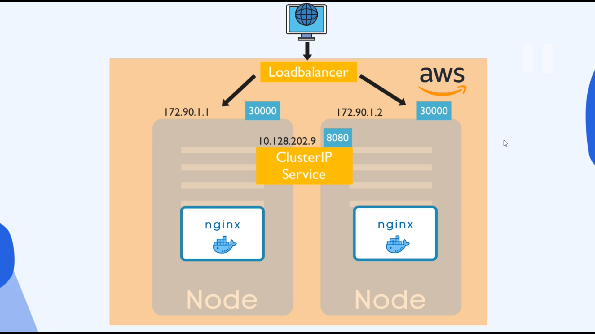

</div> <!-- Create Loadbalancer-->

#### Load Balancer on Bare Metal:

* [MetalLB website](https://metallb.universe.tf/)
* [MetalLB Installation](https://github.com/bitnami/charts/tree/master/bitnami/metallb)
* [Weave & MetalLB](https://www.weave.works/blog/kubernetes-faq-how-can-i-route-traffic-for-kubernetes-on-bare-metal)

### Access Application

<div id="Access-Application-Loadbalancer">

Now, How do we access the Loadbalancer?

* A Loadbalancer has an `IP address` but it also has a `Domain Name`

Now if you paste the Loadbalancer Domain Name, you should still see the Welcome to Nginx!

</div> <!-- Access Application -->
</div> <!-- Loadbalancer Service Type -->

## HAProxy as LoadBalancer

**NOTE:** This section is not in the CKA exam. So you can skip it.

### What is HAProxy and why should we use that?
<div id="HAProxy-as-LoadBalancer-What-is-HAProxy">

What is HAProxy?

According to the [docs](http://www.haproxy.org): HAProxy is a free, very fast, and reliable reverse-proxy offering **high availability**, **load balancing**, and **proxying** for **TCP** and **HTTP-based** applications. It is particularly suited for high-traffic websites and powers most of the world's most visited ones. Over the years, it has become the de-facto standard [open-source](https://github.com/haproxy/haproxy) load balancer, is now shipped with most mainstream Linux distributions, and is often deployed by default in cloud platforms.

---

The docs are very clear. The HAProxy is a Powerful Open-Source LoadBalancer. 

Previously we learned how to create a load balancer on a cloud provider (AWS) and use it in our Cluster (`LoadBalancer` service type).

Here we are going to do the same things, except instead of a cloud provider, we will create our very own LoadBalancer with the help of HAProxy.

---

So anyway, How should we decide between HAProxy and clouds LB?

Good question!

Here are some benefits:

* Protocols
  HAProxy provides load balancing at the **network** and **application** layers. This means you can set up backend clusters for an entire website or specify different backends based on the content of client requests.
  In contrast, on-edge load balancers only manage the distribution of **application** layer (OSI layer 7) traffic.
* Costs
  HAProxy is a free and open-source application.
  A cloud-provided load balancer requires a monthly or yearly subscription fee.
* Performance
  As shown in [this test run on AWS ARM-based Graviton2](https://www.haproxy.com/blog/haproxy-forwards-over-2-million-http-requests-per-second-on-a-single-aws-arm-instance), HAProxy scales very well with threads and can reach 2 million requests/s over SSL and 100 Gbps for forwarded traffic.
* Reliability
  HAProxy is first known for being extremely robust.
* Security
* And a lots more!

---

* In most cases, I use HAProxy instead of a Cloud LB.
* But really, it depends on your situation.
* Sometimes you want to go with a cloud LB, and other times, you want to go with HAProxy (based on the situation you are facing it).
* Fortunately, you know both methods!

</div> <!-- What is HAProxy and why should we use that? -->

### Setup HAProxy
<div id="HAProxy-as-LoadBalancer-Setup-HAProxy">

* Alright, enough talking!
* Let's set up the famous HAProxy for our cluster.
* For that, we need another EC2 instance.
* Create an EC2 instance. remember that this EC2 instance must have the same subnet as the Worker EC2 instances because it should see the instances it wants to send the traffic/requests to.
* Also, remember that this instance should have a Public IP address (Obviously)
* **Until now, our cluster has been in a Public mode (Every instance has public IP) for learning purposes.**
**So you won't have any problem going along with this section.**
**But, if your cluster is in private mode (None of the instances has a public IP address, they all have private IP addresses), you'll need to know about the bastion host.**
**So, in your case, your instance must have 1) A Public IP address and 2) A Private IP address in the same range as your cluster.**
**Because this instance must see the workers through its private hand and should be accessible to the outside world through its Public hand.**


---

For installing it, we have two choices:

1) Easy approach (Not recommended):

```shell
sudo apt install haproxy
```

Yes, that simple command will quickly and easily set you up with HAProxy. Still, you’ll find that the version you’ve just installed probably lags behind the current release by a minor version number or two, sometimes as much as a major version number.
The version you get with apt out-of-the-box will be stable and secure, but it will lack some cool new features.

2) Install the latest HAProxy using a PPA (recommended)

Head over to [haproxy.debian.net](https://haproxy.debian.net), where you can select the install instructions for your OS

```shell
sudo apt install --no-install-recommends software-properties-common
sudo add-apt-repository ppa:vbernat/haproxy-2.6
sudo apt install haproxy=2.6.\*
```

Adding `=2.6.\*` to the end tells `apt` that we want to maintain the latest version of HAProxy in the `2.6` branch, so if there are future updates in that branch, you’ll get them when you do an `apt upgrade`.

If you execute the `haproxy -v` command, you'll see your installed HAProxy version.

</div> <!-- Setup HAProxy -->

### Configure HAProxy
<div id="HAProxy-as-LoadBalancer-Configure-HAProxy">

Now that we have installed the HAProxy, it's time to configure it to load balance the traffic to our cluster.

But first, let's deploy a simple Nginx application and a NodePort service type.

```yaml
apiVersion: apps/v1
kind: Deployment
metadata:
 labels:
  app: nginx
 name: nginx
 namespace: default
spec:
 replicas: 2
 selector:
  matchLabels:
   app: nginx
 template:
  metadata:
   labels:
    app: nginx
  spec:
   containers:
   - image: nginx
    name: nginx
    ports:
    - containerPort: 80
---
apiVersion: v1
kind: Service
metadata:
 name: nginx-service
 namespace: default
spec:
 type: NodePort
 selector:
  app: nginx
 ports:
  - protocol: TCP
   port: 8080
   targetPort: 80
   nodePort: 30000
```

If you apply it, it will create Nginx deployment and open port `30000` on each Node, and I can access the Nginx welcome page by heading to `any NodeIP:30000`.

---

The HAProxy config file is in the `/etc/haproxy/haproxy.cfg` location.

If you open it, you'll see some configuration in it:

```cfg
global
	log /dev/log	local0
	log /dev/log	local1 notice
	chroot /var/lib/haproxy
	stats socket /run/haproxy/admin.sock mode 660 level admin expose-fd listeners
	stats timeout 30s
	user haproxy
	group haproxy
	daemon

	# Default SSL material locations
	ca-base /etc/ssl/certs
	crt-base /etc/ssl/private

	# See: https://ssl-config.mozilla.org/#server=haproxy&server-version=2.0.3&config=intermediate
        ssl-default-bind-ciphers ECDHE-ECDSA-AES128-GCM-SHA256:ECDHE-RSA-AES128-GCM-SHA256:ECDHE-ECDSA-AES256-GCM-SHA384:ECDHE-RSA-AES256-GCM-SHA384:ECDHE-ECDSA-CHACHA20-POLY1305:ECDHE-RSA-CHACHA20-POLY1305:DHE-RSA-AES128-GCM-SHA256:DHE-RSA-AES256-GCM-SHA384
        ssl-default-bind-ciphersuites TLS_AES_128_GCM_SHA256:TLS_AES_256_GCM_SHA384:TLS_CHACHA20_POLY1305_SHA256
        ssl-default-bind-options ssl-min-ver TLSv1.2 no-tls-tickets

defaults
	log	global
	mode	http
	option	httplog
	option	dontlognull
        timeout connect 5000
        timeout client  50000
        timeout server  50000
	errorfile 400 /etc/haproxy/errors/400.http
	errorfile 403 /etc/haproxy/errors/403.http
	errorfile 408 /etc/haproxy/errors/408.http
	errorfile 500 /etc/haproxy/errors/500.http
	errorfile 502 /etc/haproxy/errors/502.http
	errorfile 503 /etc/haproxy/errors/503.http
	errorfile 504 /etc/haproxy/errors/504.http
```

We are going to modify this configuration file.

---

Append these lines to end of the configuration:

```cfg
frontend http
  bind *:80
  mode tcp
  redirect scheme https code 301 if !{ ssl_fc }
  default_backend http

frontend https
  bind *:443
  mode tcp
  default_backend https

backend https
  balance roundrobin
  mode tcp
  server worker1 172.16.0.114:30000 check
  server worker2 172.16.0.154:30000 check

backend http
  balance roundrobin
  mode tcp
  server worker1 172.16.0.114:30000 check
  server worker2 172.16.0.154:30000 check


frontend stats
  option http-use-htx
  stats enable
  stats uri /stats
  stats refresh 10s
```

* **NOTE:** Remember to replace your worker's IPs with mine!
* **NOTE:** This is the very basics of HAProxy configuration. For advanced use cases and configurations, you'll need an expert in the HAProxy world, but for now, this will work for us.

Then restart the HAProxy service:

```shell
sudo systemctl restart haproxy
```

Now, if you go to the browser and head over to `HAProxy-Instance-IP`, you'll see the Nginx welcome page!

Later on that we will learn about Ingress and SSL, you'll even see this page with SSL (That's why in the configuration, we added `https` sections!)

---

We will learn more about HAProxy after we learn Ingress.

</div> <!-- Configure HAProxy -->

## External Access with Ingress

### Why Ingress?

<div id="Why-Ingress">

1) Self-Managed K8s cluster: Create Loadbalancer yourself
2) Managed K8s cluster: Creates Loadbalancers automatically

* **Loadbalancer Disadvantages**:

1) Loadbalancer that all become entrypoints
2) Configure the Domain Name
3) Each Loadbalancer exposes new NodePort
4) Each Loadbalancer increases the cloud bill
5) `Configure` everything `outside the cluster`
6) Isn't it good:

* Having this as part of the K8s cluster?
* Configure secure connection
* Loadbalancing to different services

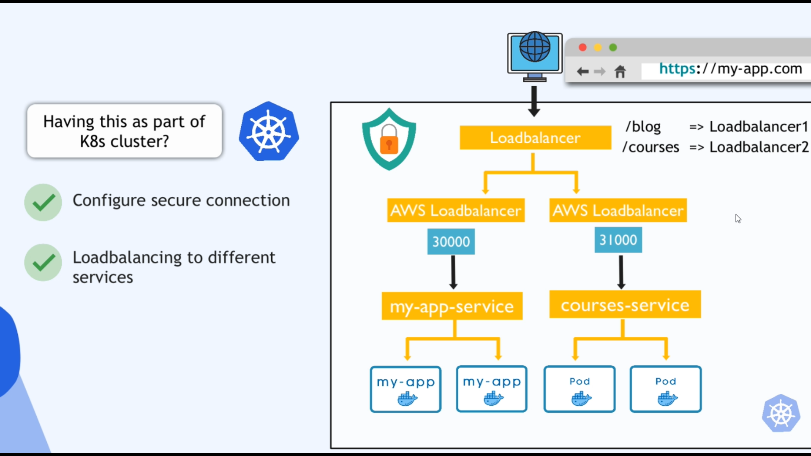

* **Ingress**
* A K8s component
* Configure `Routing`
* Configure `https`
* Ingress is deployed and available inside cluster
* We need to `expose` it either as NodePort or Loadbalancer
* 1 NodePort or Loadbalancer, which is single entrypoint

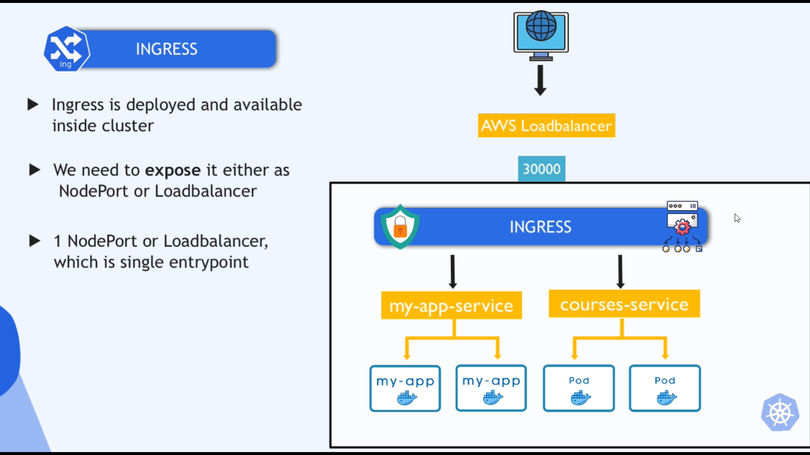

</div> <!-- Why Ingress?-->

### How Ingress works?

<div id="How-Ingress-works">

* Valid domain address
* Map domain name to `the IP address`, which is the `entrypoint`

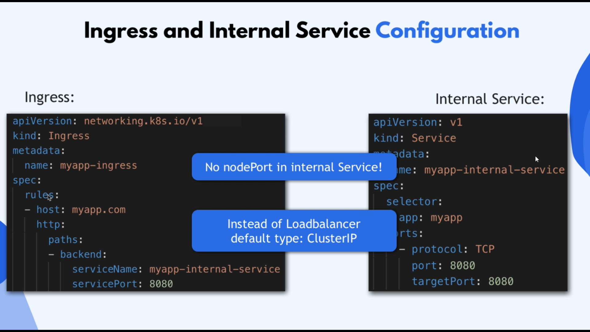

</div> <!-- How Ingress works? -->

### How to `configure Ingress`?

<div id="How-to-configure-Ingress">

#### How to configure Ingress `in your cluster?`

* You need an `implementation` of Ingress
* which is `Ingress Controller`

#### What is `Ingress Controller?`

* Evaluates and process Ingress rules
* Manages redirection
* Entrypoint to cluster
* Many third-party implementations (Default: `K8s Nginx Ingress Controller`)

#### Environment `on which your cluster runs`

1) Cloud Service provider:
    * Out-of-the-box K8s solution
    * own virtualized Loadbalancer
    * Advantage: You don't have to implement Loadbalancer yourself

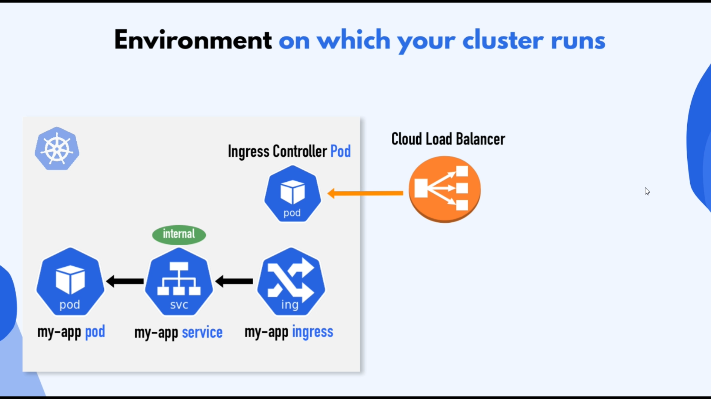

2) Bare Metal:
    * You need to configure some kind of entrypoint
    * Either inside of the cluster or outside as a separate server (Software or Hardware solution)
    * Separate server
    * Public IP address and open ports
    * Entrypoint to cluster
    * `No server in the K8s cluster is accessible from outside!`

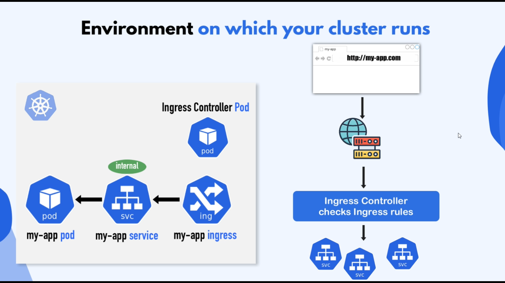

</div> <!-- How to configure Ingress? -->

### More Use Cases

<div id="Ingress-More-Use-Cases">

* Multiple paths for `same host`

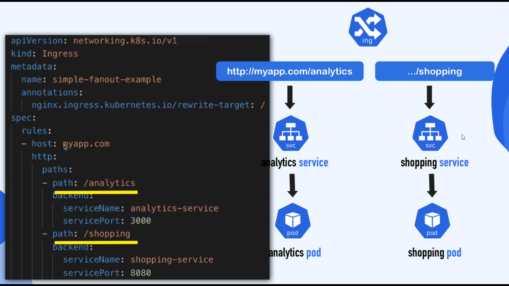

* Multiple `sub-domains` or `domains`

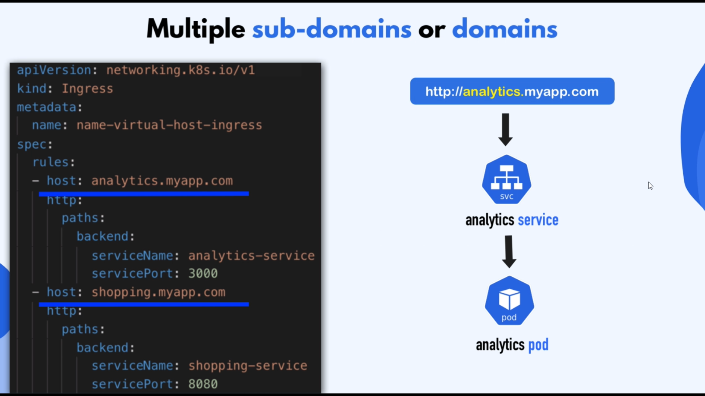

</div> <!-- More Use Cases -->

### Configuring `TLS Certificate`

<div id="Configuring-TLS-Certificate">

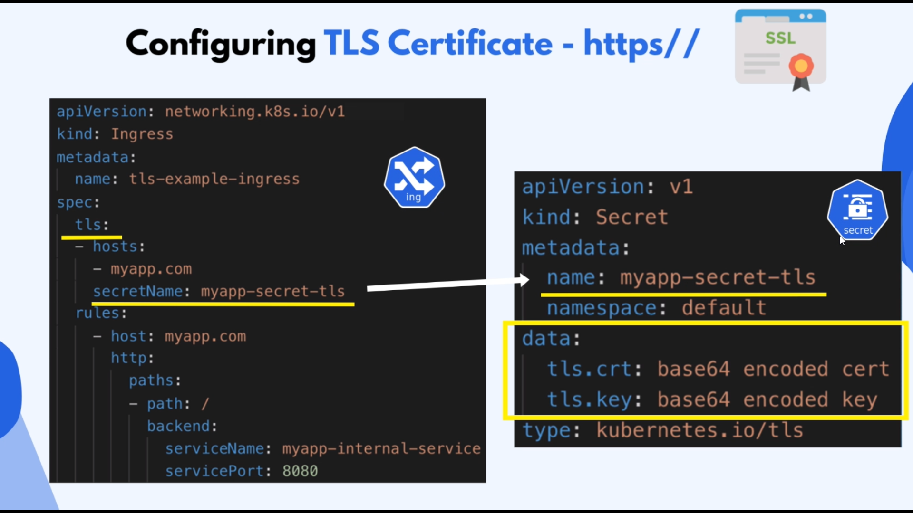

* **Important Notes**:
    1) Data Keys need to be `tls.crt` and `tls.key`
    2) Values are `file contents` NOT file paths/locations
    3) Secret component must be in the `same namespace` as the Ingress component

</div> <!-- Configuring TLS Certificate -->

## Setup ingress

### Deploy Ingress Controller

<div id="Deploy-Ingress-Controller">

We deploy our Ingress Controller via Helm charts...

What is Helm?

* Helm is a package manager for Kubernetes.
* I have a complete [Helm tutorial](https://github.com/alifiroozi80/CKA/tree/main/Helm) as well.
* But you can only know some about Helm to complete this repo.
* So, don't worry if you are not familiar with Helm.

* [Official documentation](https://github.com/kubernetes/ingress-nginx/tree/main/charts/ingress-nginx)

```shell
helm repo add ingress-nginx https://kubernetes.github.io/ingress-nginx
helm repo update
helm install [RELEASE_NAME] ingress-nginx/ingress-nginx
```

Now check this out:

```shell
helm ls # Check for the chart that we just deployed
kubectl get pod # Check for the ingress controller pod
kubectl get svc # Check for 2 ingress services (ClusterIP & Loadbalancer)
```

Now you may wonder why a Loadbalancer Service type?

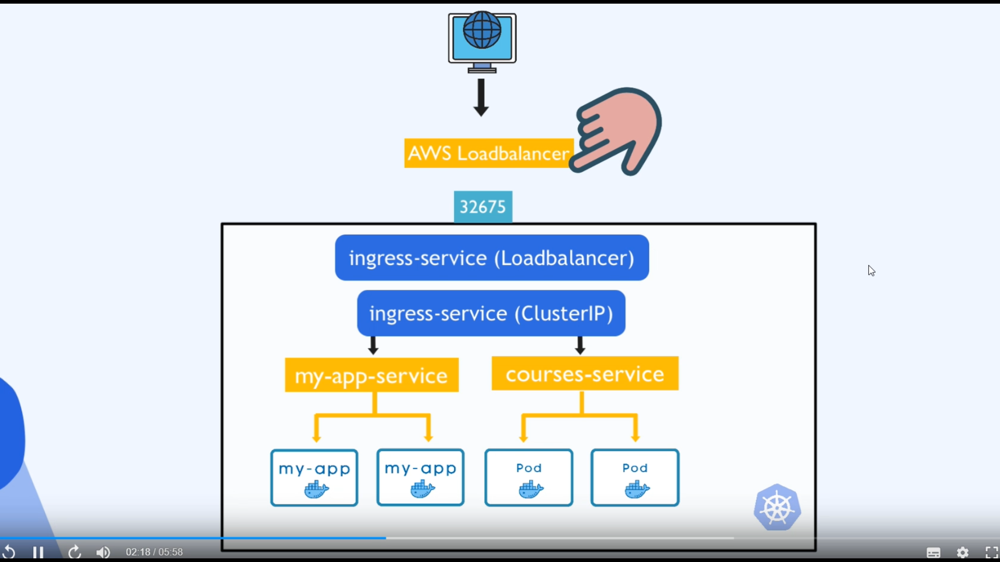

Now we should Configure a LB again... <a href="#Create-Loadbalancer">Check this section</a>

At this point, if you check the LB IP address, you should get an Nginx Error (`504 Gateway Time-out` OR `404 Not Found`).
It is because we didn't configure it yet...
So as a next step: Configure the Ingress Controller to route the traffic

</div> <!-- Deploy Ingress Controller -->

### Configure Routing with Ingress

<div id="Configure-Routing-with-Ingress">

* Ingress component is like a `Configuration` piece `for the Ingress Controller`
* We defined HTTP rules, which the Ingress Controller fulfills
* K8s way to configure routing logic
* `Our` routing logic

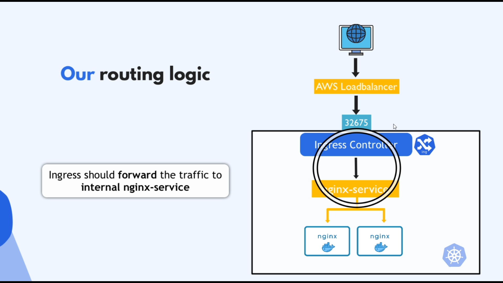

1) Change the `ingress-service` back to ClusterIP Service

* Only accessible internally!
* The `Ingress Controller` is the Only Entrypoint of the K8s cluster

</div> <!-- Configure Routing with Ingress -->

### Create & Apply `Ingress Config File`

<div id="Create-Apply-Ingress-Config-File">

First, lets generate an Ingress Template

```shell
kubectl create ingress my-app-ingress --rule=host/path=service:port --dry-run=client -o yaml > my-ingress.yaml
```

Open the file and cleaning up... After this, you should have something like this:

```yaml
apiVersion: networking.k8s.io/v1
kind: Ingress
metadata:
  name: my-app-ingress
spec:
  rules:
    - host: host
      http:
        paths:
          - backend:
              service:
                name: service
                port:
                  name: port
            path: /path
            pathType: Exact
```

Ingress Rules:

Each HTTP rule contains:

* An optional `host`
* List of `paths`, each of which has an associated backend
* A `backend` is combination of Service and port names

Path Types:

* `Exact`: Matches the URL path exactly and with case sensitivity
* `Prefix`: Matches based on a URL path prefix split by `/`

We should change this template to:

```yaml
apiVersion: networking.k8s.io/v1
kind: Ingress
metadata:
  name: my-app-ingress
  namespace: default
spec:
  ingressClassName: nginx
  rules:
    - host: www.kube.com # The Loadbalancer Domain (MUST be domain, NOT IP address)
      http:
        paths:
          - pathType: Exact
            backend:
              service:
                name: nginx-service
                port:
                  number: 8080
            path: /my-app
```

* apply it

```shell
kubectl apply -f my-ingress.yaml
```

* [X] Notes: If you get `...Faild calling webhook "validate.nginx.ingress.kubernetes.io..."`:

* See the API

```shell
kubectl get validatingwebhookconfigurations.admissionregistration.k8s.io
```

* Edit the manifest file

```shell
kubectl edit validatingwebhookconfigurations.admissionregistration.k8s.io
```

* Change the `failurePolicy`

```yaml
# Change the failurePolicy: Fail to the:
failurePolicy: Ignore
```

* [Source](https://github.com/kubernetes/ingress-nginx/blob/main/deploy/static/provider/cloud/deploy.yaml#:~:text=networking/v1/ingresses-,failurePolicy%3A%20Fail,-matchPolicy%3A%20Equivalent)

And now Everything should be fine:

```shell
kubectl get ingress
```

* [X] Ingress component is in the `same namespace` as our internal Service

Now if you paste your `URL` in the browser, you should see the Nginx result (Instead of the errors that we got
before...)

* [X] Note: If tou are in bare-metal, you should also add the `IP URL` in your `/etc/hosts` --> e.g.
    ```text
    10.152.183.110 www.kube.com
    ```

</div> <!-- Create & Apply Ingress Config File -->

### Configure Multiple Paths

<div id="Configure-Multiple-Paths">

Now lets change our `my-ingress.yaml` file to:

```yaml
apiVersion: networking.k8s.io/v1
kind: Ingress
metadata:
  name: my-ingress
  namespace: default
spec:
  ingressClassName: nginx
  rules:
    - host: www.kube.com
      http:
        paths:
          - pathType: Exact
            backend:
              service:
                name: nginx-service
                port:
                  number: 8080
            path: /my-app
```

First check the described ingress:

```shell
kubectl describe ingress my-ingress
```

As you can see, if now we check the `URL` we get an error, bit if we head over to `URL/my-app` we get `404 Not Found`...
This means now traffic will forward to the nginx-service, but my nginx doesn't know how to handle it...
So, Now we want to handle this issue that our main page/root (`URL`) doesn't response. Just add the following line
under the `metadata` section:

```yaml
  annotations:
    nginx.ingress.kubernetes.io/rewrite-target: /
```

* If your app can handle the path, then you don't need this `rewrite`
    * [Source](https://github.com/kubernetes/ingress-nginx/tree/main/docs/examples/rewrite#rewrite-target)

Now if you head over to `URL/my-app`, we can see the Nginx welcome page

</div> <!-- Configure Multiple Paths -->

### Some Notes

<div id="Some-Notes-on-ingress-controller">

If you check the pods, you can see that we have only 1 `ingress nginx controller`,
In Production, you should have 1 replica per Worker Node

</div> <!-- Some Notes -->

## SSL & Ingress

### Intro
<div id="SSL-and-Ingress-Intro">

Until now, we already know many things about K8s Networking, especially the Ingress. 
We know that Ingress is awesome and blah blah, but wouldn't it be fantastic if we had an SSL certificate with our Ingress? Or, even better: automatically create and assign the SSL certificates to our Ingress resources.

[Cert-Manager](https://github.com/cert-manager/cert-manager) is an Open Source project that Automatically provision and manage TLS certificates in Kubernetes.

In this section, we will learn about it.

**NOTE:** This section is not in the CKA exam. So you can skip it.

</div> <!-- Intro -->

### Deploy Cert-Manger
<div id="SSL-and-Ingress-Deploy-Cert-Manger">

We need to install cert-manager to do the work with Kubernetes to request a certificate and respond to the challenge to validate it. We can use Helm or plain Kubernetes manifests to install cert-manager.

We will use Helm to install it. I have a [Helm tutorial](https://github.com/alifiroozi80/CKA/tree/main/Helm), be sure to check it too.

---

Now let's talk a little more about cert-manager.

Cert-manager mainly uses two different custom Kubernetes resources - known as CRDs - to configure and control how it operates and store state. These resources are Issuers and Certificates. (I have a [tutorial](https://github.com/alifiroozi80/CKA/tree/main/Operators) about K8s CRDs and Operators. Check that as well)

That's enough to start using cert-manager but to understand the certificate concept, check the [official documentation](https://cert-manager.io/docs/concepts/certificate).

---

* Let's install the cert-manager Helm chart with this one-liner:
   ```shell
   helm install cert-manager cert-manager \
    --repo https://charts.jetstack.io \
    --create-namespace --namespace cert-manager \
    --set installCRDs=true
   ```
* If you prefer to install with a single YAML file, that's fine too! (see the [documentation](https://cert-manager.io/docs/installation/) for instructions)
   ```shell
   kubectl apply -f https://github.com/cert-manager/cert-manager/releases/download/v1.10.1/cert-manager.yaml
   ```

</div> <!-- Deploy Cert-Manger -->

### Configure a Let's Encrypt Issuer
<div id="SSL-and-Ingress-Configure-a-Lets-Encrypt-Issuer">

We'll set up two issuers for Let's Encrypt in this example: `staging` and `production`.

The Let's Encrypt `production` issuer has [very strict rate limits](https://letsencrypt.org/docs/rate-limits). When you're experimenting and learning, it can be very easy to hit those limits. Because of that risk, we'll start with the Let's Encrypt `staging` issuer, and once we're happy that it's working we'll switch to the `production` issuer.

**Note:** You'll see a warning about untrusted certificates from the `staging` issuer, but that's totally expected.

Create this definition locally and update the email address to your own. This email is required by Let's Encrypt and used to notify you of certificate expiration and updates.

---

Before moving forward, let's check the [Official Docs](https://cert-manager.io/docs/tutorials/acme/nginx-ingress/#issuers) about `Issuer` and `ClusterIssuer`:

An Issuer defines how cert-manager will request TLS certificates. **Issuers are specific to a single namespace** in Kubernetes, but there's also a which is meant to be a **cluster-wide** version.

Take care to ensure that your Issuers are created in the same namespace as the certificates you want to create. You might need to add `-n my-namespace` to your `kubectl create` commands.

Your other option is to replace your `Issuers` with `ClusterIssuers`; ClusterIssuer resources apply across all Ingress resources in your cluster. If using a `ClusterIssuer`, remember to update the Ingress annotation `cert-manager.io/issuer` to `cert-manager.io/cluster-issuer`. (More on that later!)

---

We will install the `ClusterIssuer`.

**STAGING**

```yaml
apiVersion: cert-manager.io/v1
   kind: ClusterIssuer
   metadata:
     name: letsencrypt-staging
   spec:
     acme:
       # The ACME server URL
       server: https://acme-staging-v02.api.letsencrypt.org/directory
       # Email address used for ACME registration
       # This email is required by Let's Encrypt and used to notify you of certificate expiration and updates
       email: user@example.com
       # Name of a secret used to store the ACME account private key
       privateKeySecretRef:
         name: letsencrypt-staging
       # Enable the HTTP-01 challenge provider
       solvers:
       - http01:
           ingress:
             # Change it to your Ingress Controller if its not Nginx. e.g. traefik
             class: nginx
```

**PRODUCTION**

```yaml
apiVersion: cert-manager.io/v1
   kind: ClusterIssuer
   metadata:
     name: letsencrypt-prod
   spec:
     acme:
       # The ACME server URL
       server: https://acme-v02.api.letsencrypt.org/directory
       # Email address used for ACME registration
       email: user@example.com
       # Name of a secret used to store the ACME account private key
       privateKeySecretRef:
         name: letsencrypt-prod
       # Enable the HTTP-01 challenge provider
       solvers:
       - http01:
           ingress:
             class: nginx
```

* **NOTE:** Both of these issuers are configured to use the `HTTP01` challenge provider (See the [docs](https://cert-manager.io/docs/configuration/acme/http01)).

Apply both files.

Now, if you get these `clusterissuers`:

```shell
kubectl get clusterissuer
```

they are not `ready` yet. We have to wait a couple of minutes for those to become ready.

Meanwhile, let's describe them:

```shell
kubectl describe issuer letsencrypt-staging
```
```shell
Name:         letsencrypt-staging
Namespace:    default
Labels:       <none>
Annotations:  kubectl.kubernetes.io/last-applied-configuration={"apiVersion":"cert-manager.io/v1","kind":"Issuer","metadata":{"annotations":{},"name":"letsencrypt-staging","namespace":"default"},(...)}
API Version:  cert-manager.io/v1
Kind:         Issuer
Metadata:
  Cluster Name:
  Creation Timestamp:  2022-11-17T18:03:54Z
  Generation:          0
  Resource Version:    9092
  Self Link:           /apis/cert-manager.io/v1/namespaces/default/issuers/letsencrypt-staging
  UID:                 25b7ae77-ea93-11e8-82f8-42010a8a00b5
Spec:
  Acme:
    Email:  email@example.com
    Private Key Secret Ref:
      Key:
      Name:  letsencrypt-staging
    Server:  https://acme-staging-v02.api.letsencrypt.org/directory
    Solvers:
      Http 01:
        Ingress:
          Class: nginx
Status:
  Acme:
    Uri:  https://acme-staging-v02.api.letsencrypt.org/acme/acct/7374163
  Conditions:
    Last Transition Time:  2022-11-17T18:04:00Z
    Message:               The ACME account was registered with the ACME server
    Reason:                ACMEAccountRegistered
    Status:                True
    Type:                  Ready
Events:                    <none>
```

After a couple of minutes, if you get it, it should be in the `ready` state.

```shell
$ kubectl get clusterissuer -o wide
NAME                  READY   STATUS                                                 AGE
letsencrypt-prod      True    The ACME account was registered with the ACME server   1d
letsencrypt-staging   True    The ACME account was registered with the ACME server   1d
```

</div> <!-- Configure a Let's Encrypt Issuer -->

### Create a SSL on a Ingress Resource
<div id="SSL-and-Ingress-Create-a-SSL-on-a-Ingress-Resource">

Alright, let's create a simple Nginx sample app.

```yaml
apiVersion: apps/v1
kind: Deployment
metadata:
 labels:
  app: nginx
 name: nginx
 namespace: default
spec:
 replicas: 2
 selector:
  matchLabels:
   app: nginx
 template:
  metadata:
   labels:
    app: nginx
  spec:
   containers:
   - image: nginx
     name: nginx
     ports:
     - containerPort: 80
---
apiVersion: v1
kind: Service
metadata:
 name: nginx-service
 namespace: default
spec:
 type: ClusterIP
 selector:
  app: nginx
 ports:
  - protocol: TCP
   port: 8080
   targetPort: 80
```

```yaml
apiVersion: networking.k8s.io/v1
kind: Ingress
metadata:
 annotations:
  nginx.ingress.kubernetes.io/rewrite-target: /
 name: my-ingress
 namespace: default
spec:
 ingressClassName: nginx
 rules:
  - host: Your Registered Domain or Domain of the Loadbalancer
   http:
    paths:
     - pathType: Exact
      backend:
       service:
        name: nginx-service
        port:
         number: 8080
      path: /
```

If you apply this, you will see the Nginx welcome page, as we already saw.

We want to create and assign an SSL certificate for this Nginx app with Let's Encrypt Issuers that we have already deployed in our cluster **Automatically**.

For this, we can add an `annotation` to our Ingress resource file and a `tls` section, as we learned in the Ingress section.

```yaml
apiVersion: networking.k8s.io/v1
kind: Ingress
metadata:
  annotations:
    nginx.ingress.kubernetes.io/rewrite-target: /
    # Cert-Manager Annotation
    cert-manager.io/cluster-issuer: letsencrypt-staging
  name: my-ingress
  namespace: default
spec:
  ingressClassName: nginx
  # The TLS Section
  tls:
  - secretName: A Name
    hosts:
    - Your Registered Domain or Domain of the Loadbalancer
  rules:
    - host: Your Registered Domain or Domain of the Loadbalancer
      http:
        paths:
          - pathType: Exact
            backend:
              service:
                name: nginx-service
                port:
                  number: 8080
            path: /
```

Note: The secret that is used in the ingress should match the secret defined in the certificate. There isn't any explicit checking, so a typo will result in the ingress-nginx-controller falling back to its self-signed certificate. In our example, we are using annotations on the ingress (and ingress-shim) which will **create the correct secrets on your behalf**.

Apply the file again.

Now, if we check for a certificate in the cluster, we will see a certificate has been created automatically!

```shell
$ kubectl get certificate
NAME   READY    SECRET          AGE
Name   False    Secret-Name     1d
```

It's not ready yet.

After a couple of minutes, it will become ready!

```shell
$ kubectl get certificate -o wide
NAME   READY   SECRET        ISSUER                STATUS                                          AGE
Name   True    Secret-Name   letsencrypt-staging   Certificate is up to date and has not expired   1d
```

If you check the `secret`s in your namespace, you'll see the `secret` has been created for us automatically!

Also, you can describe the certificate and see a lot of information about it.

---

Now that we have confidence that everything is configured correctly, you can update the annotations in the ingress to specify the `production` issuer:

```yaml
apiVersion: networking.k8s.io/v1
kind: Ingress
metadata:
  annotations:
    nginx.ingress.kubernetes.io/rewrite-target: /
    cert-manager.io/cluster-issuer: letsencrypt-prod
  name: my-ingress
  namespace: default
spec:
  ingressClassName: nginx
  tls:
  - secretName: A Name
    hosts:
    - Your Registered Domain or Domain of the Loadbalancer
  rules:
    - host: Your Registered Domain or Domain of the Loadbalancer
      http:
        paths:
          - pathType: Exact
            backend:
              service:
                name: nginx-service
                port:
                  number: 8080
            path: /
```

Apply the file.

Now you can see the Nginx welcome page with SSL certs without any restrictions.

Congrats!

</div> <!-- Create a SSL on a Ingress Resource -->

<p align="right">(<a href="#top">back to top</a>)</p>

# Users & Permissions

Lecture Overview

* How `Authentication` and `Authorization` works in Kubernetes
* How to configure users, groups, and their permissions
* Authorization with `Role Based Access Control (RBAC)`.
* Which K8s resources to use to define permissions in the cluster

### Role & Role Binding

<div id="Role-Role-Binding">

* **Role:**
    * With the **Role** component, you can define namespaced permissions
    * Bound to a **specific Namespace**
    * **What resources** in that namespace can you access? (`Pod`, `Deployment`, `Service`, ...)
    * **What action** can you do with this resource? (`"list"`, `"get"` `"update"`, `"delete"`, ...)
    * Define Resources and Access Permissions
        * [ ] No information on WHO gets these permissions
    * **How to attach Role Definition to a person or team?**

* **RoleBinding:**
    * Link ("Bind") a Role to a User or Group
    * All members of the Group get permissions defined in the Role

</div> <!-- Role & Role Binding -->

### Cluster Role & ClusterRole Binding

<div id="Cluster-Role-ClusterRole-Binding">

How about K8s Admins?

* Managing Namespaces in a cluster
* Configuring cluster-wide Volumes


* **ClusterRole:**
    * Defines resources and permissions `**cluster wide**


* **ClusterRoleBinding:**
    * Link ("Bind") a ClusterRole to a User or Group

</div> <!-- Cluster Role & ClusterRole Binding -->

### User & Groups in Kubernetes

<div id="User-Groups-in-Kubernetes">

How do we create Users and Groups?

* Kubernetes **doesn't manage Users natively**
* Admins can choose from **different authentication strategies**
* **No Kubernetes Objects** exist for representing regular user accounts

#### External Source for Authentication

<div id="External-Source-for-Authentication">

1) Static Token File
2) Certificates
3) 3rd Party Identity Service

* Admin configure external source
* `API Server` handles authentication of all the requests
* API Server uses one of these configured authentication methods

---

* Example for Tokens (users.csv):
  ```text
  aWpoZGZzaXNoaWZsa2pldWwK, user_1, u1001,group1
  aWpoZGZzaXNoaWZoc2Roc2Ru, user_2, u1002,group2
  aWpoZGZzaXNoaWZzc3Nzc3MK, user_3, u1005,group3
  ```

* Pass token file via `--token-auth-file=/users.csv` command option
  ```shell
  kube-apiserver --token-auth-file=/users.csv [other options]
  ```

---
Admins:

1) Manually create certificates for users
2) Or configure LDAP as the authentication source

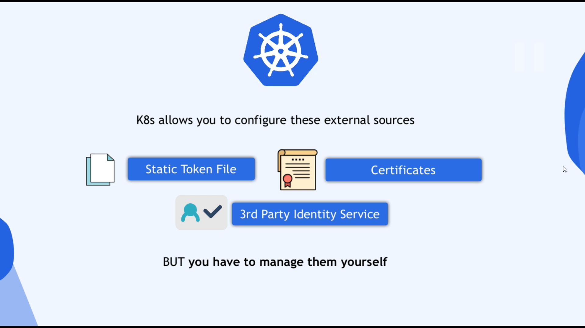

</div> <!-- External Source for Authentication -->
</div> <!-- User & Groups in Kubernetes -->

### Service Accounts

<div id="Service-Accounts">

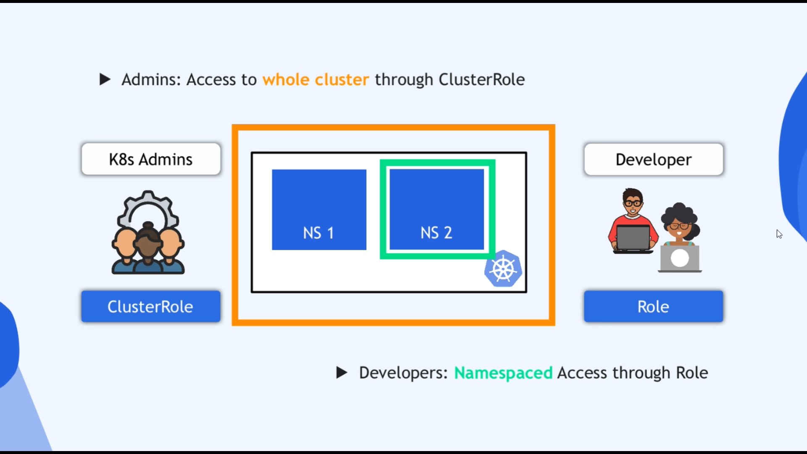

How about Authorization for Applications

* Applications are **inside** the cluster and **outside** the cluster
* e.g.:

    1) Monitoring Apps, which collects metrics from other apps within the cluster (Prometheus)
    2) CI/CD Server deploying apps inside the cluster (Jenkins)
    3) Infrastructure Provisioning Tools configuring the cluster (Terraform)

* We also want Apps to have **only the permission it needs!**


* **ServiceAccount**: K8s Component that **represent an Application as User**
    * Link ServiceAccount to `Role` with RoleBinding (e.g., CI/CD example)
    * Link ServiceAccount to `ClusterRole` with ClusterRoleBinding (e.g., Monitoring Apps)

</div> <!-- Service Accounts -->

### Example Configuration Files

<div id="Example-Configuration-Files-in-rbac">

* **`Role` Configuration File**

```yaml
apiVersion: rbac.authorization.k8s.io/v1
kind: Role
metadata:
  namespace: my-app
  name: developer
rules:
  - apiGroups:
      - ""
    resources:
      - pods
    verbs:
      - get
      - list
      - watch
    resourceNames: # Optional
      - "myapp"
  - apiGroups:
      - ""
    resources:
      - secrets
    verbs:
      - get
    resourceNames: # Optional
      - "myapp"
```

* `apigroups`: `""` Indicates the **core API group**
* `resources`: K8s components like Pods, Deployments, etc.
* `verbs`:
    * [X] The actions on a resource
    * [X] `get`, `list` (read-only) or `create`, `update` (read-write)
* `resourceNames`: Define access to only certain pods in that namespace

---

* **`RoleBinding` Configuration File**

```yaml
apiVersion: rbac.authorization.k8s.io/v1
kind: RoleBinding
metadata:
  name: jane-developer-binding
subjects:
  - apiGroup: rbac.authorization.k8s.io
    kind: User
    name: jane
roleRef:
  apiGroup: rbac.authorization.k8s.io
  kind: Role
  name: developer
```

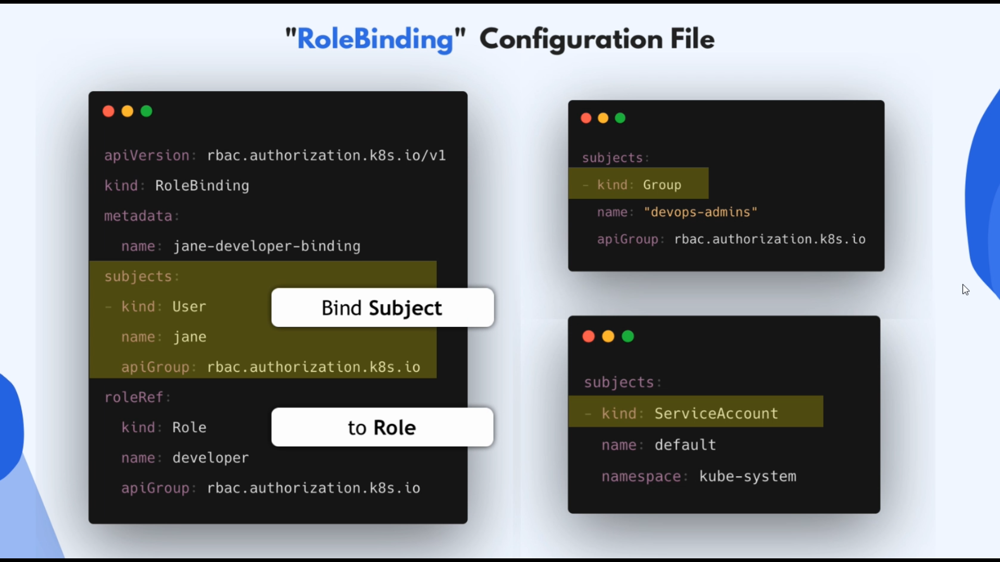

---

* **`ClusterRole` Configuration File**

```yaml
apiVersion: rbac.authorization.k8s.io/v1
kind: ClusterRole
metadata:
  name: cluster-admin
rules:
  - apiGroups:
      - ""
    resources:
      - nodes
    verbs:
      - get
      - list
      - create
      - delete
      - update
```

1) Define access for **cluster-wide resources**
2) Define access for **namespace resources**

</div> <!-- Example Configuration Files -->

### `Creating` & `Viewing` RBAC Resources

<div id="Creating-Viewing-RBAC-Resources">

* Create `Role`, `ClusterRole`, etc. just like any other Kubernetes component
    ```shell
    kubectl apply -f <ROLE-MANIFEST.YAML>
    ```

* View Components with `get` and `describe` command
    ```shell
    kubectl get roles
    kubectl describe role <NAME>
    ```

</div> <!-- Creating & Viewing RBAC Resources -->

### Checking API Access

<div id="Checking-API-Access-RBAC">

* Kubectl provides an `auth can-i` subcommand
* To quickly check if the current user can perform a given action

```shell
kubectl auth can-i create deployments --namespace dev
```

* Admins can also check the permissions of other users

</div> <!-- Checking API Access -->

### Wrap UP

<div id="Wrap-UP-RBAC-1">

**Layers of Security**

Let's say our Jenkins application from outside the cluster wants to connect to the cluster:

1) API Server checks if Jenkins User is authenticated
2) Is Jenkins **allowed** to **connect to the cluster at all?**
3) You can enable multi-authentication methods at once
4) RBAC is one of the multiple Authorization Modes
5) With RBAC: Role, ClusterRole, and Bindings are checked


</div> <!-- Wrap UP -->

## Other Authorization Modes

<div id="Other-Authorization-Modes">

`RBAC` is one of four authorization modes...

* 4 Authorization Modes:

    1) Node
    2) ABAC
    3) RBAC
    4) Webhook

* [X] [Kubernetes Docs](https://kubernetes.io/docs/reference/access-authn-authz/authorization/#authorization-modules)
* You can choose more than one authorization modules

Where to enable the authorization mode?

* In the `API Server` configuration
    ```shell
    sudo vim /etc/kubernetes/manifests/kube-apiserver.yaml
    ```

and check the `- --authorization-mode=Node,RBAC` under the command section:

```yaml
spec:
  containers:
    - command:
        - kube-apiserver
        - --advertise-address=192.168.220.121
        - --allow-privileged=true # Enabled by default
        - --authorization-mode=Node,RBAC
```

</div> <!-- Other Authorization Modes -->

## Certificates in Kubernetes

<div id="RBAC-Certificates-in-Kubernetes">

We already saw that when we initialized our cluster, kubeadm generated certificates automatically and stored them:

* `Server Certificate` in `/etc/kubernetes/pki` (`apiserver.crt` & `apiserver.key`)
* `ETCD Certificate` in `/etc/kubernetes/pki/etcd`

Kubeadm inits also generated a `Client Certificate` for other services that talk to the API Server.

How signed those Certificates?

* Kubeadm generated a CA for K8s cluster
* All clients have a copy of k8s CA
  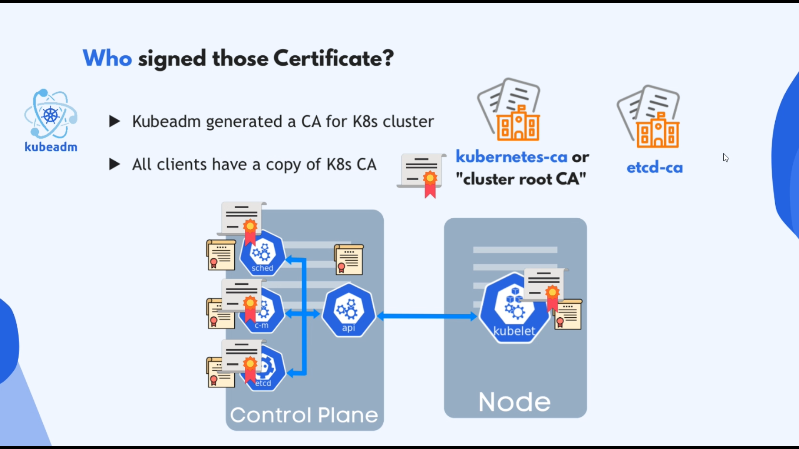
* [X] K8s CA's are trusted within K8s by all components, who have a copy of the CA

</div> <!-- Certificates in Kubernetes -->

## Certificates `API`

<div id="RBAC-Certificates-API"> 

As we said before, K8s allow you to configure these external sources;

But **you have to manage them yourself** in this section, we talk about Configure User Authentication
via `Certificates.`

### `Process` of Certificate Signing

<div id="Process-of-Certificate-Signing">

Process of signing a `Client Certificate`:

1) Create Key-Pair
2) Generate `Certificate Signing Request (CSR)`
3) Send CSR using K8s Certificate API
4) K8s signs certificate for you (`Pending` State)
5) K8s admin approves the certificate

</div> <!-- Process of Certificate Signing -->
</div> <!-- Certificates API -->

## Demo Overview

<div id="RBAC-Demo-Overview">

In this overview:

* User Account
    * Create a client key with `openssl`
    * Create `CertificateSigningRequest` for key
    * Approve `CertificateSigningRequest`
    * Get signed certificate
    * Permit to create, delete, and update K8s resources
    * Validate user permission
* Service Account
    * Create a Service Account for Jenkins
    * Give Permissions to create, delete, and update K8s resources

## Create User Account

<div id="DEMO-Create-User-Account">

* Create a client key (Private) with openssl
  ```shell
  openssl genrsa -out dev-tom.key 2048
  ```
* Create CertificateSigningRequest for key
  ```shell
  openssl req -new -key dev-tom.key -subj "/CN=tom" -out dev-tom.csr
  ```

### Create `CSR K8s Resource`

* dev-tom-csr.yaml
  ```yaml
  apiVersion: certificates.k8s.io/v1
  kind: CertificateSigningRequest
  metadata:
    name: dev-tom
  spec:
    request: BASE64 VALUE OF THE CSR FILE with below command
    signerName: kubernetes.io/kube-apiserver-client
    expirationSeconds: 86400  # one day
    usages:
    - client auth
  ```
    * [X] `cat dev-tom.csr | base64 | tr -d "\n"`
    * [Docs](https://kubernetes.io/docs/reference/access-authn-authz/certificate-signing-requests/#create-certificatesigningrequest)

* Now apply it with `kubectl apply -f dev-tom-csr.yaml` and check it:
  ```shell
  kubectl get csr
  ```

#### Approve `CSR`

```shell
kubectl certificate approve dev-tom

```

#### Get signed certificate

```shell
kubectl get csr dev-tom -o yaml
```

Under the status section, you see a `certificate` key that its value is coded with `base64`

Just copy it and:

```shell
echo 'BASE64 CODED CERTIFICATE' | base64 --decode > dev-tom.crt
```

</div> <!-- Create User Account -->

### Connect to K8s Cluster

<div id="DEMO-Connect-to-K8s-Cluster">

---

#### kubectl `options`:

First check the kubernetes control plane address by: `kubectl cluster-info`, then:

```shell
kubectl \
--server https://192.168.220.121:6443 \ # The address from above command
--certificate-authority /etc/kubernetes/pki/ca.crt \
--client-certificate dev-tom.crt \
--client-key dev-tom.key \
get pod
```

However, it will fail after executing because we already have a `config` file in the `~/.kube` folder...

Move the `~/.kube/config` file somewhere else and execute the command again...

This time it will execute correctly but shows a `Forbidden` message since the new user doesn't have any Role. (
Authenticated, but no permissions yet!)

---

#### Use `kubeconfig file`

* First copy the `config` to change its content:
  ```shell
  cp config dev-tom.conf
  ```
* then open the file and change all the `kubernetes-admin` to `dev-tom`
* Then, under the `user` section, you have two keys: `client-certificate-data` & `client-key-data` that we have to
  change
  & config, for that, we have two options (We'll see them both):
    1) Reference Files
    2) Include base64-encoded content

#### 1) Reference Files:

Change the keys like so:

```yaml
# [ ... ]
users:
  - name: dev-tom
    user:
      client-certificate: dev-tom.crt
      client-key: dev-tom.key
```

Now the kubectl works fine: `kubectl --kubeconfig dev-tom.conf get pod`

* Now we should Give all the 3 files (`dev-tom.conf`, `dev-tom.crt`, `dev-tom.key`) to Tom

#### 2) Include base64-encoded content

But isn't it better if we give Tom only one file?!

* encode `dev-tom.crt`
  ```shell
  base64 dev-tom.crt | tr -d "\n"
  ```
* encode `dev-tom.key`
  ```shell
  base64 dev-tom.key | tr -d "\n"
  ```

* Change the `dev-tom.conf` like so:
  ```yaml
  # [...]
  users:
    - name: dev-tom
      user:
        client-certificate-data: BASE64 VALUE OF THE dev-tom.crt
        client-key-data: BASE64 VALUE OF THE dev-tom.key
  ```

Now everything is working like a charm, and you only have to give `dev-tom.conf` to Tom.

Alternatively, you can rename the `dev-tom.conf` to `config` and place it in the `~/.kube` folder using `kubectl`
command line before (`kubectl get pod`)

</div> <!-- Connect to K8s Cluster -->

### Give User Permission (ClusterRole & ClusterRoleBinding)

<div id="DEMO-Give-User-Permission">

* **Recap**
    * User created in the cluster
    * Certificate signed by K8s CA
    * We have a valid Kubeconfig

* But we don't have permissions to do anything! in this section, we want to Give permissions to CRUD common resources in
  `all namespaces`. So, in this section we:
    1) Create `ClusterRole`
    2) Create `ClusterRoleBinding`

#### Create `ClusterRole`

<div id="Create-ClusterRole-RBAC">

* First we use an autogenerated template (`dev-cr.yaml`) and change it a little bet
  ```shell
  kubectl create clusterrole dev-cr --verb=get,list,create,update,delete --resource=deployments.apps,pods --dry-run=client -o yaml > dev-cr.yaml
  ```

  ```yaml
  apiVersion: rbac.authorization.k8s.io/v1
  kind: ClusterRole
  metadata:
    name: dev-cr
  rules: # List of "rules"
  
  - apiGroups: # Rules are defined per apiGroups
    - ""
    resources:
    - pods # Remember: resources always define in "Plural of kind"
    - services
    verbs: ["*"] # All kind of actions
  
  - apiGroups:
    - apps
    resources:
    - deployments
    - statefulSets
    verbs:
    - get
    - list
    - create
  ```
    * be sure to check the [docs](https://kubernetes.io/docs/reference/generated/kubernetes-api/v1.23/) for all
      the `apiGroups`.
    * [List of Kubernetes RBAC rule verbs](https://stackoverflow.com/questions/57661494/list-of-kubernetes-rbac-rule-verbs)

* Apply this file with `cluster-admin` kubeconfig
  ```shell
  kubectl --kubeconfig config apply -f dev-cr.yaml
  ```

* Check it
  ```shell
  kubectl --kubeconfig config get clusterrole
  ```
  ```shell
  kubectl --kubeconfig config describe clusterrole dev-cr
  ```

</div> <!-- Create ClusterRole -->

#### Create `ClusterRoleBinding`

<div id="Create-ClusterRoleBinding-RBAC">

* First we use an autogenerated template (`dev-crb.yaml`)
  ```shell
  kubectl create clusterrolebinding dev-crb --clusterrole=dev-cr --user=tom --dry-run=client -o yaml > dev-crb.yaml
  ```

  ```yaml
  apiVersion: rbac.authorization.k8s.io/v1
  kind: ClusterRoleBinding
  metadata:
    name: dev-crb
  roleRef: # reference existing role
    apiGroup: rbac.authorization.k8s.io
    kind: ClusterRole
    name: dev-cr
  subjects: # reference existing User, Group or ServiceAccount
    - apiGroup: rbac.authorization.k8s.io
      kind: User
      name: tom
  ```

* Apply this file with `cluster-admin` kubeconfig
  ```shell
  kubectl --kubeconfig config apply -f dev-crb.yaml
  ```

* Check it
  ```shell
  kubectl --kubeconfig config get clusterrolebinding
  ```
  ```shell
  kubectl --kubeconfig config describe clusterrolebinding dev-crb
  ```

</div> <!-- Create ClusterRoleBinding -->

#### Checking `API Access`

<div id="Checking API Access-RBAC">

* And now, at this point, we can see all the Pods, but NOT node, for example...
  ```shell
  kubectl get pods # Return all the pods
  ```
  ```shell
  kubectl get nodes # Return a "Forbidden" error
  ```

* `auth can-i`: kubectl subcommand for quickly querying the API authorization layer
  ```shell
  kubectl --kubeconfig config auth can-i get pods --as tom
  ```
  ```shell
  kubectl --kubeconfig config auth can-i create pods --as tom
  ```
  ```shell
  kubectl --kubeconfig config auth can-i get nodes --as tom
  ```

</div> <!-- Checking API Access -->
</div> <!-- Give User Permission (ClusterRole & ClusterRoleBinding) -->

## Service Account & permissions

<div id="DEMO-Service-Account-permissions">

K8s distinguishes between a **user account** and a **service account**.

* Service Accounts provide an **identity for processes** that run in a Pod
* Assign **permissions** to that Service Account via `Role` and `ClusterRole` (`Binding`)

### Create `ServiceAccount`

<div id="Create-ServiceAccount-RBAC">

* Create a ServiceAccount (`jenkins-sa.yaml`)
  ```yaml
  kubectl create serviceaccount jenkins --dry-run=client -o yaml > jenkins-sa.yaml
  ```
  ```yaml
  apiVersion: v1
  kind: ServiceAccount
  metadata:
    name: jenkins
  ```

* Apply this file. Based on your Kubernetes version, you should consider:

1) If your Kubernetes version is before `1.24`, the ServiceAccount will automatically create a Token (`Secret`) for
   you...
   this means after running `kubectl describe serviceaccount jenkins`. You should see a **Token**...

2) But if your Kubernetes version is equal greater than `1.24`, you should do some extra steps:

* create a `Secret` manually for your ServiceAccount:
  ```yaml
  apiVersion: v1
  kind: Secret
  type: kubernetes.io/service-account-token
  metadata:
    name: jenkins
    annotations:
      kubernetes.io/service-account.name: "jenkins"
  ```
* Apply this secret in the same namespace that you applied the `jenkins-sa.yaml` and, you are good to go...

* Sources
    * [blog](https://itnext.io/big-change-in-k8s-1-24-about-serviceaccounts-and-their-secrets-4b909a4af4e0)
    * [kubernetes docs](https://kubernetes.io/docs/concepts/configuration/secret/#service-account-token-secrets)
    * [kubernetes github](https://github.com/kubernetes/kubernetes/blob/master/CHANGELOG/CHANGELOG-1.24.md#urgent-upgrade-notes)


* [X] NOTE: in the rest of this tutorial, we are going with option number 2. so I assume your Kubernetes version is
  greater or equal to `1.24.X`. If not, it's OK! You can still follow along.

</div> <!-- Create ServiceAccount -->

### Access Cluster with Service Account

<div id="Access-Cluster-with-Service-Account-RBAC">

* Now we want that generated token! for that:
  ```shell
  kubectl get secret <SECRET-NAME> -o yaml
  ```

* Save this token variable inside a `$token`:
  ```shell
  token=<THE-TOKEN>
  ```
    * [X] If your `version < 1.24` then you have to first `base64 --decode` the token and after that save it in `$token`

* Test the connection
  ```shell
  kubectl --server <ADDRESS> --certificate-authority /etc/kubernetes/pki/ca.crt --token $token get pod
  ```

At this point you can see everything is correct, but still we don't have permissions...

* Create a configuration file for jenkins (`jenkins.conf`)
  ```yaml
  apiVersion: v1
  clusters:
  - cluster:
      certificate-authority-data: LS0tLS1CRUdJTiBDRVJUSUZJQ0FURS0tLS0tCk1JSUMvakNDQWVhZ0F3SUJBZ0lCQURBTkJna3Foa2lHOXcwQkFRc0ZBREFWTVJNd0VRWURWUVFERXdwcmRXSmwKY201bGRHVnpNQjRYRFRJeU1EVXpNREEzTVRVMU1Wb1hEVE15TURVeU56QTNNVFUxTVZvd0ZURVRNQkVHQTFVRQpBeE1LYTNWaVpYSnVaWFJsY3pDQ0FTSXdEUVlKS29aSWh2Y05BUUVCQlFBRGdnRVBBRENDQVFvQ2dnRUJBTWNQClBsQ1lLb0Yxb2Z1cmxtc01zSXFxc1FXeEd2Z0xnemlDRFNIcDN3S2NrZVBUREE2VW9vZDRmUDNTM21oR25HS1cKNHhRSHdDRlovWjlkMWRuNHVYMjJNN1NQbzRZS2xlNFkzMUlTRmgxM0lCUnJZM0FrN1lkaVo0UlVYamxjWVhrWQo5ZFdyWUYvSlc0MXdsd1RFemZseEsyeXY1bjlnaTgzaVNNN1ZOcXRWRFkvbVZuQ3YwRXNRN1NiTVlnZUI4aG9XCmpGRVozRUxZeDVJQXZ5dmF2K2pxOTJ1bjJ3bmcwWE4yK04rSkxyY0pJTmhrQkRvRC9HMWpmYlVFR3dqeUZGTkoKejROcEhRYnpwZGRDazk4RHFHRkR2L1lPVExoRW16NWpZdktMYmZqeWJoSUF3YkI0UktlM1E4YkZjcm5WVndkcQpxa0FYY1Y3M04xQ2lnckRiMnFzQ0F3RUFBYU5aTUZjd0RnWURWUjBQQVFIL0JBUURBZ0trTUE4R0ExVWRFd0VCCi93UUZNQU1CQWY4d0hRWURWUjBPQkJZRUZLK0M2ZXM1cWc1ejA4Qy9VaEI2Nm1iSW5OdlJNQlVHQTFVZEVRUU8KTUF5Q0NtdDFZbVZ5Ym1WMFpYTXdEUVlKS29aSWh2Y05BUUVMQlFBRGdnRUJBR296WG9DdEJJOE5zd2g4WGxTVwppMEJMWlR4bUpBOU5UQXc2Q29HNDJiMVZoeGh6b2J3NnZDUHdqZnpqMGRXalBMQ0NaRnVXSzM0UTViNkdNWk4rCm5pdG5uOWhvYjFlbW9SVk5OZnBGYUJZOS8zdFZJWlRNTVFQd3JFaDRaNWYrQ3ZMTHpBM0szak1GZFN5U1hWTXMKeFpGYkdIM3hVb2tNbEJHdmJ6VnF0L2s4OGh2Vi91RTVNOFN4NkJpb3pMa2lGY2I1SlpSalA5Z053d01VMHBFeQpSeDQrSmp5elFxQkVCLzRRZzdoZVJNU0NXdDdZNjlNTzc2ZlA3YVhzRDkrd2tpR0tDa3hFeHBBTzE3YTI5ZkE3CkVrZ2VDSWRXVjExUk5JaGo3VkFidXRuV0p1Y0E4TkRFQlkyaHhDZUd6bzE4VFFGbjhDZUhQUEEvdFduZVNibFoKcG9JPQotLS0tLUVORCBDRVJUSUZJQ0FURS0tLS0tCg==
      server: https://192.168.220.121:6443
    name: kubernetes
  contexts:
  - context:
      cluster: kubernetes
      user: jenkins
    name: jenkins@kubernetes
  current-context: jenkins@kubernetes
  kind: Config
  preferences: {}
  users:
  - name: jenkins
    user:
     token: <TOKEN>
  ```
    * [X] If your `version < 1.24` then you have to first `base64 --decode` the token and after that save it in `$token`

* You can access the cluster via a configuration file
  ```yaml
  kubectl --kubeconfig jenkins.conf get pod
  ```

</div> <!-- Access Cluster with Service Account -->

### Give Permission (Role & RoleBinding)

<div id="Give -Permission-Role-RoleBinding-RBAC-SA">

At this point, Jenkins is Authenticated, But no permissions.

In this section, we give permissions only to a specific namespace. We use `Role` for namespaced permissions.

* [X] Security Best Practice: Give the least privilege...

---

**Create Role**

* Create a role (`cicd-role.yaml`)
  ```shell
  kubectl create role cicd-role --verb=create,update,list --resource=deployments.apps,services --dry-run=client -o yaml > cicd-role.yaml
  ```
  ```yaml
  apiVersion: rbac.authorization.k8s.io/v1
  kind: Role
  metadata:
    name: cicd-role
    namespace: default # Optional
  rules:
  - apiGroups:
    - ""
    resources:
    - services
    verbs:
    - create
    - update
    - list
  - apiGroups:
    - apps
    resources:
    - deployments
    verbs:
    - create
    - update
    - list
  ```

Apply this file.

---

**Create RoleBinding**

* Create a RoleBinding (`cicd-binding.yaml`)
  ```shell
  kubectl create rolebinding cicd-binding --role=cicd-role --serviceaccount=default:jenkins --dry-run=client -o yaml > cicd-binding
  ```
  ```yaml
  apiVersion: rbac.authorization.k8s.io/v1
  kind: RoleBinding
  metadata:
    name: cicd-binding
  roleRef:
    apiGroup: rbac.authorization.k8s.io
    kind: Role
    name: cicd-role
  subjects:
  - kind: ServiceAccount
    name: jenkins
    namespace: default
  ```

Apply this file, then check the jenkins permission.

* Check the permissions
  ```shell
  kubectl auth can-i watch deployment --as system:serviceaccount:default:jenkins -n default
  ```
  ```shell
  kubectl auth can-i create service --as system:serviceaccount:default:jenkins -n my-app
  ```

</div> <!-- Give Permission (Role & RoleBinding) -->
</div> <!-- Service Account & permissions -->
</div> <!-- Demo Overview -->

<p align="right">(<a href="#top">back to top</a>)</p>

# Troubleshooting In Kubernetes

## Troubleshoot Applications

<div id="Troubleshoot-Applications-Troubleshooting">

* Is a Pod running?
  ```shell
  kubectl get POD_NAME
  ```

* Is Pod registered with Service?
* Is Service forwarding the request?
  ```shell
  kubectl get ep
  ```
  ```shell
  kubectl describe SERVICE_NAME
  ```

* Is Service accessible?
  ```shell
  nc SERVICE_IP SERVICE_PORT
  ```
  ```shell
  ping SERVICE_NAME
  ```

* Check application logs
  ```shell
  kubectl logs POD_NAME
  ```

* Check Pod status and recent events
  ```shell
  kubectl describe pod POD_NAME
  ```

These were just Simple paths of troubleshooting Pod and Application

</div> <!-- Troubleshoot Applications -->

## Debug with temporary Pods -- Busy-Box

Pod Network is different from a Cluster Node Network.

* Execute troubleshooting commands from `within` a Pod
* [X] Common Docker images with Unix utilities...
* [Busybox](https://hub.docker.com/_/busybox) provides several Unix utilities in a single executable file.
  e.g. `ifconfig`, `nslookup`, `netstat`, `ping`, [etc](https://boxmatrix.info/wiki/BusyBox-Commands).

* Run a single BusyBox Pod
  ```shell
  kubectl run debug-pod --image=busybox
  ```

After running this command, your Pod status will change from `Running` to `Completed` status..., and you can not execute
the `kubectl exec -it debug-pod -- sh` in it ... But why is that?!

---

* Containers execute a specific task
    * Run MySQL database...
    * Start web application
    * Synchronize data...
* Container exists once the task is done
* **Container lives as long as a process inside lives**

Where do you see what process a container starts?

* Dockerfile --> CMD command
    * specifies the instruction that is to be executed when a Docker container starts

* When we look at [busybox Dockerfile](https://github.com/docker-library/busybox/blob/master/stable/glibc/Dockerfile)
  we see that the default CMD is `sh`, sp if no terminal is attached, it exits...

So, How to keep the busybox container alive? Here are 2 Options:

1) Start busybox with interactive mode (`-it`)
    ```shell
    kubectl run debug-pod --image=busybox -it
    ```
    * Now, the busybox Pod will always be in the `Running` state. even if we exit, we can
      reattach to the container via `kubectl exec -it debug-pod -- sh`
2) Define `command` and `args` in Configuration File...

### Commands & Args

* Overwrite Dockerfile command?
  ```shell
  docker run <image_name> <command> 
  ```
    * The <command> will overwrite the CMD instruction
* Not overwrite, but pass parameters?
    * like `sh my-script.sh`
    * Not possible with `CMD` instruction
    * `Entrypoint` instruction allows appending other commands

---

* CMD
    * Main purpose of CMD is to provide defaults for an executing container.
* ENTRYPOINT
    * Preferred for the executable that should always run.
    * allow users to append other commands.
* CMD & ENTRYPOINT
    * ENTRYPOINT = defines the process that starts in the container.
    * CMD = provides **default arguments** for the `ENTRYPOINT` instruction.

How does this map to Kubernetes?

* `ENTRYPOINT` is the `command`.
* `CMD` is the `arguments`.

  ```yaml
  apiVersion: v1
  kind: Pod
  metadata:
    name: busybox-pod
  spec:
    containers:
    - image: busybox
      name: busybox-container 
      command: ["sh"] # ENTRYPOINT
      args: ["-c", "while true; do echo Hello-World!; sleep 5; done"] # CMD           
  ```

* Overwrite commands using K8s configuration
    * No need for adjustment in the Docker Image
    * Flexibility overwrite in Pod configuration

---

Execute commands in the Pod environment without entering the Pod.

```shell
kubectl exec -it busybox-pod -- sh -c "while true; do echo hello; sleep2; done"
```

* BASH or SHELL?
    * bash is a superset of shell
    * bash has more functionality & more elegant syntax
    * [X] Some images don't have bash available

<div id="Commands-Args-Troubleshooting"></div> <!-- Commands & Args -->
<div id="Debug-with-temporary-Pods-Busy-Box"></div> <!-- Debug with temporary Pods -- Busy-Box -->

## Kubectl Format Output

<div id="Kubectl-Format-Output-Troubleshoot">

* [X] In previous sections, we learned Debugging inside the Pod
* Now, we are going to Debug cluster components using kubectl
* Exact information in a digestible way

---

* Get a massive list of attributes about our nodes:
  ```shell
  kubectl get no -o json
  ```

But this is too much! well, Kubectl uses `JSONPath` expressions to filter on specific fields in the
`JSON` object and format the output...

* `-o wide`: Standard output with additional information.
* `-o yaml`: Output a YAML formatted object.
* `-o json`: Output a JSON formatted object.

---

### Output Option: JSONPath

<div id="Output-Option-JSONPath-Troubleshooting">

* JsonPath is a query language for JSON
* Similar to XPath for XML
* Kubectl uses JSONPath expression to filter on specific fields


* Get first pod name:
  ```shell
  kubectl get pod -o jsonpath='{.items[0].metadata.name}'
  ```
* Get All pods names:
  ```shell
  kubectl get pod -o jsonpath='{.items[*].metadata.name}'
  ```
* Iterate between names:
  ```shell
  kubectl get pod -o jsonpath='{ range .items[*]}{.metadata.name}{"\n"}{end}'
  ```
* Get names + IP addresses:
  ```shell
  kubectl get pod -o jsonpath='{ range .items[*]}{.metadata.name}{"\t"}{.status.podIP}{"\n"}{end}'
  ```
* We can write custom scripts for JSONPath expressions


* Add columns using `custom-columns` output format:
  ```shell
  kubectl get pod -o custom-columns=POD_NAME:.metadata.name,POD_IP:.status.podIP,CREATED_AT:.status.startTime
  ```
  ```shell
  POD_NAME                                    POD_IP         CREATED_AT
  nginx-deployment-74d589986c-6bqv4           10.1.116.82    2022-07-02T10:10:48Z
  nginx-deployment-74d589986c-gpfm7           10.1.116.105   2022-07-02T10:10:48Z
  ingress-nginx-controller-6587d85c87-tzwpd   10.1.116.91    2022-07-09T05:19:27Z
  ```

* In this section we learned:
    * [X] Some useful ways of debugging
    * [X] Find information more efficiently

</div> <!-- Output Option: JSONPath -->
</div> <!-- Kubectl Format Output -->

## Troubleshoot Kubelet & Kubectl

### Troubleshoot Kubelet issue

<div id="Troubleshoot-Kubelet-issue">

What if one of our worker nodes gets into `NotReady` status?! This problem is most commonly for `kubelet`, So,
Check the Kubelet process.

* Check kubelet status:
  ```shell
  service kubelet status
  ```
* Check extended logs of Kubelet service with `journalctl`:
  ```shell
  journalctl -u kubelet
  ```
* Check where the kubelet is:
  ```shell
  which kubelet
  ```
* Open the kubelet configuration (Check the path via `service kubelet status`):
  ```shell
  sudo vim /etc/systemd/system/kubelet.service.d/10-kubeadm.conf
  ```
  ```editorconfig
  # Note: This dropin only works with kubeadm and kubelet v1.11+
  [Service]
  Environment="KUBELET_KUBECONFIG_ARGS=--bootstrap-kubeconfig=/etc/kubernetes/bootstrap-kubelet.conf --kubeconfig=/etc/kubernetes/kubelet.conf"
  Environment="KUBELET_CONFIG_ARGS=--config=/var/lib/kubelet/config.yaml"
  # This is a file that "kubeadm init" and "kubeadm join" generates at runtime, populating the KUBELET_KUBEADM_ARGS variable dynamically
  EnvironmentFile=-/var/lib/kubelet/kubeadm-flags.env
  # This is a file that the user can use for overrides of the kubelet args as a last resort. Preferably, the user should use
  # the .NodeRegistration.KubeletExtraArgs object in the configuration files instead. KUBELET_EXTRA_ARGS should be sourced from this file.
  EnvironmentFile=-/etc/default/kubelet
  ExecStart=
  ExecStart=/usr/bin/kubelet $KUBELET_KUBECONFIG_ARGS $KUBELET_CONFIG_ARGS $KUBELET_KUBEADM_ARGS $KUBELET_EXTRA_ARGS
  ```

* in the `ExecStart` section, check the `/usr/bin/kubelet` path is the same
  path as you got from `which kubelet`
* Reload the service
  ```shell
  sudo systemctl daemon-reload
  sudo systemctl restart kubelet
  ```
* Check the kubelet service again
  ```shell
  service kubelet status
  ```

</div> <!-- Troubleshoot Kubelet issue -->

### Troubleshoot kubectl connection issue

<div id="Troubleshoot-kubectl-connection-issue">

If you can not connect to the cluster: Check the `~/.kube/config` file:

* Check if CA Certificate is correct?
  ```shell
  echo 'CA-CERTIFICATE' | base64 --decode
  ```
  ```shell
  sudo cat/etc/kubernetes/pki/ca.crt
  ```
    * This two value should be the same.
* Check if server endpoint is correct?

</div> <!-- Troubleshoot kubectl connection issue -->

<p align="right">(<a href="#top">back to top</a>)</p>

# Multiple Containers in a Pod

Great! Now developers have access to the cluster and know how to debug it. but let's say they have some
scripts that are NOT part of the main application, e.g., Updating the cache, Doing authentication tasks, collecting
logs,
etc., or Scripts that run "before" each app start-up, or Preparing the environment before app start-up...

* What is the best way to deploy these scripts?
* How to do it in Kubernetes?

## `Init` and `Sidecar` Containers

<div id="Init-and-Sidecar-Containers">

### `Sidecar` Container

* You can have multiple containers inside the Pod
* Main and Helper application
* The container providing helper functionality is called the sidecar container
* Usually operates asynchronously
* [X] Can talk to each other using localhost (WithOUT DNS, IP, etc.)
* [X] Can share data

---

### `Init` Container

* e.g.:
    * Set Environment Variables
    * System Checks
    * Wait for service to be available
* Run once in the beginning and exits
* the Main container starts afterward
* Init containers are used to `initialize` something inside your Pod
  ```yaml
  apiVersion: v1
  kind: Pod
  metadata:
    name: myapp-pod
  spec:
    containers:
      - name: myapp-container
        image: busybox:1.8
        command: ['sh', '-c', 'echo the app is running!']
    initContainers:
      - name: init-myservice
        image: busybox:1.28
        command: ['sh', '-c', 'COMMAND']
  ```

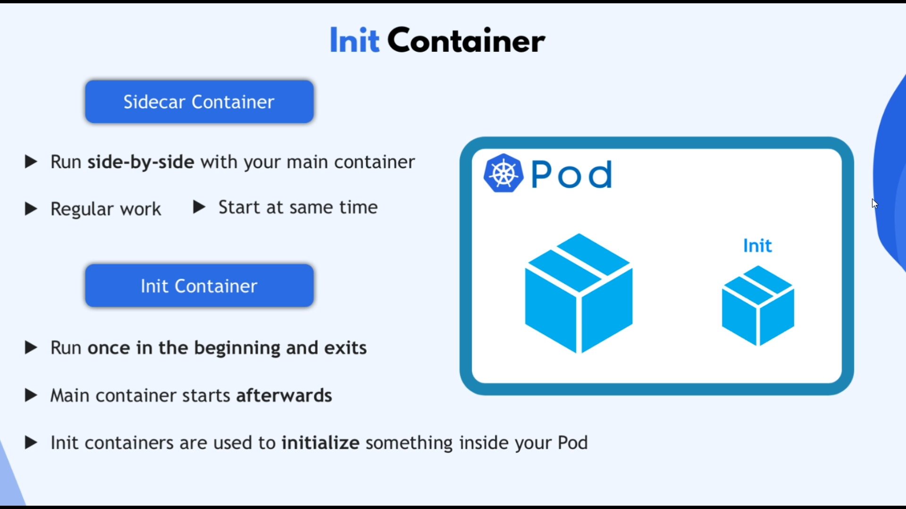

</div> <!-- Init and Sidecar Containers -->

## Add Sidecar and Init Container

### Add Sidecar Container

<div id="Add-Sidecar-Container">

* Create a file and apply it
  ```yaml
  apiVersion: apps/v1
  kind: Deployment
  metadata:
    name: nginx-deployment
    labels:
      app: nginx
  spec:
    replicas: 3
    selector:
      matchLabels:
        app: nginx
    template:
      metadata:
        labels:
          app: nginx
      spec:
        containers:
        - name: nginx
          image: nginx
          ports:
          - containerPort: 80
        - name: log-sider
          image: busybox
          command: ['sh', '-c', "while true; do echo sync app logs; sleep 20; done"]                                                                                                         
  ```
* Checks these things out:
    * Pods and their creation
    * the pod logs (when you have multiple containers, you always need to specify the container!)

</div> <!-- Add Sidecar Container -->

### Add Init Container

<div id="Add-Init-Container">

* Adding an Init container to the previous file:
  ```yaml
  apiVersion: apps/v1
  kind: Deployment
  metadata:
    name: nginx-deployment
    labels:
      app: nginx
  spec:
    replicas: 3
    selector:
      matchLabels:
        app: nginx
    template:
      metadata:
        labels:
          app: nginx
      spec:
        containers:
        - name: nginx
          image: nginx
          ports:
          - containerPort: 80
        - name: log-sider
          image: busybox
          command: ['sh', '-c', "while true; do echo sync app logs; sleep 20; done"]
        initContainers:
          - name: mydb-available
            image: busybox
            command: ['sh', '-c', "until nslookup mydb-service; do echo waiting for database; sleep 4; done"]
  ```
    * Check that the pods remain at the `Init` state...
* Create a service and see that the Pods state will change!
  ```shell
  kubectl create svc clusterip mydb-service --tcp=80:80
  ```

</div> <!-- Add Init Container -->

## Exposing Pod and Cluster Vars to Containers

<div id="Exposing-Pod-and-Cluster-Vars-to-Containers">

Let's say you need some data about your application's Pod or K8s environment to add Pod information as metadata
to logs. Such as e.g.

* Pod IP
* Pod Namespace
* Service Account of Pod

* But how to access this information?
    * [X] All Pod information can be made available in the config file

* There are two ways to expose Pod fields to a running Container:
    1) Environment Variables
    2) Volume Files

---

### Environment Variable

```yaml
apiVersion: apps/v1
kind: Deployment
metadata:
  name: nginx-deployment-env
  labels:
    app: nginx
spec:
  replicas: 3
  selector:
    matchLabels:
      app: nginx
  template:
    metadata:
      labels:
        app: nginx
    spec:
      containers:
        - name: nginx
          image: nginx
          ports:
            - containerPort: 80
        - name: log-sider
          image: busybox
          command: [ 'sh', '-c' ]
          args:
            - while true; do
              echo sync app logs;
              printenv POD_NAME POD_IP POD_SERVICE_ASCCOUNT;
              sleep 20;
              done;
          env:
            - name: POD_NAME
              valueFrom:
                fieldRef:
                  fieldPath: metadata.name
            - name: POD_IP
              valueFrom:
                fieldRef:
                  fieldPath: status.podIP
            - name: POD_SERVICE_ASCCOUNT
              valueFrom:
                fieldRef:
                  fieldPath: spec.serviceAccountName
```

</div> <!-- Exposing Pod and Cluster Vars to Containers -->
<p align="right">(<a href="#top">back to top</a>)</p>

# Data Persistence

# Persisting Data with Volumes

<div id="Persisting-Data-with-Volumes">

Introduction to Kubernetes Volumes, How to `persist data` in K8s using volumes?

* Persistent Volume
* Persistent Volume Claim
* Storage Class

## The need for Volumes

<div id="The-need-for-Volumes">

### Storage Requirements

<div id="Storage-Requirements">

1) Storage that **doesn't depend on** the **pod lifecycle**.
2) Storage must be **availabe on all nodes**.
3) Storage needs to **survive** even if **cluster crashes**.

</div> <!-- Storage Requirements -->
</div> <!-- The need for Volumes -->

## Persistent Volume

<div id="Persistent-Volume">

* Persistent Volume is more like **A cluster resource**. (like CPU & RAM)
* Create via a YAML file
    * `kind: PersistentVolume`
    * `spec`: e.g., how much storage?
* Needs actual physical storage, like:
    * Cloud Storage
    * NFS server
    * Local disk

---

Where does this Storage come from, and who makes it available to the cluster?

* What **Type of Storage** do you need?
* **You** need to **create and manage** them by yourself
* [X] Think Storage as an **External plugin to your cluster**

### Persistent Volume YAML Example

<div id="Persistent-Volume-YAML-Example">

* NFS Storage
  ```yaml
  apiVersion: v1
  kind: PersistentVolume
  metadata:
    name: pv-name
  spec:
    capacity:
      storage: 5Gi # How much
    volumeMode: Filesystem
    accessModes: # Additional params, like access
      - ReadWriteOnce
    persistentVolumeReclaimPolicy: Recycle
    storageClassName: slow
    mountOptions:
      - hard
      - nfsvers=4.1
    nfs: # Nfs parameters
      path: /tmp
      server: 172.17.0.2
  ```

* Google Cloud
  ```yaml
  apiVersion: v1
  kind: PersistentVolume
  metadata:
    name: test-volumes
    labels:
      failure-domain.beta.kubernetes.io/zone: us-centrall-a__us-centrall-b
  spec:
    capacity:
      storage: 400Gi # How much
    accessModes:
      - ReadWriteOnce
    gcePersistentDisk: # Google Cloud Parametes
      pdName: my-data-disk
      fsType: ext4
  ```
* Local Storage
  ```yaml
  apiVersion: v1
  kind: PersistentVolume
  metadata:
    name: test-pv
  spec:
    capacity:
      storage: 100Gi
    volumeMode: Filesystem
    accessModes:
      - ReadWriteOnce
    persistentVolumeReclaimPolicy: Delete
    storageClassName: local-storage
    local:
      path: /mnt/disks/ssd1
    nodeAffinity:
      required:
        nodeSelectorTerms:
          - matchExpressions:
              - key: kubernetes.io/hostname
                operator: In
  ```

* Depending on storage type, spec attributes are different.
* [Complete list of storage backends supported by K8s](https://kubernetes.io/docs/concepts/storage/volumes/#volume-types)

</div> <!-- Persistent Volume YAML Example -->

---

#### Persistent Volumes are NOT namespaced

* PV outside of namespaces
* Accessible to the whole cluster

### Local vs Remote Volume Types

<div id="Local-vs-Remote-Volume-Types">

* Each Volume type has its use cases!
* Local volume types violate <a href="#Storage-Requirements">2. and 3.</a> requirement for data persistence:
    * Being tied to 1 specific node
    * Surviving cluster crashes
* For DB persistence, use remote storage!

</div> <!-- Local vs Remote Volume Types -->

### Who creates Persistence Volumes?

<div id="Who-creates-Persistence-Volumes">

* Who creates the Persistent Volumes, and when?
    * [X] K8s Administrator and K8s User
* PV are resources that need to be there **BEFORE** the Pod that **depends on** it is created...
* Admin provisions storage resources.
* Creates the PV components from these storage backends.

</div> <!-- Who creates Persistence Volumes? -->
</div> <!-- Persistent Volume -->

## Persistent Volume Claim

<div id="Persistent-Volume-Claim">

* Application has to **claim** the Persistent Volume
* We use that PVC in Pods configurations

* PVC
  ```yaml
  apiVersion: v1
  kind: PersistentVolumeClaim
  metadata:
    name: pvc-name
  spec:
    storageClassName: manual
    volumeMode: Filesystem
    accessModes:
      - ReadWriteOnce
    resources:
      requests:
        storage: 10Gi
  ```

* Pod
  ```yaml
  apiVersion: v1
  kind: Pod
  metadata:
    name: mypod
  spec:
    containers:
      - name: myapp
        image: nginx
        volumeMounts:
          - mountPath: "/var/www/html"
            name: mypd
    volumes:
      - name: mypd
        persistentVolumeClaim:
          claimName: pvc-name # The name of the PVC
  ```

</div> <!-- Persistent Volume Claim -->

## Levels of Volume abstractions

<div id="Levels-of-Volume-abstractions">

1) Pod requests the volume through the PV claim
2) Claim tries to find a volume in the cluster
3) Volume has the actual storage backend

* **NOTE:** Claims must be in the same namespace!

Then:

1) Volume is **mounted** into the **Pod**
2) Volume is **mounted** into the **Container**

---

### Why so many abstractions?

* Admins provisions storage resource
* User creates claim to PV

</div> <!-- Levels of Volume abstractions -->

## ConfigMap & Secret

<div id="ConfigMap-Secret">

* Local volumes
* Not created via PV and PVC
* Managed by Kubernetes
* Configuration file for your pod
* Certificate file for your pod

---

1) Create ConfigMap and/or Secret component
2) Mount that into your pod/container
    ```yaml
    apiVersion: v1
    kind: Pod
    metadata:
      name: mypod
    spec:
      containers:
        - name: myapp
          image: busybox
          volumeMounts:
            - name: config-dir
              mountPath: /etc/config
      volumes:
        - name: config-dir
          configMap:
            name: bb-configmap
    ```

</div> <!-- ConfigMap & Secret -->

## Storage Class

<div id="Storage-Class">

1) Admins configure storage
2) Create PV
3) K8s user claim PV using PVC

* 3rd K8s Component, which makes the process more efficient
* SC provisions PV **dynamically**, when PVC claims it...
  ```yaml
  apiVersion: storage.k8s.io/v1
  kind: StorageClass
  metadata:
    name: storage-class-name
  
  # StorageBackend is defined in the SC component via "provisioner" attribute
  # Each storage backend has own provisioner
  # `internal` provisioner - 'kubernetes.io'
  # `external` provisioner
  provisioner: kubernetes.io/aws-ebs 
  parameters: # Configure 'parameters' for storage we want to request for PV
    type: io1
    iopsPerGB: "10"
    fsType: ext4
  ```

* Requested by PersistentVolumeClaim
  ```yaml
  apiVersion: v1
  kind: PersistentVolumeClaim
  metadata:
    name: mypvc
  spec:
    storageClassName: storage-class-name # The CS name
    accessModes:
    - ReadWriteOnce
    resources:
      requests:
        storage: 100Gi
  ```

---

Storage Class usage

1) Pod claims storage via PVC
2) PVC requests storage from SC
3) SC creates PV that meets the needs of the Claim

</div> <!-- Storage Class -->
</div> <!-- Persisting Data with Volumes -->

## Configure HostPath Volume

<div id="Configure-HostPath-Volume">

Where is the data persisted?

1) Remote Storage Volumes
    * Cloud-storage
    * Remote-storage
2) local Volumes
    * Data is persisted on the K8s Node

* You should use remote storage, especially in production!
* Remote storage systems **persist data independent of the K8s Node**, where the data originated.

---

* `hostPath` Volume
    * [X] Simple configuration
    * [ ] But use only for **single node testing**. For multi-node clusters: use the `local` volume type instead.
    * [ ] Also, `hostPath` volumes contain many security risks, and it's best practice to avoid the use of `hostPaths`
      when
      possible
* **NOTE:** This is one of the volume types tested in the CKA Exam!

---

Lecture Overview

1) Create PV
    * Data is stored on the local machine
2) Create PVC
3) Create a Deployment to use Volume

### Create PersistentVolume

<div id="HostPath-Create-PersistentVolume">

```yaml
apiVersion: v1
kind: PersistentVolume
metadata:
  name: pv-data
spec:
  hostPath: # Type of PV
    path: "/mnt/data" # Depending on the type, the attributes differ
  capacity: # Capacity
    storage: 10Gi # A PV will have a specific storage capacity
  accessModes:
    - ReadWriteOnce
```

* Volume Plugins
    * ReadWriteOnce
    * ReadWriteMany
    * ReadOnlyMany
    * ReadWriteOncePod
    * [Docs](https://kubernetes.io/docs/concepts/storage/persistent-volumes/#access-modes)
    * **NOTE**: Different resource providers support specific modes

Apply this file and check the PV:

```shell
kubectl get pv
```

* It is now on `Available` status.
* A volume will be in one of the following phases:
    * `Available`: A free resource that is not yet bound to a claim
    * `Bound`: The volume is bound to a claim
    * `Released`: The claim has been deleted, but the cluster does not yet reclaim the resource
    * `Failed`: The volume has failed its automatic reclamation

</div> <!-- Create PersistentVolume -->

### Create PersistentVolumeClaim

<div id="HostPath-Create-PersistentVolumeClaim">

```yaml
apiVersion: v1
kind: PersistentVolumeClaim
metadata:
  name: mysql-data-pvc
spec:
  resources:
    requests:
      storage: 5Gi # the specification doesn't need to match 100%, but it must be most fitting option
  accessModes:
    - ReadWriteOnce
```

* In PVC, we define how much storage, access mode, etc., we need
* K8s Control Plane looks for a PV that satisfies the claims requirements
* When a suitable PV is found, it binds the claim to the volume. Otherwise, it will stay unbound.
* **NOTE**: Different volumes may be available in the cluster

</div> <!-- Create PersistentVolumeClaim -->

### Create Deployment to use Volume

<div id="HostPath-Create-Deployment-to-use-Volume">

```yaml
apiVersion: apps/v1
kind: Deployment
metadata:
  name: my-db
  labels:
    app: my-db
spec:
  replicas: 1
  selector:
    matchLabels:
      app: my-db
  template:
    metadata:
      labels:
        app: my-db
    spec:
      containers:
        - name: mysql
          image: mysql:8.0
          env:
            - name: MYSQL_ROOT_PASSWORD
              value: mypwd
          volumeMounts:
            - name: db-data
              mountPath: "/var/lib/mysql"
      volumes:
        - name: db-data
          persistentVolumeClaim:
            claimName: mysql-data-pvc
```

* Check inside the containers, the node path, etc.
* [ ] **NOTE**: When Pod gets scheduled to another worker Node, the data won't be available!

---

* Some useful links:
    * [kubernetes persistent volume accessmode](https://stackoverflow.com/questions/37649541/kubernetes-persistent-volume-accessmode)
    * [What to do with Released persistent volume?](https://stackoverflow.com/questions/50667437/what-to-do-with-released-persistent-volume)

</div> <!-- Create Deployment to use Volume -->
</div> <!-- Configure HostPath Volume -->

## emptyDir Volume

<div id="emptyDir-Volume">

* Logging Use Case
    * Can't access each other's file system
    * Doesn't need to be persisted
* Caching Use Case
    * Storage can be shared
    * No persistence necessary

---

emptyDir Volume

* Suitable for multi-container Pods
* All containers in the Pod can read and write the same files in the emptyDir Volume
* EmptyDir volume is **initially empty**
* Is first created when a Pod is assigned to a Node and exists as long as that Pod is running on the Node
* When Pod is removed from a Node, the Data is deleted permanently
* **Data inside the emptyDir is mounted into the containers file system**

### Configure emptyDir Volume

<div id="Configure-emptyDir-Volume">

```yaml
apiVersion: apps/v1
kind: Deployment
metadata:
  name: nginx-deployment-vol
  labels:
    app: nginx
spec:
  replicas: 1
  selector:
    matchLabels:
      app: nginx
  template:
    metadata:
      labels:
        app: nginx
    spec:
      containers:
        - name: nginx
          image: nginx
          ports:
            - containerPort: 80
          command: [ 'sh', '-c' ]
          args:
            - while true; do
              echo "$(date) INFO some app date" >> /var/log/myapp.log;
              sleep 5;
              done;
          volumeMounts:
            - name: log-data
              mountPath: /var/log
        - name: log-sider
          image: busybox
          command: [ 'sh', '-c' ]
          args:
            - tail -f /var/sidecar/myapp.log;
          volumeMounts:
            - name: log-data
              mountPath: /var/sidecar
      volumes:
        - name: log-data
          emptyDir: { }
```

```shell
kubectl logs pod/nginx-deployment-vol-7b7bf97fdf-gl96t -c log-sider
```

</div> <!-- Configure emptyDir Volume -->
</div> <!-- emptyDir Volume -->

<p align="right">(<a href="#top">back to top</a>)</p>

# ConfigMap & Secret

What is the best way to create and **pass external configuration** in K8s?

* ConfigMap
* Secret

Both allow you to **decouple environment-specific configuration** from your container images

* `ConfigMap`: **Regular non-confidential data**, like database URL
* `Secret`: Use to store **sensitive data** (The built-in security mechanism is **not** enabled by default!)

---

Pods can consume ConfigMaps or Secrets in 2 different ways:

1) As individual values --> Using Environment Variables
2) As configuration files --> Using Volumes

## Demo: Pass as Environment Variables

<div id="Demo-Pass-as-Environment-Variables">

Steps:

1) Create ConfigMap component
2) Create Secret component
3) Pass Data to Pod using Evironment Variables

### Create `ConfigMap` component

<div id="Create-ConfigMap-component-ENV">

```yaml
apiVersion: v1
kind: ConfigMap
metadata:
  name: myapp-config
data:
  db_host: mysql_service
```

</div> <!-- Create ConfigMap component -->

### Create `Secret` component

<div id="Create-Secret-component-ENV">

```yaml
apiVersion: v1
kind: Secret
metadata:
  name: myapp-secret
type: Opaque # Have many type
data: # Values must be "base64" encoded stings.
  username: bXl1c2Vy # See below command
  password: bXlwd2Q=
```

* To encoder values in base64 format:
  ```shell
  echo -n "myuser" | base64
  ```

* K8s Secrets are not encrypt by default.
* [Kubernetes secret types](https://kubernetes.io/docs/concepts/configuration/secret/#secret-types)

</div> <!-- Create Secret component -->

### Pass Data to Pod using `Evironment Variables`

<div id="Pass-ata-to-Pod-using-Evironment-Variables">

```yaml
apiVersion: apps/v1
kind: Deployment
metadata:
  name: my-app
  labels:
    app: my-app
spec:
  selector:
    matchLabels:
      app: my-app
  replicas: 1
  template:
    metadata:
      labels:
        app: my-app
    spec:
      containers:
        - name: my-app
          image: busybox
          command: [ 'sh', 'c', "printenv MYSQL_USER MYSQL_PWD MYSQL_SERVER; sleep 10" ]
          env:
            - name: MYSQL_USER
              valueFrom:
                secretKeyRef:
                  name: myapp-secret
                  key: username
            - name: MYSQL_PWD
              valueFrom:
                secretKeyRef:
                  name: myapp-secret
                  key: password
            - name: MYSQL_SERVER
              valueFrom:
                configMapKeyRef:
                  name: myapp-config
                  key: db_host
```

* Secrets and ConfigMap resources must already exist, when creating the Deployment resource.

</div> <!-- Pass Data to Pod using Evironment Variables -->
</div> <!-- Demo: Pass as Environment Variables -->

## Demo: Pass as File as Volume

<div id="Demo-Pass-as-File-as-Volume">

Often applications use a configuration **File**, rather than just individual values

1) Create configuration file via `ConfifMap` & `Secret`
2) Pass to Pod configuration via **Volume**

### Create configuration file via `ConfigMap` & `Secrets`

<div id="Create-configuration-file-via-ConfigMap-Secrets">

#### Create ConfigMap

```yaml
apiVersion: v1
kind: ConfigMap
metadata:
  name: myapp-config-file
data:
  mysql.conf: |
    [mysqld]
    port=3306
    socket=/tmp/mysql.sock
    key_buffer_size=16M
    max_allowed_packet=128M
```

---

#### Create Secret

```yaml
apiVersion: v1
kind: Secret
metadata:
  name: myapp-secret-file
type: Opaque
data:
  secret.file: |
    "base64" ENCODED FILE VALUE VIA --> base64 FILE | tr -d "\n"
```

</div> <!-- Create configuration file via ConfigMap & Secrets -->

### Pass to Pod configuration via `Volume`

<div id="Pass-to-Pod-configuration-via-Volume">

* configMap & Secret are K8s Volume Types
* Review
    1) Define Volumes on Pod level
    2) Mount Volume into container

```yaml
apiVersion: apps/v1
kind: Deployment
metadata:
  name: my-db
  labels:
    app: my-db
spec:
  replicas: 1
  selector:
    matchLabels:
      app: my-db
  template:
    metadata:
      labels:
        app: my-db
    spec:
      containers:
        - name: mysql
          image: busybox:1.28
          command: [ 'sh', '-c', "cat /mysql/db-config/mysql.conf; /mysql/db-secret/secret.file; sleep 20" ]
          volumeMounts:
            - name: db-coinfig
              mountPath: /mysql/db-config
            - name: db-secret
              mountPath: /mysql/db-secret
              readOnly: true
      volumes:
        - name: db-coinfig
          configMap:
            name: myapp-config-file
        - name: db-secret
          secret:
            secretName: myapp-secret-file
```

apply the file and check its logs!


</div> <!-- Pass to Pod configuration via Volume -->
</div> <!-- Demo: Pass as File as Volume -->

## Note on Updating ConfigMap or Secret

<div id="Note-on-Updating-ConfigMap-or-Secret">

* When updating configMap or secret, Pods **don't** get the up-to-date data automatically.
* for that, you have to restart the pods.
  ```shell
  kubectl rollout restart deployment/my-db
  ```

</div> <!-- Note on Updating ConfigMap or Secret -->

<p align="right">(<a href="#top">back to top</a>)</p>

# Resource `Requests` & `Limist`

* In this section:
    1) Understand what Resource `Requests` & `Limist` are
    2) How to use them in practice

## What are Resource Requests & Limits?

### Resource `Requests`

<div id="Resource-Requests">

* 2 Types of resources:
    1) CPU
    2) Memory

* Configure **resource requests** for each container.
    * Requests is what the container is **grantedd to get**
    * K8s Scheduler uses this to figure out where to run the Pods

</div> <!-- Resource Requests -->

### Resource `Limits`

<div id="Resource-Limits">

Why resource limits are so important?

* Container will consume more than the requested resources.
* If not limited,**container** could **consume all the Node's resources**.

Configure **resource requests** for each container.

* [X] Make sure container never goes above a certain value.
* [X] Container is **only allowed to go up to the limit**.

</div> <!-- Resource Limits -->

## Configure Requests & Limits

<div id="Configure-Requests-Limits">

```yaml
apiVersion: apps/v1
kind: Deployment
metadata:
  name: my-app-resource
  labels:
    app: nginx
spec:
  replicas: 1
  selector:
    matchLabels:
      app: nginx
  template:
    metadata:
      labels:
        app: nginx
    spec:
      containers:
        - name: my-app
          image: nginx
          resources:
            requests:
              memory: "64Mi" # Memory resources are defined in "bytes"
              cpu: "250m" # CPU resources are defined in "millicores"
            limits:
              memory: "128Mi"
              cpu: "500m"
        - name: log-sider
          image: busybox
          command: [ 'sh', '-c', "while true; do echo sync app logs; sleep 20; done" ]
          resources:
            requests:
              memory: "128Mi"
              cpu: "100m"
            limits:
              memory: "256Mi"
              cpu: "200m"
```

* Best practice: Keep CPU and request at `1` or below
* If you put **values larger than your biggest Node**, your Pod will **never be scheduled**!

### Querying defined Resources & Limits

<div id="Querying-defined-Resources-Limits">

Which Pods have Resource Requests * Limits set?

```shell
kubectl get pod -o jsonpath="{range .items[*]} {.metadata.name}{.spec.containers[*].resources}{'\n'}"
```

</div> <!-- Querying defined Resources & Limits -->

### Wrap Up

<div id="Resource-Wrap-Up">

* Pods, who have no request set are evicted first

</div> <!-- Wrap Up -->
</div> <!-- Configure Requests & Limits -->

<p align="right">(<a href="#top">back to top</a>)</p>

# Node Affinity, Taints & Tolerations

* Pods are automatically scheduled on one of the worker Nodes
* **Scheduler decides** intelligently, where to place the Pod
* In some cases, **we** want may **want to decide** ourselves

## Assigning Pods to Nodes (Part 1)

<div id="">

### Node Name

<div id="Assigning-Pods-to-Nodes-Part-1-Node-Name">

* It's the simplest form of selecting a Node

```yaml
apiVersion: v1
kind: Pod
metadata:
  name: nginx
spec:
  containers:
    - image: nginx
      name: nginx
  nodeName: worker1
```

</div> <!-- Node Name -->

### Node selector

<div id="Assigning-Pods-to-Nodes-Part-1-Node-Selector">

But what if we have

* **Dynamic** Node Names?
    * So you don't know the names beforehand
    * Common in cloud environments
* **Not** enough resources?

* Node Selector
    * **Attach label** to the Node
    * **Add nodeSelector** field to Pod configuration

---

* Get all the Node labels
  ```shell
  kubectl get node --show-labels
  ```

* Add label (type=cpu) to one our nodes
  ```shell
  kubectl label node worker2 type=cpu
  ```

* Double-check the node labels again

```yaml
apiVersion: v1
kind: Pod
metadata:
  name: nginx
spec:
  containers:
    - image: nginx
      name: nginx
  nodeSelector:
    type: cpu
```

* You can delete the labels like so:
  ```shell
  kubectl lable node worker2 type-
  ```

</div> <!-- Node selector -->
</div> <!-- Assigning Pods to Nodes (Part 1) -->

## Assigning Pods to Nodes (Part 2)

<div id="">

* nodeSelector
    * [X] More flexibility over nodename
    * [ ] If not enough resources, Pods won't be scheduled
    * [ ] More flexible expressions

### Node Affinity

<div id="Assigning-Pods-to-Nodes-Part-2-Node-Affinity">

nodeAffinity:

* Similar to `nodeSelector`, but **affinity language is more expressive**.
* Match labels **more flexible with logical operators**
    * `In`
    * `Not In`
    * `Exists`
    * `DoesNotExists`
    * `Gt`
    * `Lt`
* You can define multiple rules
* Currently, 2 types of node affinity:
    * "hard" = `required`
        * Specified rules MUST be met
        * Similar to `nodeSelector`
    * "soft" = `preferred`
        * Specified rules are _preferences_
        * Scheduler will try to enforce, if faild, scheduled Pods somewhere else
* Refer to [documentation](https://kubernetes.io/docs/concepts/scheduling-eviction/assign-pod-node/#node-affinity) for
  the syntax
* But as always it's important to understand the concept or what you are defining

---

* Node **must have**:
    * Label key: kubernetes.io/e2e-az-name
    * Label value: e2e-az1 **or** e2e-az2
  ```yaml
  spec:
    affinity:
      nodeAffinity:
        requiredDuringSchedulingIgnoredDuringExecution:
          nodeSelectorTerms:
          - matchExpressions:
            - key: kubernetes.io/e2e-az-name
              operator: In
              values:
              - e2e-az1
              - e2e-az2
  ```
* Node **should have**:
    * Label key: another-node-label-key
    * Label value: another-node-label-value
  ```yaml
    spec:
      affinity:
        nodeAffinity:
          preferredDuringSchedulingIgnoredDuringExecution:
            nodeSelectorTerms:
            - matchExpressions:
              - key: another-node-label-key
                operator: In
                values:
                - another-node-label-value
  ```

---

Operators:

* `Exists`:
    * Match Nodes that have a specific label defined
    * Value doesn't matter
* `DoeesNotExist`
    * Do NOT have specific label key
* `In`:
    * Match Nodes that have a specific label (`key=value`) defined
    * Value does matter
* `Not In`
    * Do NOT have specific label `key=value`
* `Gt`
    * Greater than
* `Lt`
    * Less than

</div> <!-- Node Affinity -->

### Node Affinity Demo

<div id="Assigning-Pods-to-Nodes-Part-2-Node-Affinity-Demo">

Our Rule should be:

* MUST: Linux Nodes
* PREFERRED: type=cpu

```yaml
apiVersion: v1
kind: Pod
metadata:
  name: with-node-affinity
spec:
  containers:
    - image: nginx
      name: myapp
  affinity:
    nodeAffinity:
      requiredDuringSchedulingIgnoredDuringExecution:
        nodeSelectorTerms:
          - matchExpressions:
              - key: kubernetes.io/os
                operator: In
                values:
                  - linux
      preferredDuringSchedulingIgnoredDuringExecution:
        - weight: 1
          preference:
            matchExpressions:
              - key: type
                operator: In
                values:
                  - cpu
```

</div> <!-- Node Affinity Demo -->
</div> <!-- Assigning Pods to Nodes (Part 2) -->

## Taints & Tolerations

<div id="Taints-Tolerations">

* Properties of Pods
    * nodeName, nodeSelector, nodeAffinity
* Configure Nodes... Which Pods they should accept to be scheduled on?
* e.g. Worker1 & Worker2 should repel my-app Pods
* [X] Master Node also have Taints

---

* See the `Taints` attribute
  ```yaml
  kubectl describe node master
  ```
* See that the `Taints` is set only on Master Nodes
  ```yaml
  kubectl describe node | grep Taints
  ```

---

* Who set the taints on Master Nodes?
    * When bootstrapping `kubeadm` sets the taint

But we can see there are a bunch of Pods there! How did the Pods land on the Control Plane?

* Taints
    * Applied to Nodes
* Toleration
    * Applied to Pods
    * **Allow** the pods to schedule onto Nodes with **matching taints**
    * From `No Tolrations` to `Has a matching toleration`
* So, Taints and Tolerations work together

---

* Check the existing Pods Toleration on master nodes
  ```shell
  kubectl describe pod -n kube-system etcd-master
  ```
* They all return `Tolerations:       :NoExecute op=Exists`

### Configure Toleration

<div id="Configure-Toleration">

Lets configure Tolreation!

```yaml
apiVersion: v1
kind: Pod
metadata:
  name: pod-with-toleration
spec:
  containers:
    - image: nginx
      name: nginx
  tolerations:
    - effect: NoExecute
      operator: Exists
  nodeName: master # Why we add this? Check the below:
```

##### Why we add this? Check the below Appendix

* Without `nodeName: master`, **Does not guarantee** that Pods is scheduled in Control Plane
    * Pod **tolerates** now all Pods
    * Scheduler selects between all Nodes
    * We should guarantee that it's scheduled there via `Node Selector` or `Node Name` or `Node Affinity`

</div> <!-- Configure Toleration -->
</div> <!-- Taints & Tolerations -->

## Inter-Pod Affinity

<div id="Inter-Pod-Affinity">

Let's say we have a **Dynamic** infrastructure that Nodes get added and removed based on workload. And we have a
log-collector the collecting logs on Master nodes on 5 Nodes (5 Master Nodes). If we specify `nodeSelector` to
be scheduled on Master Nodes, All replicas might be scheduled on that 1 Control Plane Node! But we wanted:
1 replica per Node...

---

### Inter-Pod Anti-Affinity

* Allows you to constrain, which Nodes your Pod is eligible to be scheduled, **based on labels on Pods that
  are already running on the Node**
* In other words: This Pod should not run on worker1 if worker1 is already running one or more Pods with a
  specific label.
* In our example: Don't run Pod on a Node that already runs this Pod's replica

### Inter-Pod Affinity

* Imagine: Our app works with etcd only
* We only want to Let's say we have a **Dynamic** infrastructure the app **on those Nodes that run etcd**

---

* Inter-Pod Affinity
    * Schedule our Pods only on Nodes **that have etcd running** on them
* Inter-Pod Anti-Affinity
    * And which **do not have another replica of my-app already running**

### Configure Inter-Pod Affinity

<div id="Configure-Inter-Pod-Affinity">

```yaml
apiVersion: apps/v1
kind: Deployment
metadata:
  labels:
    app: myapp
  name: myapp-deployment
  namespace: kube-system
spec:
  replicas: 1
  selector:
    matchLabels:
      app: myapp
  template:
    metadata:
      labels:
        app: myapp
    spec:
      containers:
        - image: nginx
          name: myapp-container
      tolerations:
        - effect: "NoSchedule" # k describe node master | grep Taint
          operator: "Exists"
      nodeSelector:
        type: master
      affinity:
        podAntiAffinity:
          requiredDuringSchedulingIgnoredDuringExecution:
            - labelSelector:
                matchExpressions:
                  - key: app
                    operator: In
                    values:
                      - "myapp"
              topologyKey: "kubernetes.io/hostname"
        podAffinity:
          requiredDuringSchedulingIgnoredDuringExecution:
            - labelSelector:
                matchExpressions:
                  - key: tier
                    operator: In
                    values:
                      - "control-plane"
              topologyKey: "kubernetes.io/hostname"
```

</div> <!-- Configure Inter-Pod Affinity -->

### Wrap Up

<div id="Inter-Pod-Affinity-Wrap-Up">

* **Node** Affinity
    * **Node** Labels
* **Inter-Pod** Affinity
    * Pod Labels

---

* Similar to `DaemonSet`
    * DaemonSet schedules 1 replica on each Worker Node

---

We covered a lot of things:

* Inter-Pod (Anti)-Affinity
* Node (Anti)-Affinity
* Node Selector
* Node Name
* Taints & Tolerations

* **NOTE:** Do **NOT overuse** these scheduling constraints!

</div> <!-- Wrap Up -->
</div> <!-- Inter-Pod Affinity -->

<p align="right">(<a href="#top">back to top</a>)</p>

# Health Checks - Readiness and Liveness Probes

## What are Liveness & Readiness Probes?

<div id="">

### `Liveness Probe`

<div id="Health-Checks-Liveness-Probe">

#### Why `Liveness Probe` is important?

* K8s manages its resources intelligently
* Restart Pods when it crashes
* OK, Pod runs, but how about the application inside the Pod?
* We need to let Kubernetes know in which state our application is, so K8s auomatically restarts the application

---

#### How to configure it?

**3 types** of checking the health status:

1) Exec probes: Kubelet **execute** the specified **command** to check the health.
2) TCP probes: Kubelet makesd **probe connection** at the node, not on the pod.
3) HTTP probes: Kubelet **sends an HTTP request** to specified **path** and `Liveness Probe`.

</div> <!-- Liveness Probe -->

### `Readiness Probe`

<div id="Health-Checks-Readiness-Probe">

#### Why `Readiness Probe` is important?

* K8s knows the Pod state (`Liveness Probe`)
* Liveness Probe for Application state
* Health checks **after container started**
* But what about the starting up process?
* Let's K8s know if application is **ready to receive traffic**
* Without readiness probe, K8s assumes the app is ready to receive traffic as soon as the container starts

---

#### How to configure it?

* Configuration is very similar to liveness probe.
* Both check applications availability

#### Liveness vs. Readiness

* Readiness Probe
    * During application **startup**
* Liveness Probe
    * While application is **running**

</div> <!-- Readiness Probe -->

</div> <!-- What are Liveness & Readiness Probes? -->

## Configure Liveness & Readiness Probes

<div id="Configure-Liveness-and-Readiness-Probes">

```yaml
apiVersion: v1
kind: Pod
metadata:
  name: myapp-health-probes
spec:
  containers:
    - image: nginx
      name: myapp-container
      ports:
        - containerPort: 80
      readinessProbe:
        tcpSocket:
          port: 80
        initialDelaySeconds: 10 # Tell kubelet that it should wait 10 seconds before performing the first probe
        periodSeconds: 5 # Do it every X seconds
      livenessProbe:
        tcpSocket:
          port: 80
        initialDelaySeconds: 5
        periodSeconds: 15
```

</div> <!-- Configure Liveness & Readiness Probes -->

<p align="right">(<a href="#top">back to top</a>)</p>

# Deployment Update Strategies - Rolling Update

* When updating the Deployment, what happens to the Deployment?
    * Will the old Pods removed first and then restarting them?
    * **Application Downtime?**

## What is a ReplicaSet?

<div id="Deployment-Update-Strategies-What-is-a-ReplicaSet">

* Deployment
    * Creates an application rollout
* ReplicaSet
    * Created automatically in the background
    * Ensure that a specified number of Pod replicas are running at any qiven time

---

```text
 ________________            ________________            __________
/   Deployment   \ ------>  /   ReplicaSet   \ ------>  /   Pods   \ 
 -----------------          ------------------          ------------
```

* We work with Deployment
* K8s creates ReplicaSet in background
* ReplicaSet creates Pods

</div> <!-- What is a ReplicaSet? -->

## Update Deployment - Strategies

<div id="Deployment-Update-Strategies-Update-Deployment-Strategies">

* In which order do Pods get removed and new ones created?
    1) Recreate Strategy: All existing Pods are killed before new ones are created (But it cause the Application
       Downtime ❌)
    2) Rolling Update Strategy: The Deployment updates Pods in a rolling update fashion (No Application Downtime ✅)
* ReplicaSet and its Pods are linked.
* Name of ReplicaSet: `[Deployment-Name]-[Random-string]`

---

If you describe one of your existing Deployments. you should see:

```shell
$ kubectl describe deployment nginx-deployment

[...]
StrategyType:           RollingUpdate
MinReadySeconds:        0
RollingUpdateStrategy:  25% max unavailable, 25% max surge
[...]
```

* You can specify how many Pods to update at once
    * Instead of deleting/creating Pods **one by one**
    * You may want to update 5 at once
* `Max Unavailable`: Specifies the **max number of Pods that can be unavailable** during the update process
* `Max Surge`: Specifies the **max number of Pods** that can be created **over the desired number of Pods**

### Rollout History

<div id="Deployment-Update-Strategies-Rollout-History">

* When a Deployment Rollout is triggered, a new Deployment revision is created
* NOTE: A new revision is only created when the Deployment's Pod template is changed
* `kubectl rollout history deployment <deployment-name>`

```shell
$ kubectl rollout history deployment nginx-deployment

deployment.apps/nginx-deployment 
REVISION  CHANGE-CAUSE # Here we have 5 revision
1         <none>
2         <none>
4         <none>
5         <none>
```

</div> <!-- Rollout History -->

### Rollback

<div id="Deployment-Update-Strategies-Rollback">

* Rollout to a previous revision
  ```shell
  kubectl rollout undo deployment/nginx-deployment --to-revision=0 # The revision to rollback to. Default to 0 (last revision)
  ```
* Check status
  ```shell
  kubectl rollout status deployment/nginx-deployment
  ```

</div> <!-- Rollback -->
</div> <!-- Update Deployment - Strategies -->

<p align="right">(<a href="#top">back to top</a>)</p>

# Owners and dependents

## What is the Owners and dependents concept in K8s?

<div id="Owners-and-dependents-What-is-the-Owners-and-dependents-concept-in-K8s">

* [Owners and Dependents](https://kubernetes.io/docs/concepts/overview/working-with-objects/owners-dependents)
* Some objects are created by other objects (example: `Pods` created by `replicaSets`, themselves created
  by `Deployments`)
* When an owner object is deleted, its dependents are deleted (this is the default behavior; it can be changed)
* We can delete a dependent directly if we want (but generally, the owner will recreate another right away)
* An object can have multiple owners

### Finding out the owners of an object

<div id="Owners-and-dependents-Finding-out-the-owners-of-an-object">

* The owners are recorded in the field `ownerReferences` in the `metadata` block
* Let's create a deployment running nginx
    ```shell
    kubectl create deployment owner-example --image=nginx --replicas 3
    ```
* Check its Pods
    ```shell
    kubectl get pods -l app=owner-example -o yaml
    ```
    ```yaml
    [...]
    ownerReferences:
    - apiVersion: apps/v1
      blockOwnerDeletion: true
      controller: true
      # These pods are owned by a ReplicaSet named owner-example-xxxxxxxxxx.
      kind: ReplicaSet
      name: owner-example-c466f59dd
      uid: 96a164d6-1a9b-4ec8-8d07-ac9b3bb3278e
      resourceVersion: "296451"
      uid: a9d312f4-23d6-4efa-b75c-73178b3e6486
    [...]
    ```

</div> <!-- Finding out the owners of an object -->

### Listing objects with their owners

<div id="Owners-and-dependents-Listing-objects-with-their-owners">

* This is a good opportunity to review the <a href="#Output-Option-JSONPath-Troubleshooting">custom-columns</a> output!
* Let's show all Pods with their owners:
    ```shell
    kubectl get pod -o custom-columns=\
    NAME:.metadata.name,\
    OWNER-KIND:".metadata.ownerReferences[0].kind",\
    OWNER-NAME:".metadata.ownerReferences[0].name"
    ```

</div> <!-- Listing objects with their owners -->
</div> <!-- What is the Owners and dependents concept in K8s? -->

## Deletion policy

<div id="Owners-and-dependents-Deletion-policy">

* When deleting an object through the API, three policies are
  available ([Docs](https://kubernetes.io/docs/concepts/architecture/garbage-collection/#cascading-deletion)):
    * `foreground` (API call returns after all dependents are deleted)
    * `background` (API call returns immediately; dependents are scheduled for deletion)
    * `orphan` (the dependents are not deleted)
* When deleting an object with `kubectl`, this is selected with `--cascade`:
    * `--cascade=background` deletes all dependent objects (default)
    * `--cascade=orphan` orphans dependent objects

### What happens when an object is deleted

<div id="Owners-and-dependents-What-happens-when-an-object-is-deleted">

* It is removed from the list of owners of its dependents
* If, for one of these dependents, the list of owners becomes empty ...
    * If the policy is `orphan`, the object stays
    * Otherwise, the object is deleted

</div> <!-- What happens when an object is deleted -->
</div> <!-- Deletion policy -->

## Orphaning pods

<div id="Owners-and-dependents-Orphaning-pods">

We are going to delete the `Deployment` and `replicaSet` that we created without deleting the corresponding Pods!

* Delete the Deployment
    ```shell
    kubectl delete deployment owner-example --cascade=orphan
    ```
* Delete the replicaSet
    ```shell
    kubectl delete rs -l app=owner-example --cascade=orphan
    ```
* Check that the pods are still here
    ```shell
    kubectl get pods
    ```

### When and why would we have orphans?

<div id="Owners-and-dependents-When-and-why-would-we-have-orphans">

* If we remove an owner and explicitly instruct the API to orphan dependents
* If we change the labels on a dependent, so that it's not selected anymore (e.g. change the `app: owner-example` in the
  pods)
* If a deployment tool that we're using does these things for us
* If there is a serious problem within API machinery or other components (i.e. "this should not happen")

</div> <!-- When and why would we have orphans? -->

### Finding orphan objects

<div id="Owners-and-dependents-Finding-orphan-objects">

1) We're going to output all pods in `JSON` format
2) Then we will use `jq` to keep only the ones without an owner
3) And we will display their name

* List all pods that do not have an owner
    ```shell
    kubectl get pod -o json | jq -r "
          .items[]
          | select(.metadata.ownerReferences|not)
          | .metadata.name"
    ```

</div> <!-- Finding orphan objects -->

### Deleting orphan pods

<div id="Owners-and-dependents-Deleting-orphan-pods">

Now that we can list orphan pods, deleting them is easy

* Add `| xargs kubectl delete pod` to the previous command:
    ```shell
    kubectl get pod -o json | jq -r "
          .items[]
          | select(.metadata.ownerReferences|not)
          | .metadata.name" | xargs kubectl delete pod
    ```

</div> <!-- Deleting orphan pods -->
</div> <!-- Orphaning pods -->

<p align="right">(<a href="#top">back to top</a>)</p>

# ETCD Backup & Restore

## What etcd stores?

<div id="ETCD-Backup-Restore-What-etcd-stores">

* etcd: A distributed, reliable **key-value store**
* Periodically backing up the etcd cluster data is important

---

* What is stored inside etcd?
    * Kubernetes cluster configuration and state data such as the number of pods, their state, namespace, etc. It also
      stores Kubernetes API objects and service discovery details.
* What is **not stored** inside etcd?
    * Application Data is not stored in it
    * Reminder: Storage configured with Persistent Volume for application data

</div> <!-- What etcd stores? -->

## Backing up etcd

<div id="ETCD-Backup-Restore-Backing-up-etcd">

* How to create an etcd Backup?
    * Etcdctl is a **command line tool** for interacting with etcd server

---

1) Install etcdctl
2) Create backup with etcdctl

### Install etcdctl

<div id="ETCD-Backup-Restore-Install-etcdctl">

* Install etcd-client client
  ```shell
  sudo apt install etcd-client
  ```

</div> <!-- Install etcdctl -->

### Create backup with etcdctl

<div id="ETCD-Backup-Restore-Create-backup-with-etcdctl">

```shell
ETCDCTL_API=3 \ # The API version used by etcdctl to speak to etcd, you can check the version with "etcdctl version"
etcdctl snapshot save /tmp/etcd-backup-new.db
```

However, it qives us an error (`Error:  context deadline exceeded`), because we need to **authenticate** to the etcd
server!

* API server also connects to etcd server
  ```shell
  $ sudo cat /etc/kubernetes/manifests/kube-apiserver.yaml
  
  [...]
    - --etcd-cafile=/etc/kubernetes/pki/etcd/ca.crt
    - --etcd-certfile=/etc/kubernetes/pki/apiserver-etcd-client.crt
    - --etcd-keyfile=/etc/kubernetes/pki/apiserver-etcd-client.key
  [...]
  ```
* Check the `etcd.yaml` file too
  ```shell
  $ sudo cat /etc/kubernetes/manifests/etcd.yaml | grep "/etc/kubernetes/pki"
  
      - --cert-file=/etc/kubernetes/pki/etcd/server.crt
      - --key-file=/etc/kubernetes/pki/etcd/server.key
      - --peer-cert-file=/etc/kubernetes/pki/etcd/peer.crt
      - --peer-key-file=/etc/kubernetes/pki/etcd/peer.key
      - --peer-trusted-ca-file=/etc/kubernetes/pki/etcd/ca.crt
      - --trusted-ca-file=/etc/kubernetes/pki/etcd/ca.crt
      - mountPath: /etc/kubernetes/pki/etcd
        path: /etc/kubernetes/pki/etcd
  ```

---

* Save the snapshot
  ```shell
  sudo ETCDCTL_API=3 etcdctl snapshot save /tmp/etcd-backup-new.db \
    --cacert /etc/kubernetes/pki/etcd/ca.crt \
    --cert /etc/kubernetes/pki/etcd/server.crt \
    --key /etc/kubernetes/pki/etcd/server.key
  ```

* Check the status
  ```shell
  $ sudo ETCDCTL_API=3 etcdctl snapshot status /tmp/etcd-backup-new.db --write-out=table
  
  +----------+----------+------------+------------+
  |   HASH   | REVISION | TOTAL KEYS | TOTAL SIZE |
  +----------+----------+------------+------------+
  | d8d0da24 |  7220348 |        874 |     1.9 MB |
  +----------+----------+------------+------------+
  ```

---

Now you backed up the etcd, here are few more extra steps:

* Save snapshot file safely
* Encrypt the snapshot files

[Kubernetes docs](https://kubernetes.io/docs/tasks/administer-cluster/configure-upgrade-etcd/#backing-up-an-etcd-cluster)

</div> <!-- Create backup with etcdctl -->
</div> <!-- Backing up etcd -->

## Note: Alternatives to manage etcd

<div id="ETCD-Backup-Restore-Note-Alternatives-to-manage-etcd">

* How about:
    * Multiple replicas?
    * Manage etcd independent of K8s cluster?

* See the location of etcd
  ```shell
  $ sudo cat /etc/kubernetes/manifests/etcd.yaml
  
    [ ... ]
    - hostPath:
        path: /var/lib/etcd
        type: DirectoryOrCreate
      name: etcd-data
  ```

---

#### Better and **more secure** way?

1) Use **Remote** Storage outside K8s cluster
    * AWS, Google Cloud, etc.
    * On-Permise Storage
2) Run etcd **outside** K8s cluster
    * Instead of running etcd on Master Nodes, run them outside cluster
    * More complex, but options you should consider

</div> <!-- Note: Alternatives to manage etcd -->

## Restoring etcd

<div id="ETCD-Backup-Restore-Restoring-etcd">

### Losing Cluster Data

<div id="ETCD-Backup-Restore-Losing-Cluster-Data">

We lose all cluster configurations!

How can we restore the data?


</div> <!-- Losing Cluster Data -->

### Restore from etcd backup

<div id="ETCD-Backup-Restore-Restore-from-etcd-backup">

1) Create Restore Point from backup
    ```shell
    sudo ETCDCTL_API=3 etcdctl snapshot restore /tmp/etcd-backup-new.db --data-dir /var/lib/etcd-backup
    ```

2) We have to tell etcd to use new location
    ```shell
    sudo vim /etc/kubernetes/manifests/etcd.yaml
    ```
    ```yaml
      - hostPath:
          path: /var/lib/etcd-backup # Changed this ONLY!
          type: DirectoryOrCreate
        name: etcd-data
    
    ```
    * Kubelet restarts static Pods automatically
    * This may take a while because **Restart** any components (e.g. kube-scheduler, kube-controller-manager, kubelet)
      to ensure they don't rely on **stale data!**

</div> <!-- Restore from etcd backup -->
</div> <!-- Restoring etcd -->

<p align="right">(<a href="#top">back to top</a>)</p>

# Kubernetes REST API

## Access REST API with kubectl proxy

<div id="Kubernetes-REST-API-Access-REST-API-with-kubectl-proxy">

We need two things to connect to API:

1) **location** of cluster (= Endpoint of API Server)
2) **Credentials** to authenticate

* First way: access using **kubectl**
    * with `kubeconfig` --> Till now we were used this method (Default method)
* Second way: Directly accessing the REST API
    * with `curl`, `wget`, `browser`

We will discuss about the Second way in this chapter

---

* Kube proxy:
    * Kubectl will run in proxy mode
    * It uses the stored apiserver location and verifies the identity of the API server using a self-signed cert

* Start the proxy
  ```shell
  kubectl proxy --port 8080 &
  ```

* check the API Server
  ```shell
  curl http://localhost:8080/api/v1
  ```

</div> <!-- Access REST API with kubectl proxy -->

## Access REST API without kubectl proxy

<div id="Kubernetes-REST-API-Access-REST-API-without-kubectl-proxy">

* Another way is **without** kubectl proxy
    * We need to pass authentication ourselves
* In this lecture, we execute script with a **user with limit permissions**

### Create Service Account with permissions

<div id="Kubernetes-REST-API-Create-Service-Account">

* Create a seviceaccount
  ```shell
  kubectl create sa myscript
  ```
* Add secret to sa
  ```yaml
  apiVersion: v1
  kind: Secret
  type: kubernetes.io/service-account-token
  metadata:
    name: myscript
    annotations:
      kubernetes.io/service-account.name: "myscript"
  ```
* Create Role
  ```yaml
  apiVersion: rbac.authorization.k8s.io/v1
  kind: Role
  metadata:
    name: script-role
  rules:
  - apiGroups:
    - apps
    resources:
    - deployments
    verbs:
    - get
    - list
    - delete
  - apiGroups:
    - ""
    resources:
    - pods
    - services
    verbs:
    - get
    - list
    - delete
  ```
* Create RoleBinding
  ```shell
  kubectl create rolebinding script-role-binding --role script-role --serviceaccount default:myscript
  ```

</div> <!-- Create Service Account -->

### Get and save variables

<div id="Kubernetes-REST-API-Get-and-save-variables">

* Get ServiceAccount Token
  ```shell
  kubectl get secrets myscript -o yaml | grep token:
  ```
* Decode it
  ```shell
  echo <TOKEN> | base64 --decode | tr -d "\n"
  ```
* Save it to `TOKEN` variable
  ```shell
  TOKEN=<VALUE>
  ```
* Get and save the server endpoint
  ```shell
  kubectl config view | grep server:
  SERVER=<VALUE FROM ABOVE COMMAND>
  ```

</div> <!-- Get and save variables -->

### Connect to REST API

<div id="Kubernetes-REST-API-Connect-to-REST-API">

* Curl!
  ```shell
  curl -X GET $SERVER/api --header "Authorization: Bearer $TOKEN" --cacert /etc/kubernetes/pki/ca.crt
  ```
* Only if you are on one of the nodes of the cluster
  ```shell
  curl -X GET $SERVER/api --header "Authorization: Bearer $TOKEN" --insecure
  ```

* Based on the action, you need a different HTTP method:
    * GET: Querying data
    * POST: Creating resources
    * PATCH: Partially updating resources
    * PUT: Replacing resources
    * DELETE: Deleting resources

</div> <!-- Connect to REST API -->

### Interacting with K8s REST API

<div id="Kubernetes-REST-API-Interacting-with-K8s-REST-API">

* `https://kube-api-server:8080/api/???`
* **What is the endpoint** for:
    * Listing Pods, Services, Namespaces etc.
    * Reading a specific Deployment, Volume etc.
    * Creating Deployment, Service, Role etc.
    * Updating a Volume, Service, Service Account etc.
    * Reading logs of specific Pod

---

#### How K8s REST API is structured?

* API Groups
    * Part of the Kubernetes API
    * Different K8s resources belong to different API groups
    * e.g. `core` --> REST Path: `/api/v1`, `apps` --> REST Path: `/api/apps/v1` etc.
    * [Official Kubernetes Documentation](https://kubernetes.io/docs/reference/generated/kubernetes-api/v1.24/#-strong-api-overview-strong-)

---

#### Examples

* **List all deployments** in `default` Namespace
  ```shell
  curl -X GET $SERVER/apis/apps/v1/namespaces/default/deployments --header "Authorization: Bearer $TOKEN" --cacert /etc/kubernetes/pki/ca.crt
  ```
* **Get specific** Deployment
  ```shell
  curl -X GET $SERVER/apis/apps/v1/namespaces/default/deployments/nginx-deployment --header "Authorization: Bearer $TOKEN" --cacert /etc/kubernetes/pki/ca.crt
  ```

---

#### Programmatic Access to the API

Write application that iteract with the K8s API?

* Instead of simple shell scripts, use a **programmatic language**
* K8s officially supports client libraries for Go, Python, JavaScript, etc.
    * With client libraries do not need to implement the API calls and request/reposnse types yourself
* Unofficial client libraries for other programming language
* [Docs](https://kubernetes.io/docs/reference/using-api/client-libraries/)

</div> <!-- Interacting with K8s REST API -->
</div> <!-- Access REST API without kubectl proxy -->

<p align="right">(<a href="#top">back to top</a>)</p>

# Upgrade Kubernetes Cluster

In this chapter, we learn how to upgrade the K8s cluster with minimum app downtime...

## How Cluster Upgrade works?

<div id="Upgrade-Kubernetes-Cluster-How-Cluster-Upgrade-works">

How `Cluster Upgrade` works?

1) Upgrade Cintrol Plane
    * Cons
        * Control Plane processes not available
        * No application downtime
        * Mangement functionalities not available
        * Crashed Pods won't be rescheduled
    * Solution
        * Have more than 1 Control Plane Node
        * Upgrade each Node one by one
2) Upgrade Worker Nodes

### Control Plane Components & its versions

<div id="How-Cluster-Upgrade-works-Control-Plane-Components-its-versions">

* There is different components on Control Plane and Worker Nodes
    * kube-apiserver
    * kube-scheduler
    * controller-manager
    * ...
* What components are we upgrading?

How are they versioned?

* `kube-apiserver` must have a **latest version**
* `kubectl`: 1 version later/earlier
* **Recommended**: Upgrading to same version

</div> <!-- Control Plane Components & its versions -->

### How to upgrade the k8s components?

<div id="How-Cluster-Upgrade-works-How-to-upgrade-the-k8s-components">

The way you upgrade the cluster depends on how you initially deployed it...

* **Same versioning** as K8s components

1) Upgrade `kubeadm` tool
2) With `kubeadm`, upgrade all **Controll Plane** components and renew cluster certificates
    * `kubeadm upgrade apply 1.24.0`
3) Drain Nodes to remove all Pods
    * `kubeadm drain master`
    * Will evict all Pods safely
    * Will be marked as `unschedulable`
4) Upghrade `kubelet` and `kubectl`
5) Change Master back to `schedulable`
    * `kubectl uncordon master`

</div> <!-- How to upgrade the k8s components -->

### How to upgrade Worker Nodes?

<div id="How-Cluster-Upgrade-works-How-to-upgrade-Worker-Nodes">

1) Upgrade `kubeadm`
    * `kubeadm upgrade apply 1.24.0`
2) Execute `kubeadm` to upgrade all `kubelet` configuration
3) Drain the Nodes
    * Pods will be rescheduled on other Nodes
4) Upgrade `kubelet`
5) Change Worker Node back to scheduled

* Best practices
    * Upgrade Worker Nodes one by one!
    * At least 2 Worker Nodes
    * At least 2 Pod Replicas
    * [X] No application downtime

</div> <!-- How to upgrade Worker Nodes? -->

### Draining Nodes

<div id="How-Cluster-Upgrade-works-Draining-Nodes">

* `kubectl drain worker1`
    * Marked As unscheduled
    * Evict all Pods
* `kubectl cordon worker1`
    * `CORDON`: Only mark unschedulable
    * Existing Pods will stay on Node
* `kubectl uncordon worker1`
    * `UNCORDON`: Marks Node schedulable
    * Existing Pods will stay on Node

</div> <!-- Draining Nodes -->

### When to upgrade?

<div id="How-Cluster-Upgrade-works-When-to-upgrade">

When and how often should you upgrade?

* Use Case: Fix in later K8s version, which affects your cluster
    * **Best Practice**: You should always **keep your cluster up-to-date**
* Kubernetes supports only up to recent 3 versions
    * **Recommended**: Upgrade **1 version at a time**

</div> <!-- When to upgrade? -->
</div> <!-- How Cluster Upgrade works? -->

## Demo: Upgrade Cluster

<div id="Upgrade-Kubernetes-Cluster-Demo-Upgrade-Cluster">

In this chapter, we will go through updating the K8s cluster with all the best practices...

Be sure to check
the [Upgrading kubeadm clusters docs](https://kubernetes.io/docs/tasks/administer-cluster/kubeadm/kubeadm-upgrade/)

### Upgrade Control Plane

<div id="Demo-Upgrade-Cluster-Upgrade Control-Plane">

#### Upgrade Kubeadm

<div id="Demo-Upgrade-Cluster-Upgrade-Kubeadm">

* Switch to sudo mode
  ```shell
  sudo -i
  ```
* See all the available version:
  ```shell
  apt-cache madison kubeadm
  ```
* Upgrade kubeadm:
  ```shell
  # replace x in 1.24.x-00 with the latest patch version
  apt-get update && \
    apt-get install -y --allow-change-held-packages kubeadm=1.24.x-00
  ```
* Verify that the download works and has the expected version:
  ```shell
  kubeadm version
  ```

</div> <!-- Upgrade Kubeadm -->

#### Upgrade Control Plane Components

<div id="Demo-Upgrade-Cluster-Upgrade-Control-Plane-Components">

* Verify the upgrade plan:
  ```shell
  kubeadm upgrade plan
  ```
* Choose a version to upgrade to, and run the appropriate command.
  ```shell
  # replace x with the patch version you picked for this upgrade
  sudo kubeadm upgrade apply v1.24.x
  ```

* **Important Note:** The above command (`kubeadm upgrade apply`) is only run on the **FIRST** master!

  **For the other control plane nodes**:

  Same as the first control plane node but use: `sudo kubeadm upgrade node`

  instead of: `sudo kubeadm upgrade apply`

Now if you get all pods in `kube-system` namespace, you'll see all the static Pods has restarted...

But if you get your node (`kubectl get node`) you'll see that your node version is still the old version...

</div> <!-- Upgrade Control Plane Components -->

#### Drain the Node

<div id="Demo-Upgrade-Cluster-Drain-the-Node">

* Prepare the node for maintenance by marking it unschedulable and evicting the workloads:
  ```shell
  # replace <node-to-drain> with the name of your node you are draining
  kubectl drain <node-to-drain> --ignore-daemonsets
  ```

Now if you get the nodes (`kubectl get node`), you'll see `Ready/SchedulingDisable` in status section.

</div> <!-- Drain the Node -->

#### Upgrade Kubelet & Kubectl

<div id="Demo-Upgrade-Cluster-Upgrade-Kubelet-and-Kubectl">

* Upgrade the kubelet and kubectl:
  ```shell
  sudo -i
  ```
* Switch to sudo mode
  ```shell
  # replace x in 1.24.x-00 with the latest patch version
  apt-get update && \
    apt-get install -y --allow-change-held-packages kubelet=1.24.x-00 kubectl=1.24.x-00
  ```

* Restart the kubelet:
  ```shell
  systemctl daemon-reload
  systemctl restart kubelet
  ```

</div> <!-- Upgrade Kubelet & Kubectl -->

#### Uncordon the Node

<div id="Demo-Upgrade-Cluster-Uncordon-the-Node">

* Bring the node back online by marking it schedulable:
  ```shell
  # replace <node-to-drain> with the name of your node
  kubectl uncordon <node-to-drain>
  ```

</div> <!-- Uncordon the Node -->
</div> <!-- Upgrade Control Plane -->

### Upgrade the Workers

<div id="Demo-Upgrade-Cluster-Upgrade-the-Workers">

Basically go through all over this process again and again!

</div> <!-- Upgrade the Workers -->
</div> <!-- Demo: Upgrade Cluster -->
<p align="right">(<a href="#top">back to top</a>)</p>

# Manage multiple clusters with Contexts

In this chapter we will cover: How to use kubectl to switch between multiple clusters?

## Kube Contexts

<div id="Manage-multiple-clusters-with-Contexts-Kube-Contexts">

Lets say we have multiple clusters to administrator, so we have multiple `kubeconfig` file.

But it's not so efficent to use `--kubeconfig` option everytime with our `kubectl` command!

---

Access multiple clusters using `Contexts`

* Define all the clusters and users in the 1 `kubeconfig` file
* Define a **context** for each cluster
* We can **switch between clusters using these contexts**
* [X] No need to specify kube konfig file

### What is a Contexts?

<div id="Manage-multiple-clusters-with-Contexts-What-is-a-Contexts">

* In a `kubeconfig` file, we have:
    * List of K8s clusters
    * List of K8s users
    * Names to reference them inside the kubeconfig file
    * And also we have `Context`

* Context
    * Combination of which user should access which cluster
    * Or "Use the credentials of the **kubernetes-admin** user to access the **kubernetes** cluster"
    * We interact with it via either:
        * Update kubeconfig manually
        * or Use `kubectl config` commands

</div> <!-- What is a Contexts? -->

### Current-Contexts

<div id="Manage-multiple-clusters-with-Contexts-Current-Contexts">

* Lets say we have a `~/.kube/config` file taht:
    * Multiple clusters
    * Multiple users
    * Multiple contexts
* Which context does it use?
    * `current-context`

---

* How to **switch** the context?
    ```shell
    kubectl config use-context <CONTEXT-NAME>
    ```
* Display list of contexts
    ```shell
    kubectl config get-context
    ```
* Display the `current-context`
    ```shell
    kubectl config gcurrent-context
    ```

</div> <!-- Current-Contexts -->

### Add a Contexts

<div id="Manage-multiple-clusters-with-Contexts-Add-a-Contexts">

Lets say we have 3 cluster and for two of them, we have an admin but for the third one, we want to add user for it

```text
___________________________     _____________________________    ______________________________ 
|   stage-admin@staging    |    |   dev-admin@development    |   |   my-script@development    |
| stage-admin ---> staging |    | dev-admin ---> development |   | my-script ---> development |
|__________________________|    |____________________________|   |____________________________|
```

---

* Add a user under `users`
    ```yaml
    users:
      - name: my-script
        user:
          token: xxxxxxx
    ```
* Add a context under `contexts`

```yaml
contexts:
  - context:
      cluster: development
      user: my-script
    name: my-script@development
```

</div> <!-- Add a Contexts -->

### Namespaces in Contexts

<div id="Manage-multiple-clusters-with-Contexts-Namespaces-in-Contexts">

* Each context consists actually 3 components
    * cluster
    * user
    * namespace
* [X] By default, the `default` namespace is configured
* Other than `default` namespace, we need to define them

---

Lets say most of the time, we work with 1 specific namespace (other than `default`) and its kind of
annoying to use `--namespace` for each `kubectl` command...

* Switch default namespace
    ```shell
    kubectl config set-context --current --namespace kube-system
    ```

* Now check the `~/.kube/config` file
    ```yaml
    contexts:
      - context:
          cluster: kubernetes
          namespace: kube-system # Just added!
          user: kubernetes-admin
        name: kubernetes-admin@kubernetes
    ```

</div> <!-- Namespaces in Contexts -->
</div> <!-- Kube Contexts -->
<p align="right">(<a href="#top">back to top</a>)</p>

# K8s Certificate Management

In this chapter, we'll cover:

* **When** does the cluster certificates **expire**?
* **Renew** certificates, if needed...

## Check Certificate Expiration

<div id="K8s-Certificate-Management-Check-Certificate-Expiration">

We already know that all certificates has been generated by `Kubeadm`...

* Check the certs expirations
    ```shell
    sudo kubeadm certs check-expiration
    ```
* `Client` certificates expire after `1` year
* `CA` certificates expire after `10` year

* Check certs with detail
    ```shell
    sudo openssl x509 -in /etc/kubernetes/pki/ca.crt -text -noout 
    ```
* Check certs with detail and grep the expiration
    ```shell
    sudo openssl x509 -in /etc/kubernetes/pki/ca.crt -text -noout | grep Validity -A2
    ```

---

* **Kubeadm renews certificates** during the cluster upgrade
* You should actually upgrade regularly, So **you don't have to manually renew it**, kubeadm will take care of it

</div> <!-- Check Certificate Expiration -->

## Renew Certificates

<div id="K8s-Certificate-Management-Renew-Certificates">

You can renew 1 certificate or all at once...

* Renew `apiserver`
    ```shell
    sudo kubeadm certs renew apiserver 
    ```

</div> <!-- Renew Certificates -->

<p align="right">(<a href="#top">back to top</a>)</p>

# Secure cluster - Network Policies

## Control Traffic with Network Policies

<div id="Secure-cluster-Network-Policies-Control-Traffic-with-Network-Policies">

* By default: All communication (to and from Pods) is allowed
* With Network Policies you can control traffic flow at the IP address and port level
* `Network Policy`: Who can talk to whom

---

Network Policy

* The rules are defined with NetworkPlocy resource in a K8s manifest
* It configure the `CNI` application
* The Network plugin implements the Network policies
* **NOTE**: Not all Network Plugins support Network Policies! e.g.
    * Flannel does not support network policies

### How to configure Network Policies

<div id="Traffic-with-Network-Policies-How-to-configure-Network-Policies">

#### Configure Ingress rules

```yaml
apiVersion: networking.k8s.io/v1
kind: NetworkPolicy
metadata:
  name: np-data
  namespace: my-app
spec:
  podSelector: # Which application?
    # For which Pod replicas do this policies apply?
    # If empty, then all Pods in defined namespace
    matchLabels:
      app: mysql

  policyTypes: # Which rule type?
    # Incoming rules: Ingress
    # Outgoing rules: Egress
    - Ingress

  ingress:
    # Each rule allows traffic which matches both the "from" and "ports" section
    - from:
        - podSelector:
            matchLabels:
              app: backend

      ports: # Restrict port
        - protocol: TCP
          port: 3306

    # List of Ingress rules
```

---

#### Configure Egress rules

```yaml
apiVersion: networking.k8s.io/v1
kind: NetworkPolicy
metadata:
  name: np-backend
  namespace: my-app
spec:
  podSelector:
    matchLabels:
      app: backend
  policyTypes:
    - Egress
    # Restrict backends outgoing traffic to mysql and redis
    # Ingress: "from" which apps?
    # Egress: "to" which apps?
  egress:
    - to:
        - podSelector:
            matchLabels:
              app: mysql
      ports:
        - protocol: TCP
          port: 3306
```

---

#### Configuration with `namespces`

```yaml
apiVersion: networking.k8s.io/v1
kind: NetworkPolicy
metadata:
  name: np-backend
  namespace: my-app
spec:
  podSelector:
    matchLabels:
      app: backend
  policyTypes:
    - Egress
  egress:
    - to: # First rule
        - podSelector:
            matchLabels:
              app: mysql
          namespaceSelector:
            matchLabels:
              kubernetes.io/metadata.name: database # Match namespace via Labels
      ports:
        - protocol: TCP
          port: 3306

    - to: # Second rule
        - podSelector:
            matchLabels:
              app: redis
          namespaceSelector:
            matchLabels:
              kubernetes.io/metadata.name: database
      ports:
        - protocol: TCP
          port: 6379
```

</div> <!-- How to configure Network Policies -->

### podSelector & namespaceSelector

<div id="Traffic-with-Network-Policies-podSelector-and-namespaceSelector">

Becareful with the syntax...

* podSelectoer
    * Match Pods with label `app: mysql` **AND** are in namespace `...:database`
      ```yaml
      - podSelector:
          matchLabels:
            app: mysql
        namespaceSelector:
          matchLabels:
            kubernetes.io/metadata.name: database
      ```
* namespaceSelector
    * Match Pods with label `app" mysql` in local namespace
    * Match Pods in `database` namespaces
    * Its a `OR`
      ```yaml
      - podSelector:
          matchLabels:
            app: mysql
      -  namespaceSelector:
          matchLabels:
            kubernetes.io/metadata.name: database
      ```

</div> <!-- podSelector & namespaceSelector -->

### Define Ingress & Egress in 1 Policy

<div id="Traffic-with-Network-Policies-Define-Ingress-and-Egress-in-1-Policy">

```yaml
apiVersion: networking.k8s.io/v1
kind: NetworkPolicy
metadata:
  name: np-backend
  namespace: my-app
spec:
  podSelector:
    matchLabels:
      app: backend
  policyTypes:
    - Ingress
    - Egress
  ingress:
    [ ... ]
  egress:
    [ ... ]
```

</div> <!-- Define Ingress & Egress in 1 Policy -->

### Deny/Allow All Traffic

<div id="Traffic-with-Network-Policies-Deny-Allow-All-Traffic">

#### Deny all incoming traffic

```yaml
apiVersion: networking.k8s.io/v1
kind: NetworkPolicy
metadata:
  name: np-backend
  namespace: my-app
spec:
  podSelector: { } # Match all pods
  policyTypes:
    - Ingress
```

* With this you can create a `default` isolation policy for a namespace
* No `ingress` attribute = Block all incoming traffic

#### Allow all incoming traffic

```yaml
apiVersion: networking.k8s.io/v1
kind: NetworkPolicy
metadata:
  name: np-backend
  namespace: my-app
spec:
  podSelector: { }
  policyTypes:
    - Ingress
  ingress:
    - { } # Allows all traffic
```

* With this you can allow all traffic to all pods in a namespace

---

* Bydefault: All traffic is allowed in all the namespaces

</div> <!-- Deny/Allow All Traffic -->
</div> <!-- Control Traffic with Network Policies -->

## Demo: Configure Network Policies

<div id="Secure-cluster-Network-Policies-Demo-Configure-Network-Policies">

In this section:

1) Create 3 Deployments (`frontend`, `backend`, `DB`)
2) Create and configure network policies

### Create 3 Deployments

<div id="Demo-Configure-Network-Policies-Create-3-Deployments">

* Create a `myapp` namespace
    ```shell
    kubectl create ns myapp
    ```
* Set a `myapp` namespace as our default namepace
    ```shell
    kubectl config set-context --current --namespace=myapp
    ```

---

* frontend.yaml
    ```yaml
    apiVersion: apps/v1
    kind: Deployment
    metadata:
      name:  frontend
      namespace: myapp
      labels:
        app: frontend
    spec:
      selector:
        matchLabels:
          app: frontend
      replicas: 2
      template:
        metadata:
          labels:
            app: frontend
        spec:
          containers:
          - name:  node
            image:  node:16-alpine
            command:
              - sh
              - -c
              - sleep 3000
            ports:
            - containerPort:  3000
    ```

* backend.yaml
    ```yaml
    apiVersion: apps/v1
    kind: Deployment
    metadata:
      name: backend
      namespace: myapp
    spec:
      replicas: 2
      selector:
        matchLabels:
          app: backend
      template:
        metadata:
          labels:
            app: backend
        spec:
          containers:
          - name: nginx
            image: nginx:1.21-alpine
            ports:
            - containerPort: 80
    ```

* database.yaml
    ```yaml
    apiVersion: apps/v1
    kind: Deployment
    metadata:
      name: database
      namespace: myapp
      labels:
        app: database
    spec:
      replicas: 2
      selector:
        matchLabels:
          app: database
      template:
        metadata:
          labels:
            app: database
        spec:
          containers:
          - name: redis
            image: redis:6-alpine
            ports:
            - containerPort: 6379
    ```

* Apply them one one by one
    ```shell
    kubectl apply -f frontend.yaml
    kubectl apply -f backend.yaml
    kubectl apply -f database.yaml
    ```

</div> <!-- Create 3 Deployments -->

### Check Default behavior: All Ingress & Egress allowed

<div id="Demo-Configure-Network-Policies-All-Ingress-Egress-allowed">

* First get all Pods ip
    ```shell
    # kubectl get pods -o wide
    NAME                        READY   STATUS    RESTARTS   AGE     IP        
    frontend-7b9546d8f-fqwg9    1/1     Running   0          33m     10.42.0.63
    frontend-7b9546d8f-9kbqp    1/1     Running   0          33m     10.42.0.62
    database-5648cc7db9-5476q   1/1     Running   0          30m     10.42.0.64
    database-5648cc7db9-5cvbl   1/1     Running   0          30m     10.42.0.65
    backend-6645fb55c5-zq8r4    1/1     Running   0          2m20s   10.42.0.67
    backend-6645fb55c5-g7bn9    1/1     Running   0          2m20s   10.42.0.66
    ```

* ✅ `backend` to `database`
    ```shell
    kubectl exec backend-6645fb55c5-zq8r4 -- sh -c 'nc -v 10.42.0.64 6379'
    # 10.42.0.64 (10.42.0.64:6379) open
    ```
* ✅ `frontend` to `database`
    ```shell
    kubectl exec frontend-7b9546d8f-fqwg9 -- sh -c 'nc -v 10.42.0.64 6379'
    # 10.42.0.64 (10.42.0.64:6379) open
    ```
* ✅ `database` to `backend`
    ```shell
    kubectl exec database-5648cc7db9-5476q -- sh -c 'nc -v 10.42.0.66 80'
    # 10.42.0.66 (10.42.0.66:80) open
    ```

</div> <!-- Check Default behavior: All Ingress & Egress allowed -->

### Create Frontend Network Policy

<div id="Demo-Configure-Network-Policies-Create-Frontend-Network-Policy">

* Forntend Policy
    * `Egress`: Allow traffic only to `backend` Pod

```yaml
apiVersion: networking.k8s.io/v1
kind: NetworkPolicy
metadata:
  name: np-frontend
  namespace: myapp
spec:
  podSelector:
    matchLabels:
      app: frontend
  policyTypes:
    - Egress
  egress:
    - to:
        - podSelector:
            matchLabels:
              app: backend
      ports:
        - protocol: TCP
          port: 80
```

</div> <!-- Create Frontend Network Policy -->

### Create DB Network Policy

<div id="Demo-Configure-Network-Policies-Create-DB-Network-Policy">

* DB Policy
    * `Ingress`: Allow traffic only from `backend` Pod
    * `Egress`: Block any outgoing traffic
* `Egress` means only outgoing traffic that Pod **initiates**

```yaml
apiVersion: networking.k8s.io/v1
kind: NetworkPolicy
metadata:
  name: np-database
  namespace: myapp
spec:
  podSelector:
    matchLabels:
      app: database
  policyTypes:
    - Ingress # Limit who can talk to 'DB': 'backend'
    - Egress # Limit who 'DB' can talk to: 'no one'
  ingress:
    - from:
        - podSelector:
            matchLabels:
              app: backend
      ports:
        - protocol: TCP
          port: 6379
```

</div> <!-- Create DB Network Policy -->

### Apply Policies

<div id="Demo-Configure-Network-Policies-Apply-Policies">

* Apply the files
* See the `networkpolicies`
    ```shell
    kubectl get networkpolicy
    ```

---

* ✅ `backend` to `DB`
    ```shell
    kubectl exec backend-6645fb55c5-zq8r4 -- sh -c 'nc -v 10.42.0.65 6379'
    # 10.42.0.65 (10.42.0.65:6379) open
    ```
* ❌ `frontend` to `DB`
    ```shell
    kubectl exec frontend-7b9546d8f-fqwg9 -- sh -c 'nc -v 10.42.0.65 6379'
    # command terminated with exit code 1
    ```
* ✅ `frontend` to `backend`
    ```shell
    kubectl exec frontend-7b9546d8f-fqwg9 -- sh -c 'nc -v 10.42.0.67 80'
    # 10.42.0.67 (10.42.0.67:80) open
    ```
* ❌ `DB` to `backend`
    ```shell
    kubectl exec -it database-5648cc7db9-5476q -- sh -c 'nc -v 10.42.0.67 80'
    # command terminated with exit code 1
    ```

</div> <!-- Apply Policies -->
</div> <!-- Demo: Configure Network Policies -->

<p align="right">(<a href="#top">back to top</a>)</p>

---

# Pro Tips

<div id="Pro-Tips">

## Exam Tips

<div id="Pro-Tips-Exam-Tips">

### Imperative kubectl commands

<div id="Pro-Tips-Exam-Tips-Imperative-kubectl-commands">

* Quickely create resources using imperative commands
    * Faster and preparing config files
* Get used to using `--help` option
    * Save you a lot of time
    * Quickly look up instead of using UI
    * You don't have to memorize any commands
* Generate **boilerplate manifests**
    * `kubectl create service clusterip myservice --tcp=80:80 --dry-run=client -o yaml > myservice.yaml`

</div> <!-- Imperative kubectl commands -->

### Use shortcuts

<div id="Pro-Tips-Exam-Tips-Use-shortcuts">

* Kubectl
    * Create an **alias**
    * `alias k=kubectl`
* Dry Run
    * Save command in **variable**
    * `export do="--dry-run=client -o yaml"`
    * `k create svc clusterip myservice --tcp=80:80 $do > myservice.yaml`

</div> <!-- Use shortcuts -->

### Temp File when editing Deployments

<div id="Pro-Tips-Exam-Tips-Temp-File-when-editing-Deployments">

* You can NOT edit all specification of **existing** Pods
    * You can't add/remove containers
    * You can't add volumes
* You need to delete your Deployment and re-apply updated Deployment manifest
    * `kubectl edit ...`: When exit, you will get an error
* In the event an error occurs while updating, a **temporary file will be created**
    * `kubectl apply -f /tmp/file.yaml`

</div> <!-- Temp File when editing Deployments -->

### Practice these commands

<div id="Pro-Tips-Exam-Tips-Practice-these-commands">

* **Scale** Deployments up and down
    * `kubectl scale --replicas=3 deployment/mysql`
* **Filter** resources
    * Display all Nodes, which don't have taints `NoSchedule`
    * Display all `ready` Nodes
    * Display all Pods that have Resource Requests set
    * List all Pods running on `Worker1`
* Display resource usage Pods or Nodes
    * `kubectl top <POD_NAME> --containers`
* Switching default namespace
    * `kubectl config set-context --current --namespace=some-name-space`

</div> <!-- Practice these commands -->

### Working with Root User

<div id="Pro-Tips-Exam-Tips-Working-with-Root-User">

* You are NOT working with root user. e.g. `sudo apt update`
* **Switch to the root user**, if you have more to do (`sudo -i`)

</div> <!-- Working with Root User -->

### Sessions & Users

<div id="Pro-Tips-Exam-Tips-Sessions-and-User">

* Be careful of **session switches**
* **Pay Attention**: which server and which user?

</div> <!-- Sessions & Users -->

### Multiple clusters

<div id="Pro-Tips-Exam-Tips-Multiple-clusters">

* At the **beginning of each question:** Command to switch to right cluster
* Pay Attention ti the environment you are in
    * Kubeconfig file?
    * Cluster context?

</div> <!-- Multiple clusters -->

### K8s official documentation

<div id="Pro-Tips-Exam-Tips-K8s-official-documentation">

During the exam, you only have access to the [Kubernetes Official Documentation](https://kubernetes.io/docs/home/)

* Everything can be found here
* Learn how to work with the docs
* Use as the only source

</div> <!-- K8s official documentation -->
</div> <!-- Exam Tips -->

## Networking

<div id="Pro-Tips-Networking">

### Pod Communication

<div id="Pod-Communication">

* You can crete a simple pod and go inside and from there, curl Services via `IP:PORT` & `Service-name:PORT`

```shell
kubectl run -it --rm test-nginx-svc --image=nginx  -- bash
```

1) IP:PORT

```shell
curl http://<SERVICE-IP>:8080
```

2) DNS

```shell
curl http://nginx-service:8080
```

If you couldn't curl your service via `Service-name:PORT` then you probably have a `DNS Issue`....

</div> <!-- Pod Communication -->

### CoreDNS

<div id="CoreDNS">

Service Name Resolution Problems?

1) Check CoreDNS Pods are running and accessible?
2) Check CoreDNS logs
3) Check <a href="#DNS-in-kubernetes">this section</a>

</div> <!-- CoreDNS -->
</div> <!-- Networking -->

## Pro Tips for working with Kubectl

<div id="Pro-Tips-for-working-with-Kubectl">

### kubectl: Shorthand alias

<div id="kubectl-Shorthand-alias">

For your time sake:

```shell
alias k=kubectl
```

</div> <!-- kubectl: Shorthand alias -->

### Creating K8s Manifest Files

<div id="Creating-K8s-Manifest-Files">

Imperative vs. Declarative:

1) Imperative (Kubectl Command):

* Testing
* Creating K8s objects temporarily...

2) Declarative (Configuration Files)

* Creating permanent components...
* History of configurations

```shell
kubectl create service clusterip test-cidr-block --tcp 80:80 --dry-run=client -o yaml > test-svc.yaml
# OR
kubectl create deployment test-nginx --image=nginx --port=80 --replicas=3 --dry-run=client -o yaml > test-nginx.yaml
```

But remember :You have to clean up a little bit of this file, e.g. `creationTimestamp` or `status`

</div> <!-- Creating K8s Manifest Files -->
</div> <!-- Pro Tips for working with Kubectl -->
</div> <!-- Pro Tips -->

<p align="right">(<a href="#top">back to top</a>)</p>

## Links & Resources

<div id="Pro-Tips-links">

* [Open Source Curriculum for CNCF Certification Courses](https://github.com/cncf/curriculum)
* [4 Most Important Kubernetes Interview Questions](https://www.linkedin.com/pulse/4-most-important-kubernetes-interview-questions-raju-kumar-)
* VCluster | [Website](https://www.vcluster.com) | [Docs](https://www.vcluster.com/docs/what-are-virtual-clusters)
  | [Demo](https://www.youtube.com/watch?v=FYqKQIthH6s&t=2135s)
* [k9s - Kubernetes CLI To Manage Your Clusters In Style!](https://k9scli.io)

</div>

<p align="right">(<a href="#top">back to top</a>)</p>
