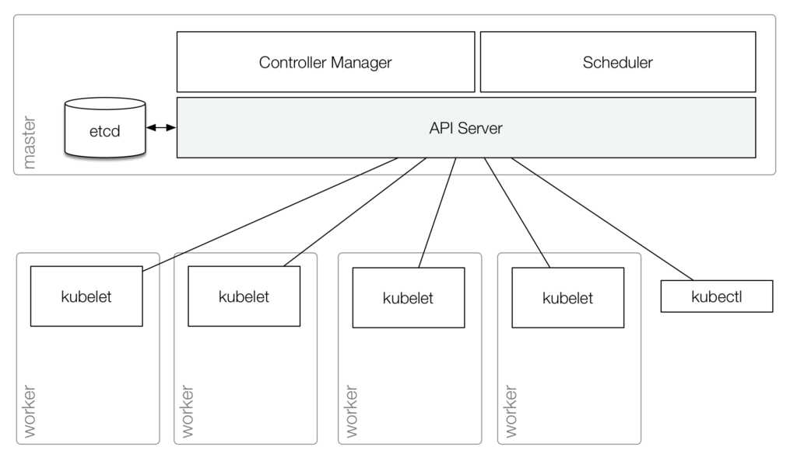
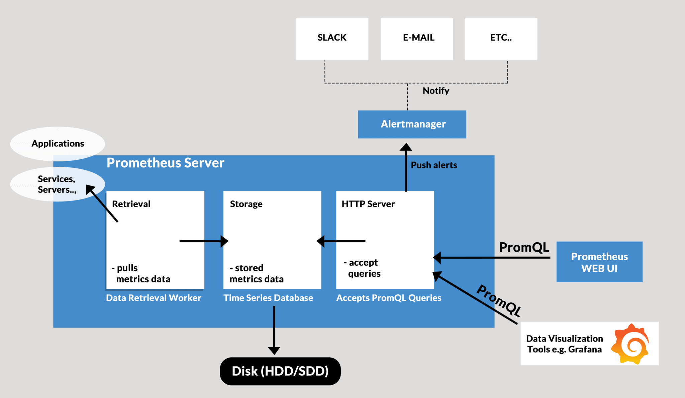

<!-- PROJECT LOGO -->
<br />
<div align="center">
  <a href="https://github.com/alifiroozi80/CKA/edit/main/Operators">
    
  </a>

<h3 align="center">Operators</h3>

  <p align="center">
    Extend the functionality of the Kubernetes API
  </p>
</div>
<br>
<div id="top">
<!-- TABLE OF CONTENTS -->
<details>
  <summary>Table of Contents</summary>
  <ol>
  <li>
     Extending the Kubernetes API
    <ul>
        <li>
                Intro
            <ul>
                <li><a href="#Extending-the-Kubernetes-API">Extending the Kubernetes API</a></li>
                <li><a href="#Revisiting-the-API-server">Revisiting the API server</a></li>
                <li><a href="#Creating-new-types">Creating new types</a></li>
            </ul>
        </li>
        <li>
                Custom Resource Definitions (CRDs)
            <ul>
                <li><a href="#Custom-Resource-Definitions-CRDs">Creating a simple CRD</a></li>
                <li><a href="#CRD-Syntax-of-CRD">Syntax of a CRD YAML file</a>
                    <ul>
                        <li><a href="#CRD-Syntax-of-CRD-Validation">Validation</a></li>
                        <li><a href="#CRD-Syntax-of-CRD-Presentation">Presentation</a></li>
                        <li><a href="#CRD-Syntax-of-CRD-Versioning">Versioning</a>
                            <ul>
                                <li><a href="#CRD-Syntax-of-CRD-Stored-Versioning">Stored version</a></li>
                                <li><a href="#CRD-Syntax-of-CRD-Served-Versioning">Served versions</a></li>
                            </ul>
                        </li>
                    </ul>
                </li>
                <li><a href="#Creating-a-custom-resource">Creating a custom resource</a></li>
                <li><a href="#What-can-we-do-with-CRDs">What can we do with CRDs?</a></li>
                <li><a href="#Some-Notes-on-CRDs">Some Notes on CRDs</a></li>
                <li><a href="#Ab-using-the-API-server">(Ab)using the API server</a></li>
            </ul>
        </li>
    </ul>
  </li>
  <li>
     K8s Operators
    <ul>
        <li><a href="#Operators-What-are-operators">What are operators?</a>
          <ul>
            <li><a href="#Operators-What-are-they-made-from">What are they made from?</a></li>
          </ul>
        </li>
        <li><a href="#Operators-Why-use-operators">Why use operators?</a>
           <ul>
            <li><a href="#Operators-State-ful-less-Applications-with-out-Operator">State(ful/less) Applications with/out Operator</a></li>
            <li><a href="#Operators-Use-cases-for-operators">Use-cases for operators</a></li>
          </ul>
        </li>
        <li><a href="#Operators-How-operators-work">How operators work</a></li>
        <li>
            Demo: Setup Prometheus Monitoring
            <ul>
                <li><a href="#Demo-Setup-Prometheus-Monitoring-Introduction">Introduction</a></li>
                <li><a href="#Demo-Setup-Prometheus-Monitoring-Setup-with-Helm-Chart">Setup with Helm Chart</a></li>
                <li><a href="#Demo-Understand-the-created-Prometheus-components">Understand the created Prometheus components</a></li>
                <li><a href="#Demo-Access-Grafana">Access Grafana</a></li>
                <li><a href="#Demo-Prometheus-UI">Prometheus UI</a></li>
            </ul>
        </li>
        <li>
            Demo: Splunk Operator for Kubernetes
            <ul>
                <li><a href="#Demo-Splunk-Operator-for-Kubernetes-Introduction">Introduction</a></li>
                <li><a href="#Demo-Splunk-Operator-for-Kubernetes-Deploy-Splunk-Operator">Installing the Splunk Operator</a></li>
                <li><a href="#Demo-Splunk-Operator-for-Kubernetes-Deploy-Splunk">Creating a Splunk Enterprise deployment</a></li>
                <li><a href="#Demo-Splunk-Operator-for-Kubernetes-Access-Splunk-Dashboard">Access Splunk Dashboard</a></li>
            </ul>
        </li>
        <li>
            What does it take to write an operator?
            <ul>
                <li>
                  Top-down vs. bottom-up
                  <ul>
                    <li><a href="#Operators-Top-down-vs-bottom-up">Top-down approach</a>
                    <li><a href="#Operators-Top-down-vs-bottom-up">Bottom-up approach</a>
                  </ul>
                </li>
                <li><a href="#Operators-General-idea">General idea</a></li>
                <li><a href="#Operators-Tools">Tools fot writing an operator</a></li>
            </ul>
        </li>
        <li><a href="#Operators-Operator-reliability">Operator reliability</a></li>
        <li><a href="#Operators-Beyond-CRDs">Beyond CRDs</a></li>
    </ul>
  </li>
</ol>
</details>
</div>

---

# Extending the Kubernetes API

# Intro

<div id="Intro-to-Extending-the-Kubernetes-API">

## Extending the Kubernetes API

<div id="Extending-the-Kubernetes-API">

There are multiple ways to extend the Kubernetes API.

For instance:

* Custom Resource Definitions (CRDs)
* Aggregation Layer
* etc.

We are going to cover:

* Custom Resource Definitions (CRDs)

</div> <!-- Extending the Kubernetes API -->

## Revisiting the API server

<div id="Revisiting-the-API-server">

* The Kubernetes API server is a central point of the control plane (everything connects to it: `controller manager`,
  `scheduler`, `kubelet`)
* Almost everything in Kubernetes is materialized by a resource
* Resources have a type (or "kind")
* We can see existing types with `kubectl api-resources`
* We can list resources of a given type with `kubectl get <type>`



</div> <!-- Revisiting the API server -->

## Creating new types

<div id="Creating-new-types">

* We can create new types with Custom Resource Definitions (CRDs)
* CRDs are created **dynamically** (without recompiling or restarting the API server)
* **CRDs themselves are resources**:
    * we can create a new type with `kubectl create` and some YAML
    * we can see all our custom types with `kubectl get crds`
* After we create a CRD, the new type works just like built-in types

</div> <!-- Creating new types -->
</div> <!-- Intro -->

# Custom Resource Definitions (CRDs)

<div id="">

## Creating a simple CRD

<div id="Custom-Resource-Definitions-CRDs">

* [Docs](https://kubernetes.io/docs/tasks/extend-kubernetes/custom-resources/custom-resource-definitions/#create-a-customresourcedefinition)

* This YAML file describes a very simple CRD representing different kinds of coffee
    ```yaml
    apiVersion: apiextensions.k8s.io/v1
    kind: CustomResourceDefinition
    metadata:
      name: coffees.crd.example
    spec:
      group: crd.example
      versions: # VERSIONING
        - name: v1
          served: true # VERSIONING-SERVED
          storage: true # VERSIONING-STORED
          schema: # VALIDATION
            openAPIV3Schema:
              type: object
              properties:
                spec:
                  type: object
                  properties:
                    taste:
                      type: string
      scope: Namespaced
      names:
        plural: coffees
        singular: coffee
        kind: Coffee
        shortNames:
        - cof
    ```
* Apply it
    ```shell
    kubectl apply -f <FILE-NAME.yaml>
    ```
* Confirm that it shows up
    ```shell
    kubectl get crd
    ```

</div> <!-- Creating a simple CRD -->

## Syntax of a CRD YAML file

<div id="CRD-Syntax-of-CRD">

### Validation

<div id="CRD-Syntax-of-CRD-Validation">

* By default, a CRD is "free form" (we can put pretty much anything we want in it)
* When creating a CRD, we should provide an
  `OpenAPI v3 schema` ([Example](https://github.com/amaizfinance/redis-operator/blob/master/deploy/crds/k8s_v1alpha1_redis_crd.yaml#L34))
* The API server will then validate resources created/edited with this schema
* If we need a stronger validation, we can use a Validating Admission Webhook:
    * Run
      an [admission webhook server](https://kubernetes.io/docs/reference/access-authn-authz/extensible-admission-controllers/#write-an-admission-webhook-server)
      to receive validation requests
    * Register the webhook by creating
      a [ValidatingWebhookConfiguration](https://kubernetes.io/docs/reference/access-authn-authz/extensible-admission-controllers/#configure-admission-webhooks-on-the-fly)
    * Each time the API server receives a request matching the configuration,
    * The request is sent to our server for validation

</div> <!-- Validation -->

### Presentation

<div id="CRD-Syntax-of-CRD-Presentation">

* By default, `kubectl get mycustomresource` won't display much information (just the name and age of each resource)
* When creating a CRD, we can specify additional columns to
  print ([Example](https://github.com/amaizfinance/redis-operator/blob/master/deploy/crds/k8s_v1alpha1_redis_crd.yaml#L6)
  , [Docs](https://kubernetes.io/docs/tasks/extend-kubernetes/custom-resources/custom-resource-definitions/#additional-printer-columns))
* By default, `kubectl describe mycustomresource` will also be generic
* `kubectl describe` can show events related to our custom resources (for that, we need to create Event resources, and
  fill the `involvedObject` field)
* For scalable resources, we can define a `scale` sub-resource
* This will enable the use of `kubectl scale` and other scaling-related operations

</div> <!-- Presentation -->

### Versioning

<div id="CRD-Syntax-of-CRD-Versioning">

* As our operator evolves over time, we may have to change the CRD (add, remove, change fields)
* Like every other resource in
  Kubernetes, [custom resources are versioned](https://kubernetes.io/docs/tasks/extend-kubernetes/custom-resources/custom-resource-definition-versioning)
* When creating a CRD, we need to specify a list of versions
* Versions can be marked as `stored` and/or `served`

#### Stored version

<div id="CRD-Syntax-of-CRD-Stored-Versioning">

* Exactly one version has to be marked as the `stored` version
* As the name implies, it is the one that will be stored in etcd
* Resources in storage are never converted automatically (we need to read and re-write them ourselves)
* Yes, this means that we can have different versions in etcd at any time
* Our code needs to handle all the versions that still exist in storage

</div> <!-- Stored version -->

#### Served versions

<div id="CRD-Syntax-of-CRD-Served-Versioning">

* By default, the Kubernetes API will serve resources "as-is" (using their stored version)
* It will assume that all versions are compatible storage-wise (i.e. that the spec and fields are compatible between
  versions)

</div> <!-- Served versions -->
</div> <!-- Versioning -->
</div> <!-- Syntax of CRD -->

## Creating a custom resource

<div id="Creating-a-custom-resource">

* This YAML file defines a resource using the CRD that we just created
    ```yaml
    apiVersion: crd.example/v1
    kind: Coffee
    metadata:
      name: arabica
    spec:
      taste: strong
    ```
* Apply it
    ```shell
    kubectl apply -f <FILE-NAME.yaml>
    ```
* View the coffee beans that we just created:
    ```shell
    kubectl get coffees
    ```

</div> <!-- Creating a custom resource -->

## What can we do with CRDs?

<div id="What-can-we-do-with-CRDs">

There are many possibilities!

* `Operators` encapsulate complex sets of resources (e.g.: a PostgreSQL replicated cluster; an etcd cluster...
  see [OperatorHub](https://operatorhub.io) to find more)
* Custom use-cases `gitkube`
    * Gitkube is a tool used to deploy applications on a Kubernetes cluster by simply running a git push . In other
      words, you can go from your source code to a deployed application on a Kubernetes cluster.
    * Creates a new custom type, `Remote`, exposing a `git`+`ssh` server
    * Deploy by pushing YAML or Helm charts to that remote
* Replacing built-in types with CRDs (see
  this [lightning talk by Tim Hockin](https://www.youtube.com/watch?v=ji0FWzFwNhA))

</div> <!-- What can we do with CRDs? -->

## Some Notes on CRDs

<div id="Some-Notes-on-CRDs">

* When creating a CRD, we should pass an **OpenAPI v3 schema** (which will be used to validate resources)
* Generally, when creating a CRD, we also want to run a **controller** (otherwise nothing will happen when we create
  resources of that type)
* The controller will typically **watch** our custom resources (and **take action when they are created/updated**)

</div> <!-- Some Notes on CRDs -->

## (Ab)using the API server

<div id="Ab-using-the-API-server">

* If we need to store something "safely" (as `key:value` in `etcd`), we can use CRDs
* This gives us primitives to read/write/list objects
* The Kubernetes API server can run on its own (without the scheduler, controller manager, and kubelet)
* By loading CRDs, we can have it manage totally different objects (unrelated to containers, clusters, etc.)

</div> <!-- (Ab)using the API server -->
</div> <!-- Custom Resource Definitions (CRDs) -->

<p align="right">(<a href="#top">back to top</a>)</p>

# K8s Operator

## What are operators?

<div id="Operators-What-are-operators">

According to [CoreOS](https://cloud.redhat.com/blog/introducing-operators-putting-operational-knowledge-into-software),
An operator represents human operational knowledge in software to manage an application reliably.

Remember that Operators are mainly used for **Stateful** or **complex** Applications.

Examples:

* Deploying and configuring replication with MySQL, PostgreSQL ...
* Setting up Elasticsearch, Kafka, RabbitMQ, Zookeeper ...
* Reacting to failures when intervention is needed
* Scaling up and down these systems

### What are they made from?

<div id="Operators-What-are-they-made-from">

* Operators combine two things:
    * Custom Resource Definitions (CRD)
    * Controller code watching the corresponding resources and acting upon them
* A given operator can define one or multiple CRDs
* The controller code (control loop) typically runs within the cluster (running as a Deployment with 1 replica is a
  common scenario)
* But it could also run elsewhere (nothing mandates that the code run on the cluster, as long as it has API access)

</div> <!-- What are they made from? -->
</div> <!-- What are operators? -->

## Why use operators?

<div id="Operators-Why-use-operators">

* Kubernetes gives us Deployments, StatefulSets, Services ...
* These mechanisms give us building blocks to deploy applications
* They work great for services that are made of `N` identical containers (like stateless ones)
* They also work great for some stateful applications like Consul, etcd ... (with the help of highly persistent volumes)
* They're not enough for complex services:
    * where different containers have different roles
    * where extra steps have to be taken when scaling or replacing containers

### State(ful/less) Applications with/out Operator

<div id="Operators-State-ful-less-Applications-with-out-Operator">

First, remember that Operators are mainly used for **Stateful** or **complex** Applications.

So, we are going to first talk about:

1) Stateless Applications on K8s
2) Stateful Applications **without** Operator
3) Stateful Applications **with** Operator

---

#### Stateless applications on K8s

Stateless Application: A Stateless application is one which depends on **no persistent storage**. The only thing your
cluster is responsible for is the code, and other static content, being hosted on it. That's it, no changing databases,
no writes and no leftover files when the pod is deleted.

So, it means when you deploy a stateless application:

* No control is necessary after the app is deployed
* Everything such as Updates or Scaling Down/Up is up to Kubernetes (Via **Control loop**)
* Control loop: **OBSERVER**, **CHECK DIFFERENCE**, **TAKE ACTION**

Kubernetes:

* Recreate died Pods
* Restart updated Pods

---

#### Stateful Applications **without** Operator

Stateful Application: Stateful applications **save data to persistent disk storage** for use by the server, by clients,
and by other applications. An example of a stateful application is a database or key-value store to which data is saved
and retrieved by other applications.

Let's say we have a MySQL database with three replicas.

* All three replicas are different
* Each replica has its state and identity
* Order is important
* This process differs for each application (MySQL, PostgreSQL, etc.)
* So, no standard solution

Typically, that's why Stateful applications require:

* Manual intervention
* Humans who operate these applications

However, in Kubernetes, this could be a problem because manually updating components is kind of against the Kubernetes
concept, that is, Automation, Self-Healing, etc.

That's why many decide to host Stateful applications outside the K8s cluster, but we need some applications inside the
K8s cluster, such as Prometheus monitoring, ETCD, etc.

So, how to manage Stateful applications?

✅Operator

---

#### Stateful Applications **with** Operator

Operator: An application-specific controller that extends the functionality of the Kubernetes API to create, configure,
and **manage instances of complex applications on behalf of a Kubernetes user**.

So, the **Operator replaces the human Operator with a software operator**

* It means the Operator takes care of:
    * How to deploy the app?
    * How to create a cluster of replicas?
    * How to recover?
    * etc

So, Tasks are **automated** and **reusable**

This will end up having only one standard automated process.

It means: more complex/environments => more benefits

##### How does this work?

Under the hood, it uses the:

* Control loop mechanism
    * Control loop: **OBSERVER**, **CHECK DIFFERENCE**, **TAKE ACTION**
* CRD
    * CRD: Custom Resource Definition
    * Custom K8s component (extends K8s API)
* Domain/app-specific knowledge
    * Automates entire lifecycle of the app it operates

---

#### Summary

* Kubernetes managing the complete lifecycle of **Stateless** apps
    * No business logic is necessary to:
        * Create
        * Update
        * Delete


* K8s can't automate the processes natively for Stateful apps
    * Operators
        * Prometheus-Operator
        * MySQL-Operator
        * PostgreSQL-Operator

</div> <!-- State(ful/less) Applications with/out Operator -->

### Use-cases for operators

<div id="Operators-Use-cases-for-operators">

* Systems with primary/secondary replication, Examples: MariaDB, MySQL, PostgreSQL, Redis ...
* Systems where different groups of nodes have different roles, Examples: ElasticSearch, MongoDB ...
* Systems with complex dependencies (that are themselves managed with operators), Examples: Flink or Kafka, which both
  depend on Zookeeper
* Representing and managing external resources (Example: [AWS Service Operator](https://operatorhub.io/?keyword=AWS))
* Managing complex cluster add-ons (Example: [Istio operator](https://operatorhub.io/operator/istio))
* Deploying and managing our applications' lifecycles (more on that later)

</div> <!-- Use-cases for operators -->
</div> <!-- Why use operators? -->

## How operators work

<div id="Operators-How-operators-work">

* An operator creates one or more CRDs (i.e., it creates new "Kinds" of resources on our cluster)
* The operator also runs a controller that will watch its resources
* Each time we create/update/delete a resource, the controller is notified

</div> <!-- How operators work -->

## Demo: Setup Prometheus Monitoring

<div id="">

### Introduction

<div id="Demo-Setup-Prometheus-Monitoring-Introduction">

* We will set up a Prometheus in the K8s cluster in this Demo.
* You can deploy pretty much anything you like, but I chose to deploy Prometheus because we have to go through this in
  our next lesson (Monitor K8s cluster with Prometheus)

* What is Prometheus?
  Prometheus is an open-source technology that provides monitoring and alerting functionality for cloud-native
  environments, including Kubernetes. It can collect and store metrics as time-series data, recording information with a
  timestamp. It can also collect and record labels, which are optional key-value pairs.
* Is Prometheus a DevOps tool?
  Prometheus is a tool that every DevOps professional should be familiar with.

---

For deploying it, we have three options:

1) Create all configuration YAML files by ourselves and execute them in the proper order
    * Inefficient ❌
    * Lot of effort ❌
2) Using an Operator
    * Manages the combination of all components as one unit ✅
3) Using Helm chart to deploy Operator
    * Most efficient ✅✅
    * Maintained by Helm community
    * Helm: Initial Setup
    * Operator: Manage Setup

---

### Prometheus Architect

Here is not the place to talk about Prometheus. We discuss Prometheus in our next lesson in detail, but for the demo's
sake, we are going through it very briefly.

Prometheus has three main components, and we have to set up these three.

* Prometheus Server processes and stores metrics data
* Alert Manager: Send Alerts
* Visualize the scraped data in UI (e.g. Grafana)



</div> <!-- Introduction -->

### Setup with Helm Chart

<div id="Demo-Setup-Prometheus-Monitoring-Setup-with-Helm-Chart">

**Note:** If you are unfamiliar with Helm, I have a [Helm tutorial](https://github.com/alifiroozi80/CKA/tree/main/Helm)
about it.

Be sure to check it out, but essentially Helm is a package manager for Kubernetes.

With that in mind, let's jump into the demo.

We will use the [Prometheus Chart](https://github.com/prometheus-community/helm-charts)

* Add the repo
  ```shell
  helm repo add prometheus-community https://prometheus-community.github.io/helm-charts
  ```
* Install Prometheus
    ```shell
    helm install prometheus prometheus-community/kube-prometheus-stack
    ```

And that's it,
We are done with Helm in this section!

</div> <!-- Setup with Helm Chart -->

### Understand the created Prometheus components

<div id="Demo-Understand-the-created-Prometheus-components">

And that's it!
Now we have a fully managed Prometheus server.

If you check your current cluster state with  `kubectl get all` you'll see a bunch of `Deployments`, `DaemonSets`, etc.

They are all created and managed by Prometheus Operator!

Now you'll hopefully see the benefits of Operators in the K8s cluster.

**Note:** What are these Components?

Here is not the place to talk about Prometheus, we will deep dive into Prometheus in our following lessons, but our goal
here is only to show the benefit of Operators, not learning Prometheus.

</div> <!-- Understand the created Prometheus components -->

### Access Grafana

<div id="Demo-Access-Grafana">

We want to access our newly created Grafana dashboard.

For that, we just quickly use the `kubectl port-forward` command.

Using Kubectl port forward lets you **quickly access your Kubernetes clusters directly from your local computer**.

```shell
kubectl port-forward deployment/prometheus-grafana 3000
```

---

Head over to [localhost:3000](http://127.0.0.1:3000), and now you should see the Grafana dashboard.
But first, we have to log in to it.

We will have to use a default username and password. However, we can create new users and update passwords later. Use
the default credentials for now:

* username: admin
* password: prom-operator

</div> <!-- Access Grafana -->

### Prometheus UI

<div id="Demo-Prometheus-UI">

```shell
kubectl port-forward service/prometheus-kube-prometheus-prometheus 9090
```

</div> <!-- Prometheus UI -->
</div> <!-- Demo: Setup Prometheus Monitoring -->

## Demo: Splunk Operator for Kubernetes

<div id="">

### Introduction

<div id="Demo-Splunk-Operator-for-Kubernetes-Introduction">

* We will set up a Splunk Enterprise application in our cluster for our second Demo.
* Here we don't use helm to manage our YAML files. We download and apply them by ourselves.
* What is Splunk?

  Splunk Enterprise collects data from any source, including metrics, logs, clickstreams, sensors, network traffic,
  web servers, custom applications, hypervisors, containers, social media, and cloud
  services. ([Splunk Enterprise](https://www.splunk.com/en_us/products/splunk-enterprise.html))
* Is Splunk used in DevOps?

  **Log and application lifecycle analytics:** Splunk is a leading log management tool ideal for DevOps.
* But, here is not the place to talk about Splunk. There are tons of tutorials on that. Here, we deploy it in our
  cluster to see and interact with Operators in action.

</div> <!-- Introduction -->

### Installing the Splunk Operator

<div id="Demo-Splunk-Operator-for-Kubernetes-Deploy-Splunk-Operator">

* [Docs](https://github.com/splunk/splunk-operator/tree/master/docs#getting-started-with-the-splunk-operator-for-kubernetes)

* We install and start the **Splunk Operator** for **cluster-wide** by running:
    ```shell
    kubectl apply -f https://github.com/splunk/splunk-operator/releases/download/2.0.0/splunk-operator-cluster.yaml
    ```
* Check the Pod
    ```shell
    $ kubectl get pods -n splunk-operator
    NAME                                                  READY   STATUS    RESTARTS      AGE
    splunk-operator-controller-manager-795cf4fc8c-46x2r   2/2     Running   0             1m
    ```

</div> <!-- Deploy Splunk Operator -->

### Creating a Splunk Enterprise deployment

<div id="Demo-Splunk-Operator-for-Kubernetes-Deploy-Splunk">

The `Standalone` **custom resource** is used to create a single instance deployment of Splunk Enterprise.

* Run this command to create a deployment named `s1`:
    ```shell
    cat <<EOF | kubectl apply -n splunk-operator -f -
    apiVersion: enterprise.splunk.com/v3
    kind: Standalone
    metadata:
      name: s1
      finalizers:
      - enterprise.splunk.com/delete-pvc
    EOF
    ```
* Check the Pods
    ```shell
    $ kubectl get po -n splunk-operator 
    NAME                                                  READY   STATUS    RESTARTS      AGE
    splunk-s1-standalone-0                                1/1     Running   0             20s
    splunk-operator-controller-manager-795cf4fc8c-46x2r   2/2     Running   0             5m
    ```

</div> <!-- Deploy Splunk -->

### Access Splunk Dashboard

<div id="Demo-Splunk-Operator-for-Kubernetes-Access-Splunk-Dashboard">

We use the `kubectl port-forward` to open port `8000` for Splunk Web access:

```shell
kubectl port-forward -n splunk-operator splunk-s1-standalone-0 8000
```

---

For the first time you want to log in, you should use the default username and password created.

* Username: `admin`
* Password:

1) Get the password key in secret yaml file
    ```shell
    kubectl get secrets splunk-s1-standalone-secret-v1 -n splunk-operator -o yaml | grep password
    ```
2) Decode the value
    ```shell
    echo 'VALUE-FROM-ABOVE-COMMAND' | base64 --decode | tr -d "\n"
    ```

</div> <!-- Access Splunk Dashboard -->
</div> <!-- Demo: Splunk Operator for Kubernetes -->

## What does it take to write an operator?

<div id="">

* Writing a quick-and-dirty operator, or a POC/MVP, is easy
* Writing a robust operator is hard
* We will describe the general idea
* We will list a few tools that can help us

### Top-down vs. bottom-up

<div id="">

* Both approaches are possible
* Let's see what they entail, and their respective pros and cons

#### Top-down approach

<div id="Operators-Top-down-vs-bottom-up">

* Start with **high-level design** (see next section)
* Pros:
    * Can yield cleaner design that will be more robust
* Cons:
    * Must be able to anticipate all the events that might happen
    * Design will be better only to the extent of what we anticipated
    * Hard to anticipate if we don't have production experience

---

#### High-level design

* What are we solving? (e.g.: geographic databases backed by PostGIS with Redis caches)
* What are our use-cases, stories? (e.g.: adding/resizing caches and read replicas; load balancing queries)
* What kind of outage do we want to address? (e.g.: loss of individual node, pod, volume)
* What are our non-features, the things we don't want to address? (e.g.: loss of datacenter/zone; differentiating
  between read and write queries; cache invalidation; upgrading to newer major versions of Redis, PostGIS, PostgreSQL)

#### Low-level design

* What Custom Resource Definitions do we need? (one, many?)
* How will we store configuration information? (part of the CRD spec fields, annotations, other?)
* Do we need to store state? If so, where?
    * State that is small and doesn't change much can be stored via the Kubernetes API (e.g.: leader information,
      configuration, credentials)
    * Things that are big and/or change a lot should go elsewhere (e.g.: metrics, bigger configuration file like GeoIP)

#### What can we store via the Kubernetes API?

* The API server stores most Kubernetes resources in etcd
* Etcd is designed for **reliability**, not for **performance**
* If our storage needs exceed what etcd can offer, we need to use something else:
    * Either directly
    * Or by extending the API server (for instance by using the agregation layer,
      like [metrics server](https://github.com/kubernetes-sigs/metrics-server) does)

</div> <!-- Top-down approach -->

#### Bottom-up approach

<div id="Operators-Top-down-vs-bottom-up">

* Start with existing Kubernetes resources (`Deployment`, `statefulSet`, etc.)
* Run the system in production
* Add scripts, automation, to facilitate day-to-day operations
* **Turn the scripts into an operator**
* Pros: simpler to get started; reflects actual use-cases
* Cons: can result in convoluted designs requiring extensive refactor

</div> <!-- Bottom-up approach -->
</div> <!-- Top-down vs. bottom-up -->

### General idea

<div id="Operators-General-idea">

* Our operator will watch its CRDs and associated resources
* Drawing state diagrams and finite state automata helps a lot
* It's OK if some transitions lead to a big catch-all "human intervention"
* Over time, we will learn about new failure modes and add to these diagrams
* It's OK to start with CRD creation / deletion and prevent any modification (that's the easy POC/MVP we were talking
  about)
* `Presentation` and `validation` will help our users (see <a href="#CRD-Syntax-of-CRD">here</a>)

</div> <!-- General idea -->

### Tools fot writing an operator

<div id="Operators-Tools">

* CoreOS / RedHat Operator Framework
    * [GitHub](https://github.com/operator-framework)
      | [Blog](https://developers.redhat.com/blog/2018/12/18/introduction-to-the-kubernetes-operator-framework)
      | [Intro talk](https://www.youtube.com/watch?v=8k_ayO1VRXE)
      | [Deep dive talk](https://www.youtube.com/watch?v=fu7ecA2rXmc)
      | [Simple example](https://faun.pub/writing-your-first-kubernetes-operator-8f3df4453234)
* Kubernetes Operator Pythonic Framework (Kopf)
    * [GitHub](https://github.com/nolar/kopf) | [Docs](https://kopf.readthedocs.io/en/stable)

</div> <!-- Tools fot writing an operator -->
</div> <!-- What does it take to write an operator? -->

## Operator reliability

<div id="Operators-Operator-reliability">

* Remember that the operator itself must be resilient (e.g.: the node running it can fail)
* Our operator must be able to restart and recover gracefully
* Do not store state locally (unless we can reconstruct that state when we restart)
* As indicated earlier, we can use the Kubernetes API to store data:
    * In the custom resources themselves
    * In other resources' annotations

</div> <!-- Operator reliability -->

## Beyond CRDs

<div id="Operators-Beyond-CRDs">

* CRDs cannot use custom storage (e.g. for time series data)
* CRDs cannot support arbitrary sub-resources (like logs or exec for Pods)
* CRDs cannot support protobuf (for faster, more efficient communication)
* If we need these things, we can use
  the [aggregation layer](https://kubernetes.io/docs/concepts/extend-kubernetes/api-extension/apiserver-aggregation)
  instead
* The aggregation layer proxies all requests below a specific path to another server (this is used e.g. by the metrics
  server)
* [This documentation page](https://kubernetes.io/docs/concepts/extend-kubernetes/api-extension/custom-resources/#choosing-a-method-for-adding-custom-resources)
  compares the features of CRDs and API aggregation

</div> <!-- Beyond CRDs -->

<p align="right">(<a href="#top">back to top</a>)</p>
