<!-- PROJECT LOGO -->
<br />
<div align="center">
  <a href="https://github.com/alifiroozi80/CKA/edit/main/Prometheus">
    
  </a>

<h3 align="center">Prometheus</h3>

  <p align="center">
    The Prometheus monitoring system and time series database.
  </p>
</div>
<br>
<div id="top">
<!-- TABLE OF CONTENTS -->
<details>
  <summary>Table of Contents</summary>
  <ol>
  <li>
     Introduction to Prometheus
    <ul>
        <li><a href="#Introduction-to-Prometheus-What-is-Prometheus">What is Prometheus</a></li>
        <li><a href="#Introduction-to-Prometheus-Prometheus-Architecture">Prometheus Architecture</a></li>
        <li><a href="#Introduction-to-Prometheus-Pull-Mechanism">Pull Mechanism</a></li>
        <li><a href="#Introduction-to-Prometheus-Configuring-Prometheus">Configuring Prometheus</a></li>
        <li><a href="#Introduction-to-Prometheus-Alert-Manager">Alert Manager</a></li>
        <li><a href="#Introduction-to-Prometheus-Data-Storage">Data Storage</a></li>
        <li><a href="#Introduction-to-Prometheus-PromQL-Query-Language">PromQL Query Language</a></li>
        <li><a href="#Introduction-to-Prometheus-Wrap-UP">Wrap UP</a></li>
    </ul>
  </li>
  <li>
      Install Prometheus in Kubernetes
    <ul>
      <li><a href="#Install-Prometheus-in-Kubernetes-Setup-Prometheus-in-K8s-cluster">Setup Prometheus in K8s cluster</a></li>
      <li><a href="#Install-Prometheus-in-Kubernetes-Understanding-Prometheus-Components">Understanding Prometheus Components</a></li>
    </ul>
  </li>
  <li>
      Data Visualization with Prometheus UI
    <ul>
      <li><a href="#Data-Visualization-with-Prometheus-UI-Decide-what-we-want-to-monitor">Decide what we want to monitor?</a></li>
      <li><a href="#Data-Visualization-with-Prometheus-UI-Prometheus-UI">Prometheus UI</a></li>
    </ul>
  </li>
  <li>
      Introduction to Grafana UI
    <ul>
      <li><a href="#Introduction-to-Grafana-Intro">Intro</a></li>
      <li><a href="#Introduction-to-Grafana-Create-your-dashboard">Create your dashboard</a></li>
      <li><a href="#Introduction-to-Grafana-Resource-Consumption-of-Cluster-Nodes">Resource Consumption of Cluster Nodes</a></li>
      <li><a href="#Introduction-to-Grafana-Test-Anomaly">Test Anomaly</a></li>
      <li><a href="#Introduction-to-Grafana-Configure-Users-and-Data-Structures">Configure Users & Data Structures</a></li>
    </ul>
  </li>
  <li>
      Alert Rules in Prometheus
    <ul>
      <li><a href="#Alert-Rules-in-Prometheus-Overview">Overview</a></li>
      <li><a href="#Alert-Rules-in-Prometheus-Existing-Alert-Rules">Existing Alert Rules</a></li>
    </ul>
  </li>
  <li>
      Create your Alert Rule
    <ul>
      <li><a href="#Create-your-Alert-Rule-Create-your-1st-Rule">Create your 1st Rule (HostHighCpuLoad)</a></li>
      <li><a href="#Create-your-Alert-Rule-Alert-Rule-for-Kubernetes">Alert Rule for Kubernetes</a></li>
      <li><a href="#Create-your-Alert-Rule-Create-your-2nd-Rule">Create your 2nd Rule (KubernetesPodCrashLooping)</a></li>
      <li><a href="#Create-your-Alert-Rule-Apply-Alert-Rules">Apply Alert Rules</a></li>
      <li><a href="#Create-your-Alert-Rule-Test-Alert-Rule">Test Alert Rule</a></li>
    </ul>
  </li>
  <li>
      Alertmanager
    <ul>
      <li>
          Introduction to Alertmanager
        <ul>
          <li><a href="#Alertmanager-Firing-State">Firing State</a></li>
          <li><a href="#Alertmanager-Alertmanager-Configuration-File">Alertmanager Configuration File</a></li>
        </ul>
      </li>
      <li>
          Configure Alertmanager with Email Receiver
        <ul>
          <li><a href="#Alertmanager-Configure-Alertmanager">Configure Alertmanager</a></li>
          <li><a href="#Alertmanager-Configure-Email-Notification">Configure Email Notification</a></li>
        </ul>
      </li>
      <li><a href="#Alertmanager-Trigger-Alerts-for-Email-Receiver">Trigger Alerts for Email Receiver</a></li>
    </ul>
  </li>
  <li>
      Monitor Third-Party Applications
    <ul>
      <li><a href="#Monitor-Third-Party-Applications-Intro">Intro</a></li>
      <li>
          Deploy Redis Exporter
        <ul>
          <li><a href="#Deploy-Redis-Exporter-Create-Alert-Rules-for-Redis">Create Alert Rules for Redis</a></li>
          <li><a href="#Deploy-Redis-Exporter-Trigger-Redis-is-Down">Trigger the 'Redis is Down'</a></li>
          <li><a href="#Deploy-Redis-Exporter-Create-Redis-Dashboard-in-Grafana">Create Redis Dashboard in Grafana</a></li>
        </ul>
      </li>
      <li><a href="#Monitor-Third-Party-Applications-Alert-Rules-Grafana-dashboard-for-Redis">Alert Rules & Grafana dashboard for Redis</a></li>
    </ul>
  </li>
  <li>
      Monitor own App
    <ul>
      <li>
        Collect & Expose Metrics
        <ul>
          <li><a href="#Collect-and-Expose-Metrics-Intro">Intro</a></li>
          <li><a href="#Collect-and-Expose-Metrics-Expose-Metrics">Expose Metrics</a></li>
          <li><a href="#Collect-and-Expose-Metrics-Build-Docker-Image-Push-it-to-a-Repo">Build Docker Image & Push it to a Repo</a></li>
          <li><a href="#Collect-and-Expose-Metrics-Deploy-App-into-K8s-cluster">Deploy App into K8s cluster</a></li>
        </ul>
      </li>
      <li>
          Configure Monitoring
        <ul>
          <li><a href="#Configure-Monitoring-Create-ServiceMonitor">Create ServiceMonitor</a></li>
          <li><a href="#Configure-Monitoring-Create-Grafana-Dashboard">Create Grafana Dashboard</a></li>
        </ul>
      </li>
    </ul>
  </li>
</ol>
</details>
</div>

---

# Introduction to Prometheus

## What is Prometheus

<div id="Introduction-to-Prometheus-What-is-Prometheus">

According to [docs](https://prometheus.io/docs/introduction/overview):

* Prometheus is an open-source monitoring system including:
    * Multiple service discovery backends to figure out which metrics to collect
    * A scraper to collect these metrics
    * An efficient time series database to store these metrics
    * A specific query language (PromQL) to query these time series
    * An alert manager to notify us according to metrics values or trends

---

### Why use Prometheus?

Today DevOps is a complex process. Therefore, we need more automation!

Let's say we have a couple of servers and a bunch of containers on them, and those containers talk to each other.

Now imagine your application suddenly is down!

* Error?
* Overloaded?
* Enough resources?
* Response latency?

You want to know if this issue is

* On Hardware
* On Application

How do you know what went wrong?

* Backend running?
* Any exception?
* Auth-Service running?
* Why did the Auth-Service crash?

---

### Use cases for using Prometheus monitoring

* Constantly monitor all the services
* Alert when crash
* Identify problems before

</div> <!-- What is Prometheus -->

## Prometheus Architecture

<div id="Introduction-to-Prometheus-Prometheus-Architecture">


---

* Main component: **Prometheus Server**
    * Does the actual monitoring work
    * It has 3 component inside it

1) HTTP Server (Accepts PromQL queries from Prometheus web UI, Grafana, etc.)
2) Storage (Stored metrics (More on that later) data in Time-Series database)
3) Retrieval (Pull metrics data from Application, Servers, Services, etc.)

---

* **What** does Prometheus monitor?
    * Linux/Windows Servers
    * Single Application
    * Services like Database

* **Which units** are monitored of those targets?
* CPU State
* Memory/Disk Space Usage
* Request Count
* Exception Count
* Request Duration

---

### Metrics

* Format: **Human-Readable** text-based
* Metrics entries: **TYPE** and **HELP** attributes
* **Help**
    * Description of what the metric is
* **TYPE**: 3 metrics types
    * **Counter**: How many times X happend?
    * **Gauge**: What is the current value of X now?
    * **Histogram**: How long or How big?
* Example of a metric
  ```text
  # HELP go_gc_duration_seconds A summary of the pause duration of garbage collection cycles.
  # TYPE go_gc_duration_seconds summary
  go_gc_duration_seconds{quantile="0"} 5.2344e-05
  go_gc_duration_seconds{quantile="0.25"} 6.0619e-05
  go_gc_duration_seconds{quantile="0.5"} 6.6437e-05
  go_gc_duration_seconds{quantile="0.75"} 8.0573e-05
  go_gc_duration_seconds{quantile="1"} 0.00264025
  go_gc_duration_seconds_sum 766.689340367
  go_gc_duration_seconds_count 1.0138386e+07
  # HELP go_goroutines Number of goroutines that currently exist.
  # TYPE go_goroutines gauge
  go_goroutines 15
  ```

### What kind of metrics can we collect?

* Node metrics (related to physical or virtual machines)
* Container metrics (resource usage per container)
* Databases, message queues, load balancers, etc. (check out
  this [list of exporters](https://prometheus.io/docs/instrumenting/exporters)!)
* Instrumentation (=deluxe `print` for our code)
* Business metrics (customers served, revenue, ...)

* Node Metrics
    * CPU, RAM, disk usage on the whole node
    * Total number of processes running, and their states
    * Number of open files, sockets, and their states
    * I/O activity (disk, network), per operation or volume
    * Physical/hardware (when applicable): temperature, fan speed...
    * ...and much more!
* Container Metrics
    * Similar to node metrics, but not totally identical
    * RAM breakdown will be different
        * active vs inactive memory
        * some memory is shared between containers, and specially accounted for
    * I/O activity is also harder to track
        * async writes can cause deferred "charges"
        * some page-ins are also shared between containers
* Application Metrics
    * Arbitrary metrics related to your application and business
    * System performance: request latency, error rate...
    * Volume information: number of rows in database, message queue size...
    * Business data: inventory, items sold, revenue...

### Collecting Metrics data from Targets

* The Prometheus server will scrape URLs like `HOSTADDRESS/metrics` at regular intervals (by default: every minute; can
  be more/less frequent)
* The list of URLs to scrape (the scrape targets) is defined in configuration
* Pulls from HTTP endpoint
* Must be in the correct format

---

### Target endpoints and exporters

* Some applications exposing `/metrics` endpoints **By default**
* Many services need another component (**Exporter**)

e.g., do You want to monitor a Linux Server?

* Download a Node Exporter
* Untar and execute it
* Convert the metrics of the server
* Exposes `/metrics` endpoint
* Configure Prometheus to scrap this endpoint
* **NOTE:** Exporters are available as **Docker image** too!

</div> <!-- Prometheus Architecture -->

## Pull Mechanism

<div id="Introduction-to-Prometheus-Pull-Mechanism">

* Prometheus use **Pull** mechanism to scrap the data from applications (Instead of **Push** mechanism that others like
  Amazon Cloud Watch use)
    * Multiple Prometheus instances can pull metrics data
    * Better detection/insight if service is up & running
* Push system of other monitoring systems, e.g. Amazon Cloud Watch
    * Application/Servers **push** to a centralized collection platform
        * High load of network traffic
        * Monitoring can become your bottleneck
        * Install additional software or tool to push metrics

---

#### Pushgateway

What if our target only **runs for a short time?**

* The Prometheus Pushgateway allows you to push time series from short-lived service-level batch jobs to an intermediary
  job which Prometheus can scrape.
* In other words: The Pushgateway is an intermediary service which allows you to push metrics from jobs which cannot be
  scraped.
* [WHEN TO USE THE PUSHGATEWAY](https://prometheus.io/docs/practices/pushing/#when-to-use-the-pushgateway)

</div> <!-- Pull Mechanism -->

## Configuring Prometheus

<div id="Introduction-to-Prometheus-Configuring-Prometheus">

* How does Prometheus know what to scrape and when?
    * [X] with simple YAML file!

* In that YAML file, we define **which targets?** and **at what interval?**
* Prometheus uses a **Service Recovery** to find those targets endpoints
* Here is an example:
  ```yaml
  # How often Prometheus will scrape its targets
  global:
    scrape_interval: 15s
    evaluation_interval: 15s
  
  # Rules for aggregating metric values or creating alerts when condition met
  rule_files:
  # - "first.rules"
  # - "second.rules"
  
  # What resources Prometheus monitors
  scrape_configs:
    - job_name: prometheus # Prometheus has its own /metrics endpoint
      static_configs:
        - targets: [ 'localhost:9090' ]
  
    # Define your own jobs
    - job_name: node_exporter
      metrics_path: "/metrics" # Default value for each job 
      schema: "http" # Default value for each job 
      scrape_interval: 1m
      scrape_timeout: 1m
      static_configs:
        - targets: [ 'localhost:9100' ]
  ```

</div> <!-- Configuring Prometheus -->

## Alert Manager

<div id="Introduction-to-Prometheus-Alert-Manager">

* **How** does Prometheus trigger the alerts?
* **Who** receives the alerts?

Prometheus has a components called **Alertmanager** that responsible for reading the alert rules of config file.

The [Alertmanager](https://prometheus.io/docs/alerting/latest/alertmanager) handles alerts sent by client applications
such as the Prometheus server. It takes care of duplicating, grouping, and routing them to the correct receiver
integration such as email, PagerDuty, or OpsGenie. It also takes care of silencing and inhibition of alerts

</div> <!-- Alert Manager -->

## Data Storage

<div id="Introduction-to-Prometheus-Data-Storage">

* **Where** does Prometheus store the data?
    * [x] [Disk usage](https://prometheus.io/docs/prometheus/latest/storage)

Prometheus stores its on-disk time series data under the directory specified by the flag `storage`, `local`, `path`. The
default path is `./data` (relative to the working directory), which is good to try something out quickly but most likely
not what you want for actual operations.

So, once you collect the metrics, Prometheus allows you to query those data by accepting PromQL queries

</div> <!-- Data Storage -->

## PromQL Query Language

<div id="Introduction-to-Prometheus-PromQL-Query-Language">

You can:

* Query targets directly through `Prometheus Web UI`
* Or use more powerful visualization tools e.g. `Grafana`

They both use `PromQL` to get the data out of Prometheus

Example Queries

* `http_requests_total{status!~"4.."}`
    * Query all HTTP status codes except `4xx` ones
* `rate(http_requests_total[5m])[30m:]`
    * Returns the `5min` rate of `http_requests_total` metric for the past `30mins`
* `sum by (instance) (irate(container_cpu_usage_seconds_total{pod_name=~"xxx.*"}[5m]))`
    * Returns the cumulated CPU usage of `xxx` pods for each node

---

* We won't learn PromQL in this repo
* We are going cover the basics to get an idea of what is possible tho
* We are going to break down one of the queries above (building it one step at a time)
* We'll learn more about PromQL in the Prometheus Alertmanager section

### Step 1 - Graphing one metric across all tags

* This query will show us CPU usage across all containers: `container_cpu_usage_seconds_total`
* The suffix of the metrics name tells us:
    * The unit (seconds of CPU)
    * That it's the total used since the container creation
* Since it's a "total," it is an increasing quantity (we need to compute the derivative if we want e.g. CPU % over time)
* We see that the metrics retrieved have `tags` attached to them

### Step 2 - Selecting metrics with tags

* This query will show us only metrics for `xxx` containers: `container_cpu_usage_seconds_total{pod_name=~"xxx.*"}`
* The `=~` operator allows regex matching
* We select all the pods with a name starting with `xxx` (it would be better to use labels to select pods; more on that
  later)
* The result is a smaller set of containers

### Step 3 - Transforming counters in rates

* This query will show us CPU usage % instead of total seconds
  used: `100*irate(container_cpu_usage_seconds_total{pod_name=~"xxx.*"}[5m])`
* The [irate](https://prometheus.io/docs/prometheus/latest/querying/functions/#irate) operator computes the "per-second
  instant rate of increase"
    * `rate` is similar but allows decreasing counters and negative values
    * With `irate`, if a counter goes back to zero, we don't get a negative spike
* The `[5m]` tells how far to look back if there is a gap in the data
* And we multiply with `100*` to get CPU % usage

### Step 4 - Aggregation operators

* This query sums the CPU usage per node:
  ```shell
  sum by (instance) (
    irate(container_cpu_usage_seconds_total{pod_name=~"xxx.*"}[5m])
  )
  ```
* `instance` corresponds to the node on which the container is running
* `sum by (instance) (...)` computes the sum for each instance
* Note: all the other tags are collapsed (in other words, the resulting graph only shows the `instance` tag)
* PromQL supports many
  more [aggregation operators](https://prometheus.io/docs/prometheus/latest/querying/operators/#aggregation-operators)

</div> <!-- PromQL Query Language -->

## Wrap UP

<div id="Introduction-to-Prometheus-Wrap-UP">

### Prometheus Characteristics

* Reliable
* Stand-alone and Self-containing
* Works, even if other parts of infrastructure broken
* No extensive set-up needed
* Less complex

---

### Scale Prometheus using Prometheus Federation

* Scalable cloud apps need monitoring that scales with them
* [Prometheus Federation](https://logz.io/blog/devops/prometheus-architecture-at-scale)
  allows a Prometheus server to **scrape data from other Prometheus servers**


---

### Prometheus with Docker and Kubernetes

* Fully compatible
* Prometheus components are available as Docker image
* Can easily be deployed in Container Environments like Kubernetes
* **Monitoring of K8s cluster Node Resources out-of-the box!**

</div> <!-- Wrap UP -->
<p align="right">(<a href="#top">back to top</a>)</p>

# Install Prometheus in Kubernetes

## Setup Prometheus in K8s cluster

<div id="Install-Prometheus-in-Kubernetes-Setup-Prometheus-in-K8s-cluster">

For deploying it, we have three options:

1) Create all configuration YAML files by ourselves and execute them in the proper order
    * Inefficient ❌
    * Lot of effort ❌
2) Using an Operator
    * Manages the combination of all components as one unit ✅
3) Using Helm chart to deploy Operator
    * Most efficient ✅✅
    * Maintained by Helm community
    * Helm: Initial Setup
    * Operator: Manage Setup

We will use option 3 (Helm chart to deploy Operator) here.

NOTE: we have covered [Helm](https://github.com/alifiroozi80/CKA/tree/main/Helm)
and [Operators](https://github.com/alifiroozi80/CKA/tree/main/Operators) previously in this repo. Here we don't need to
know much about Operators. However, we should know a little bit about Helm.

We will use the [Prometheus Chart](https://github.com/prometheus-community/helm-charts)

* Add the repo
  ```shell
  helm repo add prometheus-community https://prometheus-community.github.io/helm-charts
  ```
* Create `monitoring` Namespace
    ```shell
    kubectl create ns monitoring
    ```
* Install Prometheus in its own Namespace (`monitoring`)
    ```shell
    helm install prometheus prometheus-community/kube-prometheus-stack -n monitoring
    ```
* Get everything in `monitoring` Namespace
    ```shell
    kubectl get all -n monitoring
    ```

</div> <!-- Setup Prometheus in K8s cluster -->

## Understanding Prometheus Components

<div id="Install-Prometheus-in-Kubernetes-Understanding-Prometheus-Components">

* TWO StatefulSets
    * Prometheus Server
    * Alertmanager
* THREE Deployments
    * Prometheus Operators
        * Created Prometheus and Alertmanager StatefulSet
    * Grafana
    * Kube State Metrics
        * Own Helm chart
        * Dependency of this Helm chart that we have just installed
        * Scrapes K8s components --> K8s infrastructure monitoring out-of-the box!
* THREE ReplicaSets
    * Created by Deployments
* ONE DaemonSet
    * Node Expoerter DaemonSet
    * DaemonSet: **Runs on every Worker Node**
    * Connects to Server
    * Translate Worker Node metrics to Prometheus metrics
* Pods
    * From Deployments and StatefulSets
* Services
    * Each component has its own
* ConfigMaps
    * Configurations for different parts
    * Managed by Operator
    * How to connect to default metrics
* Secrets
    * For Grafana
    * For Prometheus
    * For Operator
    * For Alertmanager
    * Certificates
    * Username & Passwords
    * etc
* CRDS (Custom Resource Definition)
    * Extension of Kubernetes API

</div> <!-- Understanding Prometheus Components -->
<p align="right">(<a href="#top">back to top</a>)</p>

# Data Visualization with Prometheus UI

## Decide what we want to monitor?

<div id="Data-Visualization-with-Prometheus-UI-Decide-what-we-want-to-monitor">

### What is your goal? What do you want to monitor?

* We want to notice when something **unexpected** happens
* **Observe** any **anomalies**
    * CPU spikes
    * High Load
    * Insufficient Storage
    * Unauthorized Requests
* Analyze and **react** accordingly

### How do we get this information?

* Visibility of monitoring data
* What data do we have available?
    * Cluster Nodes?
        * CPU
        * RAM
    * Applications?
        * Numbers of Requests
    * Kubernetes Components
        * App Availability

</div> <!-- Decide what we want to monitor? -->

## Prometheus UI

<div id="Data-Visualization-with-Prometheus-UI-Prometheus-UI">

So, we have to monitor that information somehow.

For that, by default, we have **Prometheus Web UI**.

Let's see that in action and become familiar with it.

* See the Prometheus Web UI service.
  ```shell
  kubectl get svc -n monitoring prometheus-kube-prometheus-prometheus
  ```
* Port-forward it to `localhost:9090`
  ```shell
  kubectl port-forward -n monitoring service/prometheus-kube-prometheus-prometheus 9090:9090 &
  ```
* **NOTE:** What is `&` in Bash? A single `&`  at the end of a command means that the command should be **run in the
  background**

---

As you can see, it's a straightforward UI.

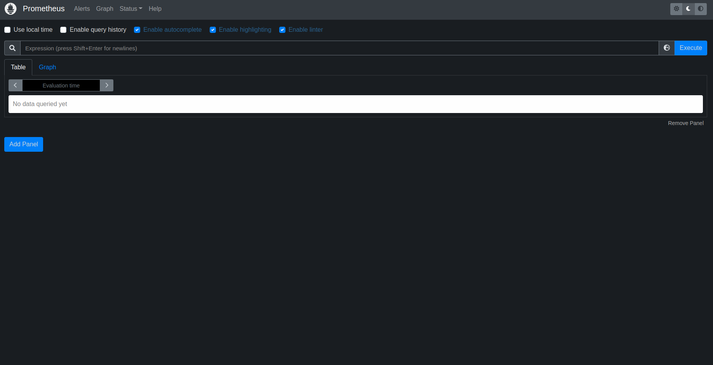

So, what targets is Prometheus monitoring?

You can see all targets if you go to the `Status/Targets`.

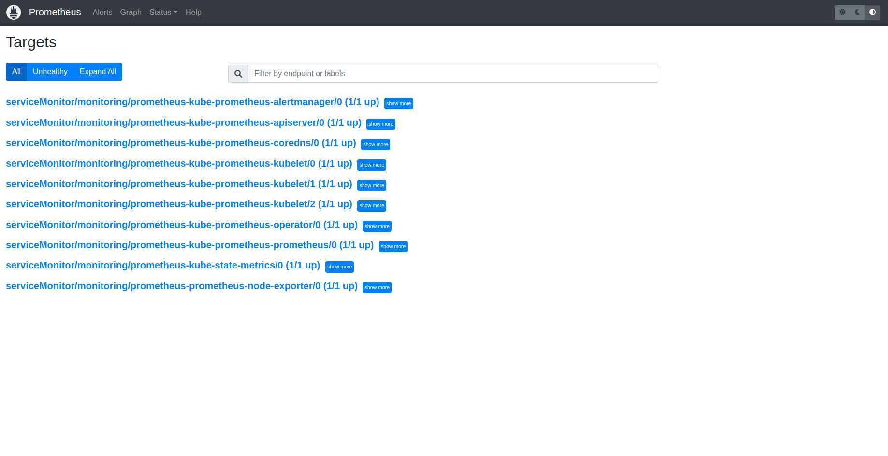

These targets are here by default. **You need to add the "target" which you want to monitor.**

If you expand one of these targets (`show more` button), you'll see a bunch of columns, one of which is `Endpoint`.
That is the endpoint exposed **inside** the cluster.

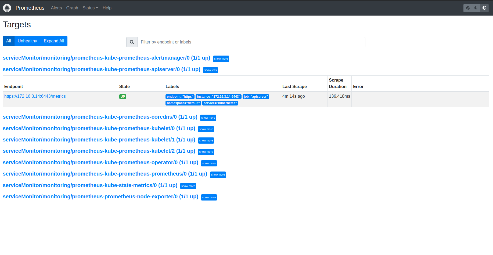

---

Let's jump back to the first page.

* Here, a long column allows you to execute PromQL queries. queries that we learned a little while ago in
  the <a href="#Introduction-to-Prometheus-PromQL-Query-Language">PromQL Query Language</a> section.

**Note:** Remember that execute queries here is `Low Level`, which is for `Debugging`.

---

Also, if we head over to `Status/Configuration` and `Status/Runtime & Build Information`, you can see the Prometheus
configuration in **read-only** mode.

I want to discuss the concept of `job`s in Prometheus in the `Status/Configuration`.

Under the `scrape_configs`, you can see the list of jobs.

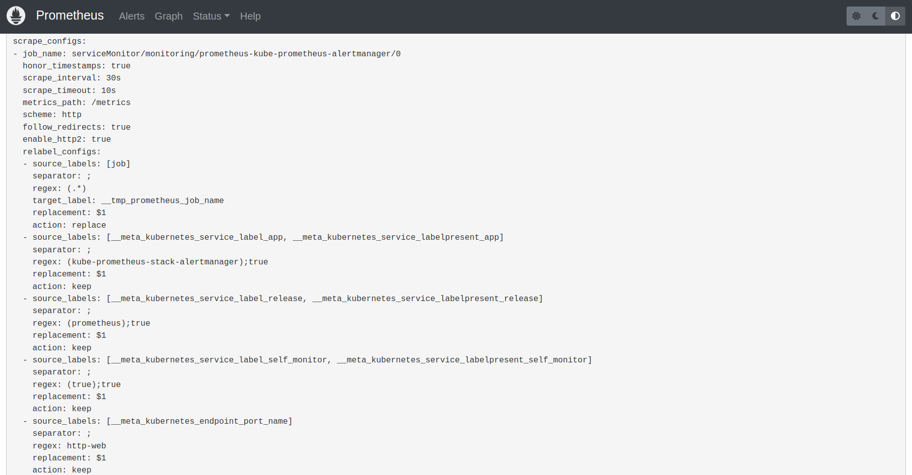

But what are these jobs?

* If you go to `Status/Targets` and expand one of the targets with two (or more) processes running (which says `2/2`),
  you can see two `Endpoints` here.
* Each of these `Endpoints` is called **Instance**, an address where you can scrape metrics.
    * Instance: An endpoint you can scrape.
* A job is a collection of those Instances that scrape the same application, and it is called a **Job**.
    * Job: Collection of Instances with the same purpose.

You can see a bunch of labels in the `Labels` column. One of them is `job`, which holds the **job name**, and you can
see this label (e.g. `job="apiserver"`) is matched **on both Instances**.

* Now, if you see this target name, e.g., `monitoring-kube-prometheus-apiserver/0`, it matches its `job_name`
  in `Status/Configuration`.
* That means if we execute a query, e.g., `apiserver_request_total`, we'll get a bunch of metrics, and each metric
  contains a lot of labels, and one of them is always the `job` name.
* And you can also filter metrics by its job name: `apiserver_request_total{job="apiserver"}`
* And every metric also has an `Instance` label that represents the `Endpoint`/`Instance` from which that metric is
  scraped.
* And here for `Apiserver`, we have two Instances, and again, we can filter based on one of these
  Instances: `apiserver_request_total{instance="192.168.126.249:443"}`.

---

Again, remember that here is not the place to see the graphs and visualize any anomalies. We have a great data
visualizer
called **Grafana**, and we will learn it in our next section!

</div> <!-- Prometheus UI -->
<p align="right">(<a href="#top">back to top</a>)</p>

# Introduction to Grafana UI

## Intro

<div id="Introduction-to-Grafana-Intro">

We learned that we need a proper data visualization tool that accesses the metrics from the Prometheus server like
[Grafana](https://grafana.com).

What is Grafana?

Grafana is an [open-source](https://github.com/grafana/grafana) interactive data visualization platform developed by
Grafana Labs. It allows users to see
their data via charts and graphs that are unified into one dashboard (or multiple dashboards!) for more straightforward
interpretation and understanding.

Let's access Grafana UI!

---

* First, let's see the Grafana service.
  ```shell
  kubectl get service/prometheus-grafana -n monitoring
  ```
* Then we port forward it to `localhost:8080`.
  ```shell
  kubectl port-forward service//monitoring-grafana 8080:80 -n monitoring &
  ```
* Now, if you head to [localhost:8080](http://localhost:8080), we'll see the Grafana dashboard. But first, we have to
  log in to it.

* We will have to use a default username and password. However, we can create new users and update passwords later. Use
  the default credentials for now:
    * username: `admin`
    * password: `prom-operator`

---

Congratulation, you are in Grafana UI!

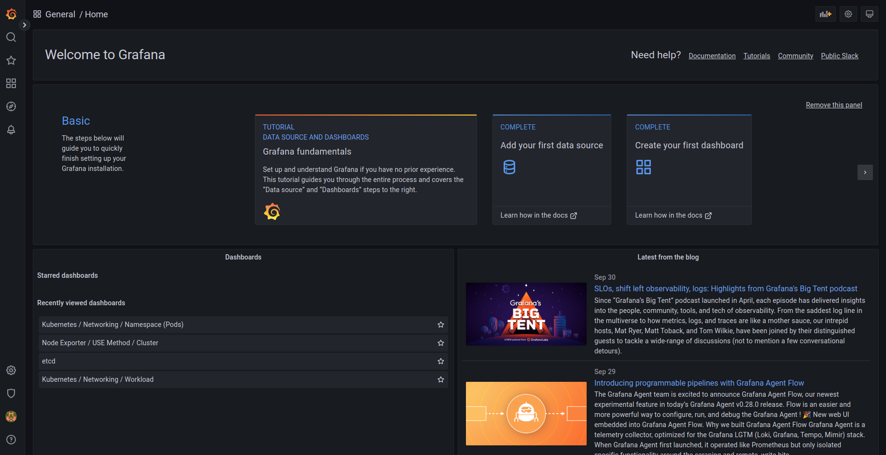

Before moving any further, if you don't have anything in your cluster, let's deploy a
simple [online shop deployment](https://github.com/alifiroozi80/CKA/tree/main/Helm#Demo-Online-Boutique-overview).

Because we need something in our cluster to be monitored by Prometheus (Beside the Prometheus itself!)

This online shop is an example from Google to understand the concept of Microservice, and we've covered it in our Helm
section (See [here](https://github.com/alifiroozi80/CKA/tree/main/Helm) if you're interested)

Now, let's access the Grafana Dashboards.

Grafana Dashboards: Dashboard is a set of one or more panels.

If you click on `Dashboards` button on the left or head over
to [localhost:8080/dashboards](http://localhost:8080/dashboards), you'll see a bunch of default dashboards made by the
Grafana team.

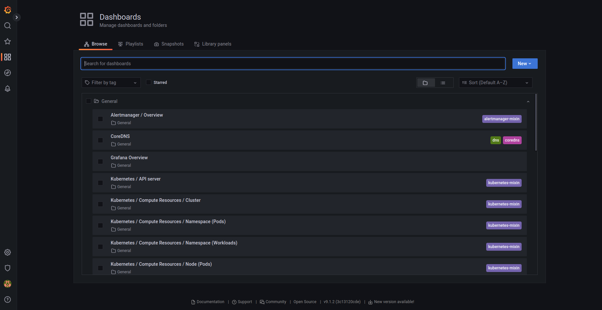

In most cases, we'll use these default dashboards.

These dashboards are grouped and organized in folders. Right now, we have one folder, the `General` folder, and inside
that folder, we have a bunch of dashboards.

So, let's see some of these dashboards that are interesting for us.

---

##### 1) `Kubernetes / Compute Resources / Cluster`

This is a Grafana dashboard! as you can see, it contains multiple rows that you can collapse.

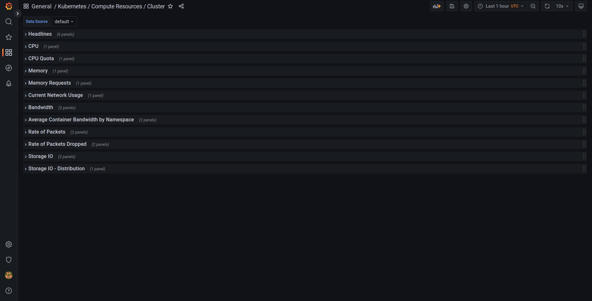

* Grafana Dashboards
    * A dashboard is a set of one or more panels
    * You can create your Dashboards (More on that later)
    * Organized into one or more rows
    * A row is a logical divider within a dashboard
    * Rows are used to group panels together

Each row has multiple `Panels`.

* Panel
    * The **primary visualization building block** in Grafana
    * Composed of a query and a visualization
    * Each panel has a query editor **specific to the data source** selected in the panel
    * Can be moved and resized within a dashboard

* Structure Summary
    * Folders
    * Dashboards
    * Rows
    * Panels

If you expand the `CPU` row, you'll see the CPU usage diagram.

It is excellent, but what if an anomaly happens, and I want to see precisely which Pod(s) caused that?

For that, we have another Dashboard called: `Kubernetes / Compute Resources / Node (Pods)`

---

##### 2) `Kubernetes / Compute Resources / Node (Pods)`

Now, head back to Dashboards and go inside the `Kubernetes / Compute Resources / Node (Pods)` dashboard.

Again, you'll see multiple rows and panels, two rows for CPU and two rows for Memory usage.

And if you expand the `CPU Usage` and `CPU Quota`, you'll see every pod in detail and how much CPU they consume
in `Table` and `graph` View.

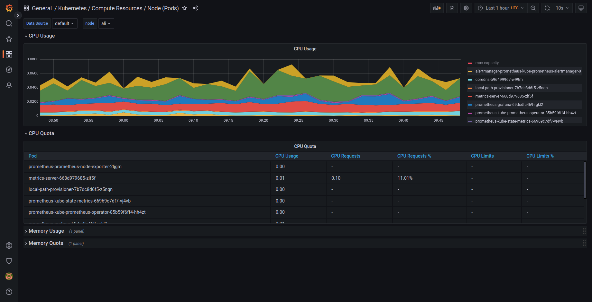

You can switch between Nodes and select the ones you want to monitor.

On the top right, you also have a Time-Frame selection.
By default, you always see the data from 1 last hour, but you can always change that and, e.g., see data from yesterday
till now.

---

Another exciting thing that you should know is if you click inside one of these panels, a menu will pop up, and if you
click on `Edit`, you'll see the Graph with its corresponding PromQL query.

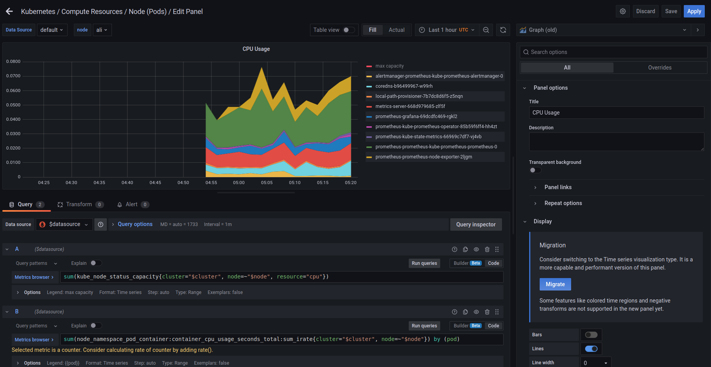

These queries are legit PromQL queries; if you copy and paste them to the Prometheus UI, you'll see the result and the
Graph! (But not beautiful as Grafana!)
e.g. `sum(node_namespace_pod_container:container_cpu_usage_seconds_total:sum_irate{cluster="$cluster", node=~"$node"}) by (pod)`

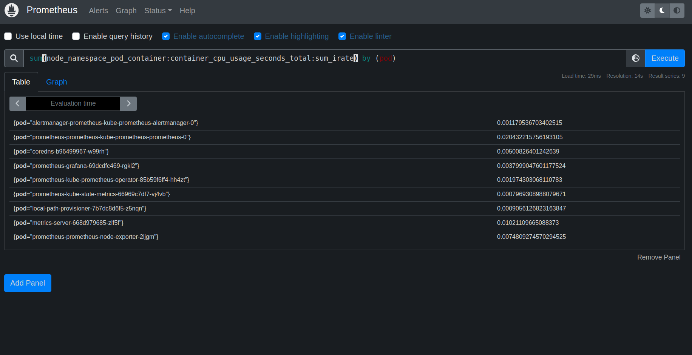
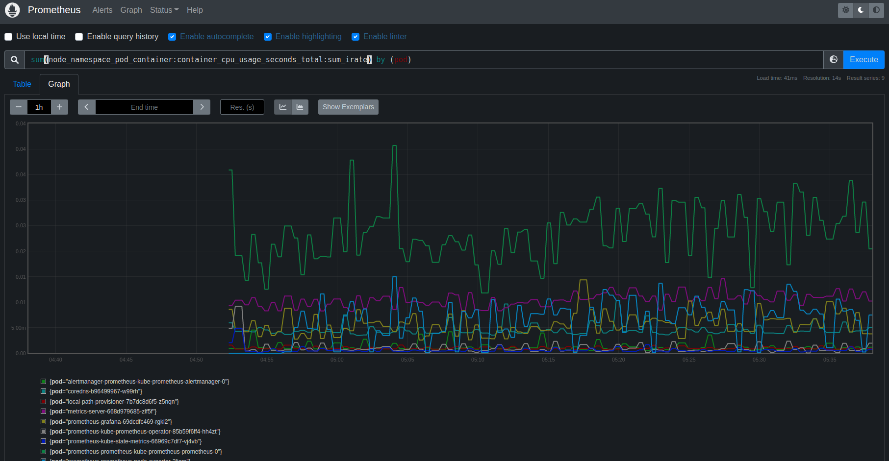

* Again, As a DevOps Engineer
    * In most cases, you don't need deep knowledge of PromQL
    * Just basic PromQL queries
    * We'll learn more about PromQL in the Prometheus Alertmanager section

</div> <!-- Intro -->

## Create your dashboard

<div id="Introduction-to-Grafana-Create-your-dashboard">

We can create our dashboard in `Dashboards/New dashboard` or head over
to [localhost:8080/dashboard/new](http://localhost:8080/dashboard/new).

However, we should know PromQL for that, or we can use the metric browser, which lets us select and choose between
metrics (These metrics are the same metrics that you have and saw in Prometheus UI (Open metrics explorer))

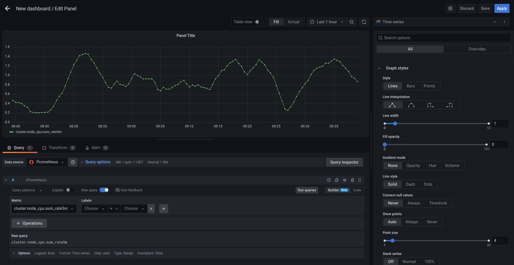

Then apply the changes and see your beautiful Graph!

</div> <!-- Create your dashboard -->

## Resource Consumption of Cluster Nodes

<div id="Introduction-to-Grafana-Resource-Consumption-of-Cluster-Nodes">

And while we are here, let's review another important dashboard, `Node Exporter / Nodes`.
This dashboard is great for resource consumption of Cluster Nodes

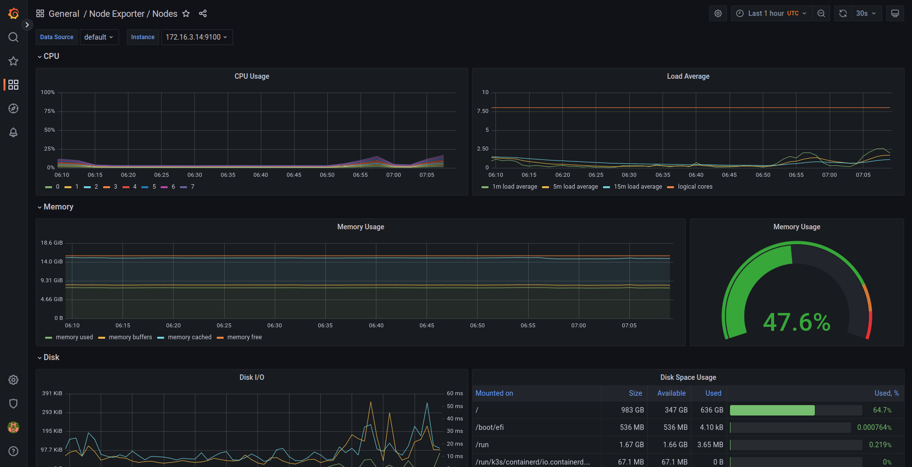

</div> <!-- Resource Consumption of Cluster Nodes -->

## Test Anomaly

<div id="Introduction-to-Grafana-Test-Anomaly">

Let's make an anomaly to our cluster and see it on the Grafana dashboards.

Here we want to curl 10000 on the front page of our online shop (or any other deployment in our cluster, e.g., Nginx,
etc.)

---

* First, create a pod
  ```shell
  kubectl run curl-test --image radial/busyboxplus:curl -it --rm
  ```

Now, you are inside that Pod.

* Let's create simple bash script
  ```shell
  # $ vi test.sh
  for i in $(seq 1 10000);
  do
    curl http://ADDRESS-OF-YOUR-SVC > test.txt
  done
  ```

* Make it executable
  ```shell
  chmod +x test.sh
  ```

* And Run it
  ```shell
  ./test.sh
  ```

---

After it is finished, let's see two important dashboards:

1) `Kubernetes / Compute Resources / Cluster`
2) `Kubernetes / Compute Resources / Node (Pods)`

You should see minor changes to your dashboards. Of course, it is not a big deal because we didn't push hard.

If you want to see some significant changes, you should curl more or do something else big enough.

</div> <!-- Test Anomaly -->

## Configure Users & Data Structures

<div id="Introduction-to-Grafana-Configure-Users-and-Data-Structures">

Grafana is managing users, teams, and even multiple organizations by itself!

For managing and inviting other users, click on `Configuration/Users` or head over
to [localhost:8080/org/users](http://localhost:8080/org/users)

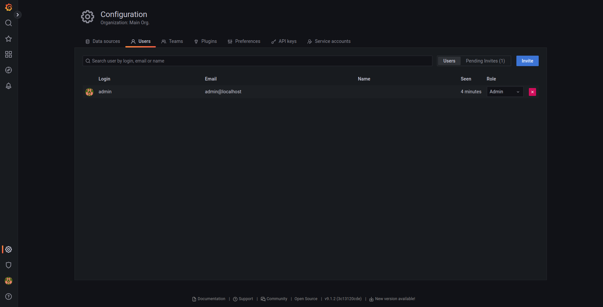

---

Grafana also supports many different storage backends.

See the complete list [here](https://grafana.com/docs/grafana/latest/datasources/#supported-data-sources)

If you click on `Configuration/Data sources` or head over
to [localhost:8080/datasources](http://localhost:8080/datasources), you can see, by default, Prometheusis there.

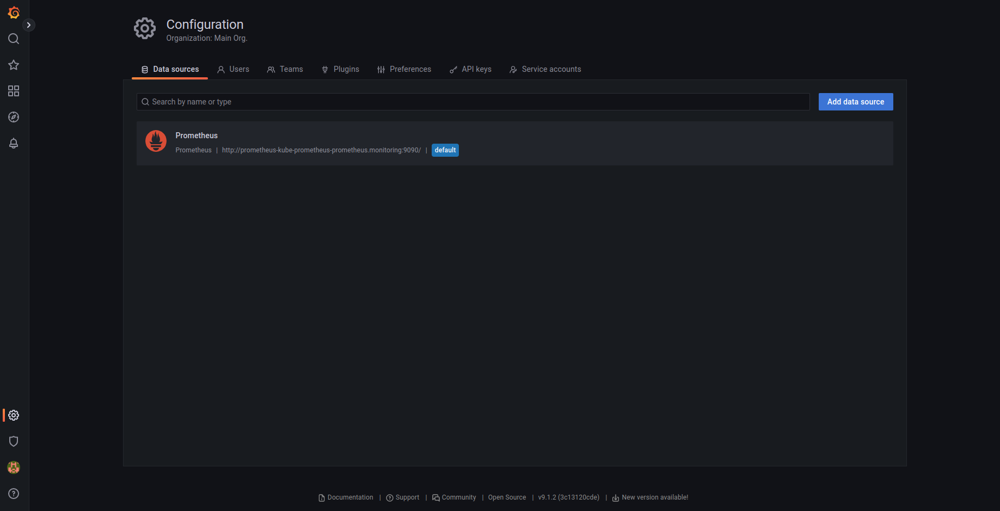

You can also add another data source by clicking on the `Add data source` button or head over
to [localhost:8080/datasources/new](http://localhost:8080/datasources/new).

Multiple data sources exist, such as most cloud providers, actual databases, etc.

---

Also, if you click on the `Explore` button or head over to [localhost:8080/explore](http://localhost:8080/explore),
based on the data source you have configured, queries will be different.

If you have multiple data sources, you can select one of them to query based on that.

PromQL is a query language for Prometheus. If you've added the, e.g., PostgreSQL or MySQL databases, you can select them
and search based on SQL query language.

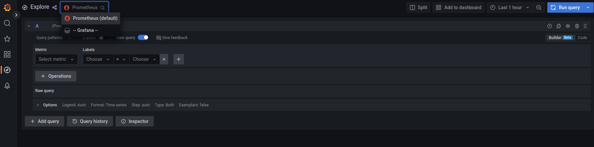

</div> <!-- Configure Users & Data Structures -->
<p align="right">(<a href="#top">back to top</a>)</p>

# Alert Rules in Prometheus

## Overview

<div id="Alert-Rules-in-Prometheus-Overview">

We've learned about Grafana and its awesome dashboards and features.

* But, in the real world,
    * People won't wait in front of the screen for anomalies
    * You want to **get notified** when something happens (via Email, Slack message, etc.)
    * Then you will check the Dashboards

* Configure our Monitoring Stack to notify us whenever something unexpected happens. e.g.
    * CPU Usage is more than 50%
    * Pod can't start
    * App not accessible

---

Alerting with Prometheus is separated into two parts.

1) Define what we want to be notified about (**Alert Rules in Prometheus Server**)

* E.g.
    * Send notification when CPU usage is above 50%
    * Send notification when Pod can not restart

2) Send notification (**Configure Alertmanager**)

* Alertmanager sends out the email/slack/etc. notification

---

Which Alert Rule do we want to configure

* In Dashboard, you can see average CPU usage
* E.g. 20%-40% max
* If it exceeds 50%, we should trigger an alert
    * Alert: when CPU > 50%

</div> <!-- Overview -->

## Existing Alert Rules

<div id="Alert-Rules-in-Prometheus-Existing-Alert-Rules">

We have some Alert Rules already out of the box, so in this section, we want to look at them and see what they look
like.

To see the Alert Rules already configured in Prometheus UI, click on `Alerts` or head over
to [localhost:9090/alerts](http://localhost:9090/alerts).


As you see, a bunch of rules has been grouped. (e.g. `alertmanager.rules`, `etcd`, `config-reloaders`, etc.)

* We have three states with each role:
    * Green: `Inactive` or condition not met
    * Red: `Firing`. Condition is met
        * Firing: meaning that Alert is sent to Alertmanager
    * Yellow: Elements that are active but not firing yet, are in the `Pending` state

---

Let's open a rule and go through it!

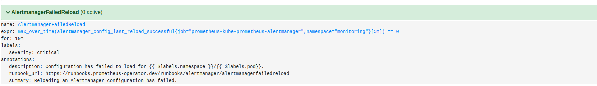

As you can see, it is very straightforward.

* `name`: Is the Rule Name
* `expr`: The PromQL query expression to be executed (More on that later)
* `for`: If the condition is met, how much should it wait to send an Alert? (Causes Prometheus to wait for a particular
  duration, so Prometheus will continue that the alert continues to be active, e.g., 10 minutes before firing the alert)
* `labels`: Allows specifying a set of additional labels to be attached to the alert.
  You can Group rules based on labels (e.g., send `critical` rules to slack and `warning` rules to email or even, e.g.,
  send namespace `dev` rules to slack and application `xxx` to Webhook URL)
* `annotations`: Specifies a set of information labels for more extended additional information
    * `description`: The body of the error
    * `runbook_url`: The explanation of the error
    * `summary`: What is the problem?

---

Let's talk about a little more on `expr`.

This is a standard PromQL query; if you paste it into the Prometheus UI search bar, you'll see the result and details!

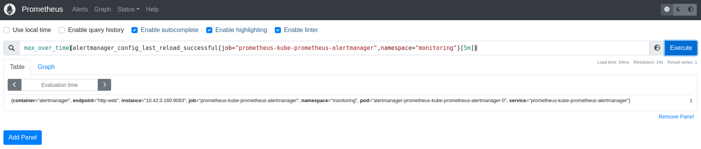

But I don't know the PromQL language, you may say!
You have [Prometheus Docs](https://prometheus.io/docs/prometheus/latest/querying/functions/) that explain every PromQL
function in detail!

e.g., here, `max_over_time` is the maximum value of all points in the specified interval. And that explains `[5m]` at
the end of the query!

See, it is easy!

</div> <!-- Existing Alert Rules -->
<p align="right">(<a href="#top">back to top</a>)</p>

# Create your Alert Rule

Till now, we've seen the existing Alert Rules, but it's time to create our own Alert Rules for things that we
specifically care about, e.g., When CPU usage is higher than 50% or when a Pod can not start

## Create your 1st Rule (`HostHighCpuLoad`)

<div id="Create-your-Alert-Rule-Create-your-1st-Rule">

Alright! It's time for the FUN part!

Create a `alert-rules.yaml` file. Then we want a starting point. For that, let's copy and paste one of the existing
Alert Rules we've checked because its syntax is pretty much the same!

```yaml
name: AlertmanagerFailedReload
expr: max_over_time(alertmanager_config_last_reload_successful{job="prometheus-kube-prometheus-alertmanager",namespace="monitoring"}[5m]) == 0
for: 10m
labels:
  severity: critical
annotations:
  description: Configuration has failed to load for {{ $labels.namespace }}/{{ $labels.pod}}.
  runbook_url: https://runbooks.prometheus-operator.dev/runbooks/alertmanager/alertmanagerfailedreload
  summary: Reloading an Alertmanager configuration has failed.
```

We are going to change it, and we are going to do it line by line.

* Change the name to `HostHighCpuLoad`.
* Then for `expr` paste this:
  ```shell
  100 - (avg by(instance) (rate(node_cpu_seconds_total{mode="idle"}[2m])) * 100) > 50
  ```

What the hell is that?!

Well, let's break it down into small pieces.

---

First, Let's start with `node_cpu_seconds_total`.
What is it? This counter metric counts the number of seconds the CPU has been running in a particular mode.

If you execute this query in Prometheus UI, you'll see a bunch of output.

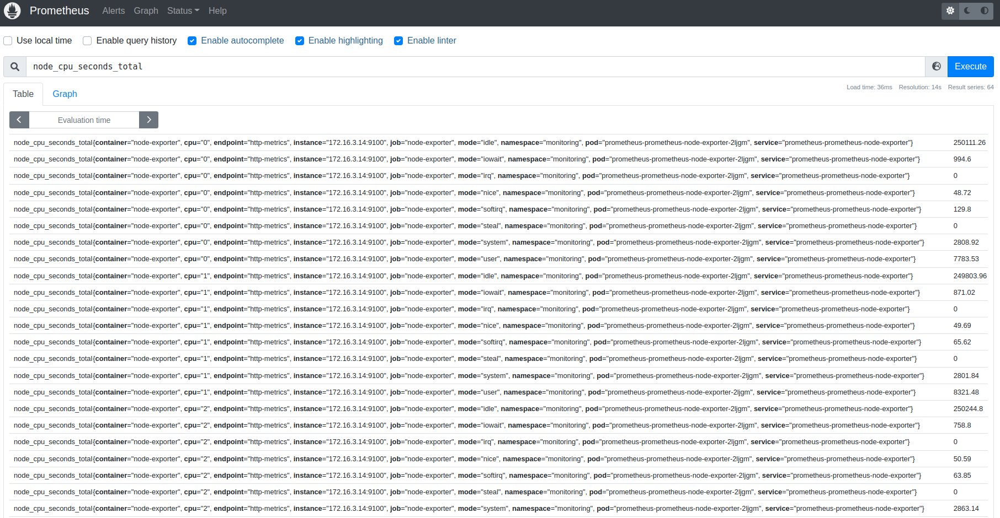

Each of these outputs has a `mode` label.
We want to grab the `idle` mode because `mode="idle"` means the CPU is NOT being used.

So, let's grab only the ones who have `mode="idle"`

---

Now I have fewer outputs, but they are not entirely readable. It is just a number. I want them in percentage!
So we use the [rate](https://prometheus.io/docs/prometheus/latest/querying/functions/#rate) function to calculate its
rate and then multiply the result by 100 to get it in percentage.

```shell
(rate(node_cpu_seconds_total{mode="idle"}[2m])) * 100
```

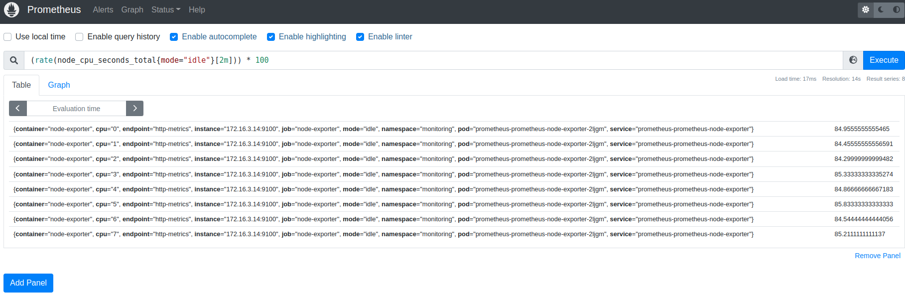

**NOTE:** How much this number is higher, the less CPU your host is using

---

Now, I want to get only one answer per Node.
E.g., if I have a Three-Node cluster, I want to get three answers, each anser is for a Node, and I want them in
percentage.

For that, I have to use the `instance` label.

If you've noticed, the value of the `instance` label is the IP address of a Node. So, I filter it by the `instance`
label:

```shell
avg by(instance) (rate(node_cpu_seconds_total{mode="idle"}[2m])) * 100
```

**NOTE:** Here, I have a One-Node Cluster, so my `instance` is just one; if you have more than one Node, you'll see more
outputs.


**NOTE:** How much this number is higher, the less CPU your host is using.

Then I subtract the value by 100 to get the used value.

```shell
100 - (avg by(instance) (rate(node_cpu_seconds_total{mode="idle"}[2m])) * 100)
```

---

The final thing to do is set a condition.

So, I use the`>` symbol to set a condition.
If the value is greater than 50, the condition will be met!

---

* We set the `for` to `2m` because 50% is not that much!
* Then we set `severity` to `warning` because, again, 50% is not a big deal
* Also, we added another label, `namespace: monitoring`, because we will use it later

For `annotations`, we don't need `runbook_url`, but you can create some page somewhere (Github, for instance), and
for `runbook_url`, refer to this page.

* Add the problem `summary` section

* We want to give the full detail in the description, so for value, we use the `{{ $value }}` syntax, and for knowing
  which Node, we use ` {{ $labels.instance }}` (`labels.` because `instance` is a label (you saw it when you executed
  the query before!))

Also, `\n` means a new line.

---

Here is the complete YAML file:

```yaml
name: HostHighCpuLoad
expr: 100 - (avg by(instance) (rate(node_cpu_seconds_total{mode="idle"}[2m])) * 100) > 50
for: 2m
labels:
  severity: warning
  namespace: monitoring
annotations:
  description: "CPU load on a host is over 50%\n Instance = {{ $labels.instance }}\n Value = {{ $value }}"
  summary: "Host CPU load is high"
```

That's it for this section!

</div> <!-- Create your 1st Rule -->

## Alert Rule for Kubernetes

<div id="Create-your-Alert-Rule-Alert-Rule-for-Kubernetes">

Alright, Now we have written a rule and want to apply it.

But How can we do that?!

You may say we can edit the `/etc/prometheus/rules/prometheus-prometheus-kube-prometheus-prometheus-rulefiles-0/*.yaml
` directly and re-apply it again. (We see that in Prometheus UI, under `Status/Configuration`
or [localhost:9090/config](http://localhost:9090/config)).

However, it is not an efficient way.

We've installed the Prometheus in our cluster via Prometheus Operator!

So, it is super easy and efficient if we use it for managing our custom rules!

Operators are managing Custom Kubernetes components (defined by `CRD`s)

Prometheus Operator extends the Kubernetes API
We create custom K8s resources
The operator takes our custom K8s resource and tells Prometheus to reload the alert rules.

So, here we want to create a simple `CRD` based on
the [docs](https://docs.openshift.com/container-platform/4.11/rest_api/monitoring_apis/monitoring-apis-index.html)

I have discussed it in this repo if you want to know more about Operators, CRD, etc.
See [here](https://github.com/alifiroozi80/CKA/tree/main/Operators)

---

The first steps are easy!

First, we define the `apiVersion`, `kind`, and `metadata`.
You can find the `apiVersion` and `kind` with the `kubectl api-resources` command or via
the [docs](https://docs.openshift.com/container-platform/4.11/rest_api/monitoring_apis/prometheusrule-monitoring-coreos-com-v1.html)

```yaml
apiVersion: monitoring.coreos.com/v1
kind: PrometheusRule
metadata:
  name: custom-rules # The rules name
  namespace: monitoring # The same Namespace that Prometheus has been installed in it
```

---

Then, we want to write the `spec` section.

To do so, we have to go with
the [official docs](https://docs.openshift.com/container-platform/4.11/rest_api/monitoring_apis/prometheusrule-monitoring-coreos-com-v1.html)
.

On the left side, you can see all the CRDs you can create.

Click on `PromethesuRule`.

As you
can [see](https://docs.openshift.com/container-platform/4.11/rest_api/monitoring_apis/prometheusrule-monitoring-coreos-com-v1.html#spec)
, under the `spec`, we have a required attribute which is `groups`.

That attribute is an array and takes two parameters, `name` and `rules`. (
see [here](https://docs.openshift.com/container-platform/4.11/rest_api/monitoring_apis/prometheusrule-monitoring-coreos-com-v1.html#spec-groups-2))
.

* `name`: As you saw in Prometheus UI, under the `Alerts` section
  or [localhost:9090/alerts](http://localhost:9090/alerts), rules are grouped, and each group has a name. This name is
  defined under the `name` key.
* `rules`: We define our rules here

---

The `rules` attribute is also an array and takes some keys.

See [here](https://docs.openshift.com/container-platform/4.11/rest_api/monitoring_apis/prometheusrule-monitoring-coreos-com-v1.html#spec-groups-rules-2)
.

Surprise!!

These keys are the same as the file we've already written! (except the `alert` key!)

So, paste the `name` of the rule in `alert`, and paste the remains here!

Eventually, your file should be something like this:

```yaml
apiVersion: monitoring.coreos.com/v1
kind: PrometheusRule
metadata:
  name: custom-rules
  namespace: monitoring
spec:
  groups:
    - name: custom.rules
      rules:
        - alert: HostHighCpuLoad
          expr: 100 - (avg by(instance) (rate(node_cpu_seconds_total{mode="idle"}[2m])) * 100) > 50
          for: 2m
          labels:
            severity: warning
            namespace: monitoring
          annotations:
            description: "CPU load on a host is over 50%\n Instance = {{ $labels.instance }}\n Value = {{ $value }}"
            summary: "Host CPU load is high"
```

And that's it!

We've just created a CRD. The Prometheus Operator will take care of it!

Congrats!

</div> <!-- Alert Rule for Kubernetes -->

## Create your 2nd Rule (`KubernetesPodCrashLooping`)

<div id="Create-your-Alert-Rule-Create-your-2nd-Rule">

Let's create another Alert Rule that notifies us whenever a Pod in the cluster restarts over three times.

The syntax is exactly like before. Add another `- alert` under `.spec.groups.rules`

Before we go further, let's break down the `expr` for this rule.

If you execute this query below in Prometheus UI, you'll see all the Pods in your cluster, which shows **how many times
they have been restarted**.

```shell
kube_pod_container_status_restarts_total
```

We want to see those which have been restarted over three times, so the query would be like this:

```shell
kube_pod_container_status_restarts_total > 3
```

---

So, the alert rule would be something like this:

```yaml
- alert: KubernetesPodCrashLooping
  expr: kube_pod_container_status_restarts_total > 5
  for: 0m # Notify us immediately
  labels:
    severity: critical # 
    namespace: monitoring
  annotations:
    description: "The {{ $labels.pod }} Pod has crash-looped {{ $value }} time(s)\n"
    summary: "A pod is crash looping"
```

</div> <!-- Create your 2nd Rule -->

## Apply Alert Rules

<div id="Create-your-Alert-Rule-Apply-Alert-Rules">

Finally, we can apply our custom rules file.

But before that, we should add some `labels` to this file to Prometheus Operator picks it up automatically.

* How did I know about labels?
  ```shell
  kubectl get pod -n monitoring --show-labels
  ```

Let's see the whole part once again before applying:

```yaml
apiVersion: monitoring.coreos.com/v1
kind: PrometheusRule
metadata:
  name: custom-rules
  namespace: monitoring
  labels:
    app: kube-prometheus-stack
    release: prometheus
spec:
  groups:
    - name: custom.rules
      rules:
        - alert: HostHighCpuLoad
          expr: 100 - (avg by(instance) (rate(node_cpu_seconds_total{mode="idle"}[2m])) * 100) > 50
          for: 2m
          labels:
            severity: warning
            namespace: monitoring
          annotations:
            description: "CPU load on a host is over 50%\n Instance = {{ $labels.instance }}\n Value = {{ $value }}"
            summary: "Host CPU load is high"
        - alert: KubernetesPodCrashLooping
          expr: kube_pod_container_status_restarts_total > 5
          for: 0m
          labels:
            severity: critical
            namespace: monitoring
          annotations:
            description: "The {{ $labels.pod }} Pod has crash-looped {{ $value }} time(s)\n"
            summary: "A pod is crash looping"
```

* Apply the file
  ```shell
  kubectl apply -f alert-rules.yaml
  ```
* See all the Alert Rules in the cluster
  ```shell
  kubectl get promrule -n monitoring
  ```
* **NOTE:** How did I know about `promrule`? The `kubectl api-resources` command!
* Check if Prometheus Operator saw our changes (`config-reloader` container).
  ```shell
  kubectl logs pod/prometheus-prometheus-kube-prometheus-prometheus-0 -n monitoring -c config-reloader
  ```
  ```shell
  [...]
  level=info ts=2022-10-08T05:13:15.633414355Z caller=reloader.go:375 msg="Reload triggered" cfg_in=/etc/prometheus/config/prometheus.yaml.gz cfg_out=/etc/prometheus/config_out/prometheus.env.yaml watched_dirs=/etc/prometheus/rules/prometheus-prometheus-kube-prometheus-prometheus-rulefiles-0
  [...]
  ```
* Check if Prometheus Operator saw our changes (`prometheus` container).
  ```shell
  kubectl logs pod/prometheus-prometheus-kube-prometheus-prometheus-0 -n monitoring -c prometheus
  ```
  ```shell
  [...]
  ts=2022-10-08T05:13:15.633Z caller=main.go:1214 level=info msg="Completed loading of configuration file" filename=/etc/prometheus/config_out/prometheus.env.yaml totalDuration=84.012008ms db_storage=885ns remote_storage=2.204µs web_handler=425ns query_engine=841ns scrape=93.763µs scrape_sd=1.173801ms notify=28.174µs notify_sd=250.415µs rules=77.932673ms tracing=4.527µs
  [...]
  ```

---

Everything seems OK!

Now, after a while, you should see our rules in Prometheus UI under the `Alerts` or head over
to [localhost:9090/alerts](http://localhost:9090/alerts)

* **NOTE:** It takes a couple of minutes to see it in Prometheus UI. Be patient.

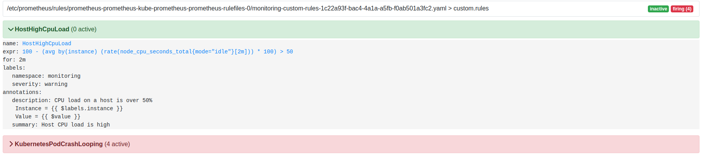

</div> <!-- Apply Alert Rules -->

## Test Alert Rule

<div id="Create-your-Alert-Rule-Test-Alert-Rule">

Alright, it's time to test our Rules!

We'll test the `HostHighCpuLoad` rule here.

First, in Grafana, open the `Kubernetes / Compute Resources / Cluster` dashboard.

If you look at the `CPU Utilisation` panel in the first row, you'll see your Cpu usage. For me, it is almost 15%

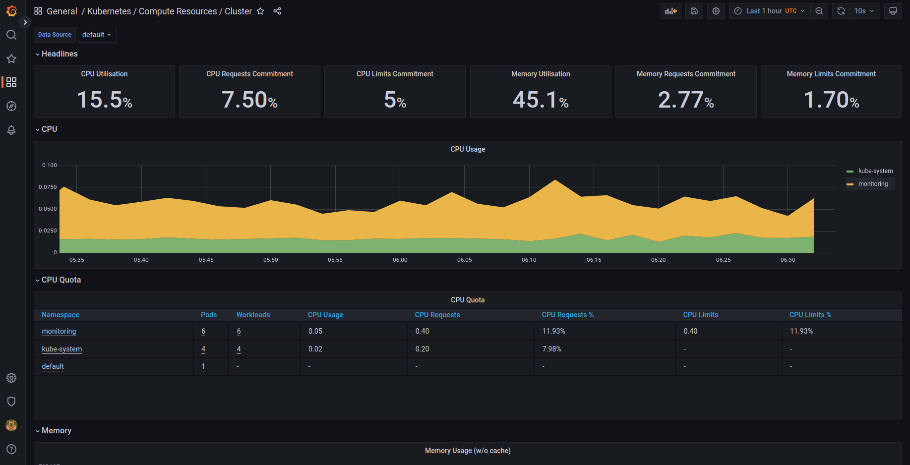

We want to generate some Cpu stress!

For that, we have lots of tools and ways, but here we will
use [this image](https://hub.docker.com/r/containerstack/cpustress) ([source code](https://github.com/containerstack/docker-cpustress))

---

Run this in your cluster:

```shell
kubectl run cpu-test --image=containerstack/cpustress -- --cpu 4 --timeout 60s --metrics-brief 
```

This command will create a pod, that generates CPU stresses for 1 minute.

* **NOTE:** If that command won't your CPU number above 50%, you should increase the `--cpu 4`. E.g., in my case, I
  should've set it to 10

---

Aha!
After a while, you should see the `CPU Utilisation` number go up!

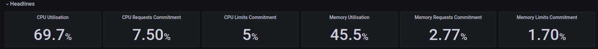

So, the Alert Rule will immediately go into the `Pending` state

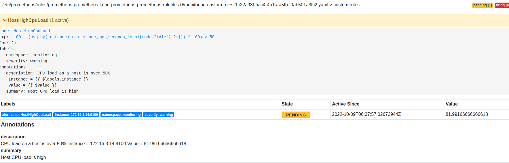

And after two minutes, Alert Rule will go into the `Firing` state

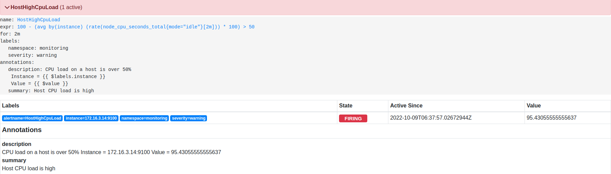

</div> <!-- Test Alert Rule -->
<p align="right">(<a href="#top">back to top</a>)</p>

# Alertmanager

## Introduction to Alertmanager

<div id="Alertmanager-Introduction-to-Alertmanager">

### Firing State

<div id="Alertmanager-Firing-State">

* Till now, we've written and seen Alert Rules that after a condition is met, they become a `Firing` state.
* As we already know, `Firing` means sending an alert to the Alertmanager.
* Alertmanager is another application, and it is not activated by default.
* That's why we did not receive alerts till now.
* But we are going to activate it and receive the alerts.
* Alertmanager is the last piece in the pipeline.
* The Alertmanager dispatches notifications about the alert
* Takes care of **deduplicating**, **grouping**, and **routing** them to the correct receiver integration
* Here, we are going to configure the Alertmanager to dispatch **notification via email**

</div> <!-- Firing State -->

### Alertmanager Configuration File

<div id="Alertmanager-Alertmanager-Configuration-File">

Notice that The Prometheus Server and the Alertmanager are two separate components, and each has its configuration.

You can see the Prometheus Server configuration by clicking `Status/Configuration` or heading over
to [localhost:9090/config](http://localhost:9090/config)

Let's see the Alertmanager Configuration.

---

First, port-forward the Alertmanager Service to `localhost:9093`

```shell
kubectl port-forward -n monitoring svc/prometheus-kube-prometheus-alertmanager 9093:9093 &
```

Then, open the browser and head over to [localhost:9093](http://localhost:9093).

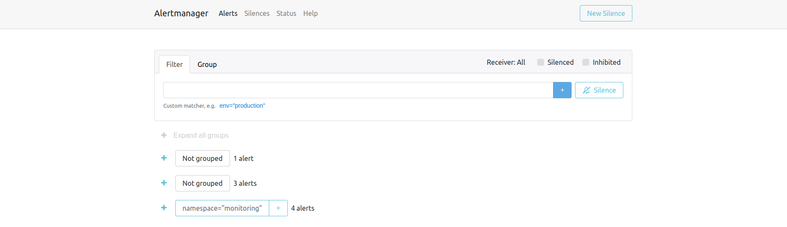

Tada! this is the Alertmanager UI!
As you can see, it is a very straightforward UI.

You can see the Alertmanager configuration by clicking on `Status` or heading over
to [localhost:9093/#/status](http://localhost:9093/#/status).

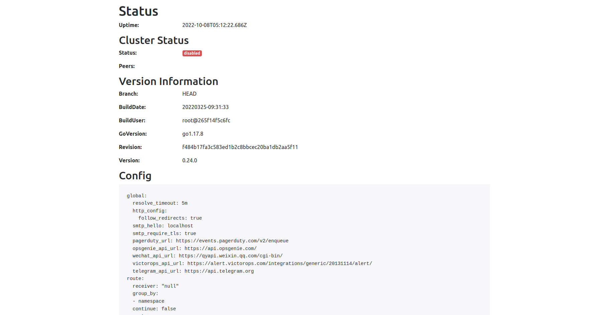

Let's talk a little about this configuration.

---

First, as you see, it has five sections. You can see the complete explanation and details about each one of them in
the [official documentation](https://prometheus.io/docs/alerting/latest/configuration), but I will explain the
important ones very briefly.

1) `global`: Global parameters are valid in all other configuration contexts.
2) `route`: Which alerts to which receivers?
3) `inhibit_rules`: A list of inhibition rules.
4) `receivers`: A list of notification receivers. These are the notification integration. e.g., Email, Slack, etc.
5) `templates`: Files from which custom notification template definitions are read. The last component may use a
   wildcard matcher, e.g. `templates/*.tmpl`.

* As you see, the `receivers` section is empty. That's why we didn't receive notifications.

Among all of those, I want to talk a little about `route`:

```yaml
route:
  ###
  # Top-Level Route
  receiver: "null"
  group_by:
    - namespace
  continue: false
  ###

  ##
  # Specific Alert
  routes:
    - receiver: "null"
      matchers: # A list of matchers that an alert has to fulfill to match the node.
        - alertname=~"InfoInhibitor|Watchdog"
      continue: false
  ##

  # Send notifications for a group of alerts
  group_wait: 30s
  group_interval: 5m

  repeat_interval: 12h # How long to wait before sending the notification again?
```

* Top-Level Route
    * Every alert enters the routing tree at the top-level route
    * Configuration applying to the **All alerts**

According to [official documentation](https://prometheus.io/docs/alerting/latest/configuration/#route):

A route block defines a node in a routing tree and its children. Its optional configuration parameters are inherited
from its parent node if not set.

Every alert enters the routing tree at the configured top-level route, which must match all alerts (i.e. not have any
configured matchers). It then traverses the child nodes. If `continue` is set to `false`, it stops after the first
matching child. If `continue` is `true` on a matching node, the alert will continue matching against subsequent
siblings. If an alert does not match any children of a node (no matching child nodes, or none exist), the alert is
handled based on the configuration parameters of the current node.

</div> <!-- Alertmanager Configuration File -->
</div> <!-- Introduction to Alertmanager -->

## Configure Alertmanager with Email Receiver

<div id="Alertmanager-Configure-Alertmanager-with-Email-Receiver">

### Configure Alertmanager

<div id="Alertmanager-Configure-Alertmanager">

Where this configuration comes from?

* First, get your secret
  ```shell
  kubectl -n monitoring get secrets/alertmanager-prometheus-kube-prometheus-alertmanager-generated -o yaml | grep alertmanager.yaml
  ```
* Then decode it (base64)
  ```shell
  echo Z2xvYmFsOgogIHJlc29sdmVfdGltZW91dDogNW0Kcm91dGU6CiAgcmVjZWl2ZXI6ICJudWxsIgogIGdyb3VwX2J5OgogIC0gbmFtZXNwYWNlCiAgcm91dGVzOgogIC0gcmVjZWl2ZXI6ICJudWxsIgogICAgbWF0Y2hlcnM6CiAgICAtIGFsZXJ0bmFtZSA9fiAiSW5mb0luaGliaXRvcnxXYXRjaGRvZyIKICBncm91cF93YWl0OiAzMHMKICBncm91cF9pbnRlcnZhbDogNW0KICByZXBlYXRfaW50ZXJ2YWw6IDEyaAppbmhpYml0X3J1bGVzOgotIHRhcmdldF9tYXRjaGVyczoKICAtIHNldmVyaXR5ID1+IHdhcm5pbmd8aW5mbwogIHNvdXJjZV9tYXRjaGVyczoKICAtIHNldmVyaXR5ID0gY3JpdGljYWwKICBlcXVhbDoKICAtIG5hbWVzcGFjZQogIC0gYWxlcnRuYW1lCi0gdGFyZ2V0X21hdGNoZXJzOgogIC0gc2V2ZXJpdHkgPSBpbmZvCiAgc291cmNlX21hdGNoZXJzOgogIC0gc2V2ZXJpdHkgPSB3YXJuaW5nCiAgZXF1YWw6CiAgLSBuYW1lc3BhY2UKICAtIGFsZXJ0bmFtZQotIHRhcmdldF9tYXRjaGVyczoKICAtIHNldmVyaXR5ID0gaW5mbwogIHNvdXJjZV9tYXRjaGVyczoKICAtIGFsZXJ0bmFtZSA9IEluZm9JbmhpYml0b3IKICBlcXVhbDoKICAtIG5hbWVzcGFjZQpyZWNlaXZlcnM6Ci0gbmFtZTogIm51bGwiCnRlbXBsYXRlczoKLSAvZXRjL2FsZXJ0bWFuYWdlci9jb25maWcvKi50bXBsCg== | base64 --decode
  ```
* And here it is!
  ```yaml
  global:
    resolve_timeout: 5m
  route:
    receiver: "null"
    group_by:
    - namespace
    routes:
    - receiver: "null"
      matchers:
      - alertname =~ "InfoInhibitor|Watchdog"
    group_wait: 30s
    group_interval: 5m
    repeat_interval: 12h
  inhibit_rules:
  - target_matchers:
    - severity =~ warning|info
    source_matchers:
    - severity = critical
    equal:
    - namespace
    - alertname
  - target_matchers:
    - severity = info
    source_matchers:
    - severity = warning
    equal:
    - namespace
    - alertname
  - target_matchers:
    - severity = info
    source_matchers:
    - alertname = InfoInhibitor
    equal:
    - namespace
  receivers:
  - name: "null"
  templates:
  - /etc/alertmanager/config/*.tmpl
  ```

---

* However, this Alertmanager is also managed by Operator.
* So, we shouldn't adjust and modify this file directly.
* Instead, as we already know, we will create a custom resource (`AlertmanagerConfig`) and apply it, and Prometheus
  Operator will take care of it the same way before.
* We'll use
  the [official documentation](https://docs.openshift.com/container-platform/4.11/rest_api/monitoring_apis/alertmanagerconfig-monitoring-coreos-com-v1beta1.html)
  here.

</div> <!-- Configure Alertmanager -->

### Configure Email Notification

<div id="Alertmanager-Configure-Email-Notification">

Let's create the `AlertmanagerConfig` component!

Again, we'll use
the [docs](https://docs.openshift.com/container-platform/4.11/rest_api/monitoring_apis/alertmanagerconfig-monitoring-coreos-com-v1beta1.html)
here.

This is the starting point:

```yaml
apiVersion: monitoring.coreos.com/v1alpha1
kind: AlertmanagerConfig
metadata:
  name: alert-manager-config
  namespace: monitoring
spec:
```

How did we know about that starting point?

You can use the docs or this command:

```shell
kubectl api-resources | grep alertmanagerconfigs
```

Now, it's time to write the `spec` part.

---

* As you see,
  the [.spec](https://docs.openshift.com/container-platform/4.11/rest_api/monitoring_apis/alertmanagerconfig-monitoring-coreos-com-v1beta1.html#spec)
  has multiple keys, and one of them
  is [receivers](https://docs.openshift.com/container-platform/4.11/rest_api/monitoring_apis/alertmanagerconfig-monitoring-coreos-com-v1beta1.html#spec-receivers)
  .
* `receivers` has **object** type, and the `name` attribute is required.
* We put `'email'` for the `name` key. Then we want to config this email. so we
  use [emailConfigs](https://docs.openshift.com/container-platform/4.11/rest_api/monitoring_apis/alertmanagerconfig-monitoring-coreos-com-v1beta1.html#spec-receivers-emailconfigs)
  attribute which is **array** type.

I explain those which we will use in this file.

* `to`: From which email address do we want to send the alerts?
* `from`: Which email account should receive those alerts?
* `smarthost`: SMTP host
    * [What is an SMTP server?](https://sendgrid.com/blog/what-is-an-smtp-server)
    * We'll use Gmail SMTP host address and port, but for other mail providers, google them (e.g., SMTP Gmail address)
* `authIdentity`: The identity to use for authentication.
* `authUsername`: The username to use for authentication.
* `authPassword`: The **secret** key contains the password to use for authentication.

* For `authPassword`, I don't want to hard-code my email password.
* So, we will create a secret, and inside that secret, we'll put our email password and then reference it here.
* As you see,
  the [authPassword](https://docs.openshift.com/container-platform/4.11/rest_api/monitoring_apis/alertmanagerconfig-monitoring-coreos-com-v1beta1.html#spec-receivers-emailconfigs-authpassword)
  has two keys: `name` and `key`.
    * `name`: The name of the secret
    * `key`: The key of the secret to select from.
* Let's put `gmail-auth` for `name` and `password` for `key` values for now.

Up to this point, our file looks like this:

```yaml
apiVersion: monitoring.coreos.com/v1alpha1
kind: AlertmanagerConfig
metadata:
  name: alert-manager-config
  namespace: monitoring
spec:
  receivers:
    - name: 'email'
      emailConfigs:
        - to: 'test@gmail.com'
          from: 'test@gmail.com'
          smarthost: 'smtp.gmail.com:587'
          authIdentity: 'test@gmail.com'
          authUsername: 'test@gmail.com'
          authPassword:
            name: gmail-auth
            key: password
```

The next step is to create that Secret file with key exactly.

---

Create a YAML file, call it whatever you want, then in that file, paste this:

```yaml
apiVersion: v1
kind: Secret
metadata:
  name: gmail-auth
  namespace: monitoring
type: Opaque
data:
  password: BASE64-ENCODED-VALUE-OF-YOUR-PASSWORD
```

* **NOTE:** If you aren't familiar with Kubernetes Secrets,
  see [here](https://github.com/alifiroozi80/CKA/tree/main/CKA#configmap--secret-1)

Before applying it, there is one little note you should consider.

* If your email account doesn't have two-step verification, you should head over
  to [myaccount.google.com/lesssecureapps](https://myaccount.google.com/lesssecureapps) and enable it. It allows other
  applications (such as Alertmanager) to use your email.
* If your email account has two-step verification enabled, you should go to your settings and create an **Application
  Password** for Alertmanager. e.g., for creating an Application Password on Gmail,
  check [here](https://support.google.com/mail/answer/185833?hl=en).
* Other email providers have such steps. Google them.

---

Let's write
the [route](https://docs.openshift.com/container-platform/4.11/rest_api/monitoring_apis/alertmanagerconfig-monitoring-coreos-com-v1beta1.html#spec-route)
section.

As you see, it has lots of attributes.

* `receiver`: Name of the receiver for this route. It should be listed in the `receivers` field. (We already did that!)
* `routes`: Child routes. Under the `routes`, you can override all the `route` attributes we've seen.
* `matchers[]`: Matcher defines how to match on alert labels.

```yaml
route:
  receiver: 'email' # Name of the 'receiver' for this route. You can overwrite that for specific rules under 'routes'.
  repeatInterval: '30m' # How long to wait before repeating the last notification.
  routes: # Child routes
    - matchers:
        - name: 'alertname'
          matchType: '='
          value: 'HostHighCpuLoad'
      repeatInterval: '10m' # Overwrite the 'repeatInterval' for this specific rule.
    - matchers:
        - name: 'alertname'
          matchType: '='
          value: 'KubernetesPodCrashLooping'  
```

In the next section, we'll apply these files and go through them.

</div> <!-- Configure Email Notification -->
</div> <!-- Configure Alertmanager with Email Receiver -->

## Trigger Alerts for Email Receiver

<div id="Alertmanager-Trigger-Alerts-for-Email-Receiver">

Alright, let's apply these files.

Remember to apply your `gmail-auth` (Email's password secret file) first and then apply
your `alert-manager-configuration`.

Here is the complete file:

```yaml
apiVersion: v1
kind: Secret
metadata:
  name: gmail-auth
  namespace: monitoring
type: Opaque
data:
  password: bm9obHh5dGRsZWNjcXp3Ywo=
---
apiVersion: monitoring.coreos.com/v1alpha1
kind: AlertmanagerConfig
metadata:
  name: alert-manager-config
  namespace: monitoring
spec:
  route:
    receiver: 'email'
    repeatInterval: '30m'
    routes:
      - matchers:
          - name: 'alertname'
            matchType: '='
            value: 'HostHighCpuLoad'
        repeatInterval: '10m'
      - matchers:
          - name: 'alertname'
            matchType: '='
            value: 'KubernetesPodCrashLooping'
  receivers:
    - name: 'email'
      emailConfigs:
        - to: 'test@gmail.com'
          from: 'test@gmail.com'
          smarthost: 'smtp.gmail.com:587'
          authIdentity: 'test@gmail.com'
          authUsername: 'test@gmail.com'
          authPassword:
            name: gmail-auth
            key: password
```

* Apply the file
* Check that the Alertmanager saw that
  ```shell
  kubectl -n monitoring logs pod/alertmanager-prometheus-kube-prometheus-alertmanager-0
  ```
  ```shell
  ts=2022-10-10T10:20:31.474Z caller=coordinator.go:126 level=info component=configuration msg="Completed loading of configuration file" file=/etc/alertmanager/config/alertmanager.yaml
  ```
* Check that the Alertmanager saw that (via `config-reloader` container)
  ```shell
  kubectl -n monitoring logs pod/alertmanager-prometheus-kube-prometheus-alertmanager-0 -c config-reloader
  ```
  ```shell
  [...]
  level=info ts=2022-10-10T10:20:31.484269487Z caller=reloader.go:375 msg="Reload triggered" cfg_in= cfg_out= watched_dirs=/etc/alertmanager/config
  ```
* Firing your rule
  ```shell
  kubectl run cpu-test --image=containerstack/cpustress -- --cpu 4 --timeout 60s --metrics-brief
  ```

---


Check the Alertmanager see the alert head over to [localhost:9093/api/v2/alerts](http://localhost:9093/api/v2/alerts)

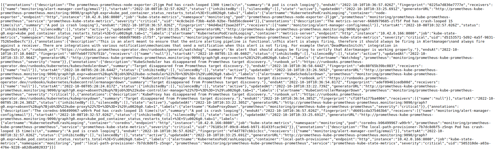

Now, an email has been sent to your Gmail.

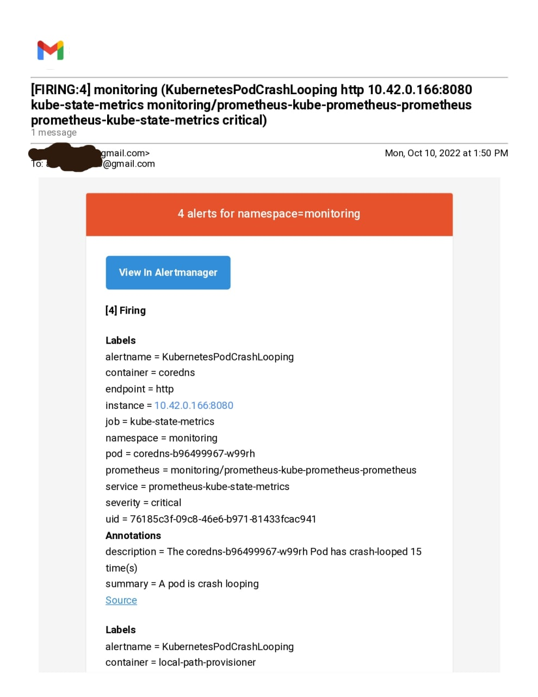

---

Now, Let's retake a look at Alertmanager Configuration.

Click on `Status` in Alertmanager or head over [localhost:9093/#/status](http://localhost:9093/#/status) to see it.

Surprise! Our configuration is now in the middle of the previous configuration.

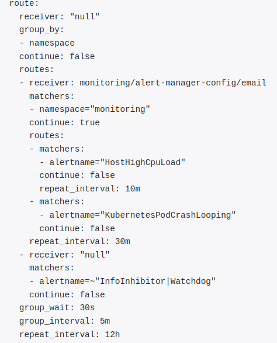

As you see, under the `routes`, there is our configured receiver.

Under that, a `matches` holds a `namespace="monitoring"` array.

This label (`namespace="monitoring"`) will also be checked whenever the Alertmanager wants to send us the alert.

That's why we set `namespace: monitoring` in our **Alert Rules** file.

Then there is a `routes` again, and under that are our rules and `matchers`.

---

Additionally, you can set more `matchers` other than `namespace` to be checked.

```yaml
route:
  receiver: 'email'
  repeatInterval: '30m'
  ###
  matchers:
    - name: 'KEY'
      matchType: '=~'
      value: 'value-1|value-2'
  ###
  routes:
    - matchers:
        - name: 'alertname'
          matchType: '='
          value: 'HostHighCpuLoad'
      repeatInterval: '10m'
    - matchers:
        - name: 'alertname'
          matchType: '='
          value: 'KubernetesPodCrashLooping'
```

Now, the alerts will not only be checked against the `alertname`, but also all alerts will check against the `namespace`
and `KEY` labels.

And that is it!

I hope you guys enjoyed it as much as I did!

</div> <!-- Trigger Alerts for Email Receiver -->
<p align="right">(<a href="#top">back to top</a>)</p>

# Monitor Third-Party Applications

## Intro

<div id="Monitor-Third-Party-Applications-Intro">

* So far, we've learned
    * **Monitor** Kubernetes Components
    * **Monitor** Resource Consumption on the Nodes
    * **Monitor** Prometheus itself

* But how about
    * **Monitor** third-party applications (e.g. Redis)
    * **Monitor** our application (e.g., online shop)

E.g., in monitoring the Redis database (which is a part of our online shop), how can we watch:

* Too much load?
* Too many connections?
* Is Redis down?
* Note that we want to monitor the Redis Pod not only on Kubernetes level but also on **Application level** too
* How do we monitor third-party apps with Prometheus?
    * [x] Prometheus **Exporters**

---

### What are exporters?

According to  [metricfire](https://www.metricfire.com/blog/first-contact-with-prometheus), An exporter comprises
software features that produce metrics data and an HTTP server that exposes the generated metrics via a given endpoint.
Metrics are exposed according to a specific format that the Prometheus server can read and ingest (scraping).

What the hell does that mean?!!

In simple words:

1) Exporter **gets metrics** data **from the service**
2) Exporter **translates** these service-specific metrics to Prometheus understandable metrics
3) Exporter **expose** these translated metrics under **`/metrics` endpoint**

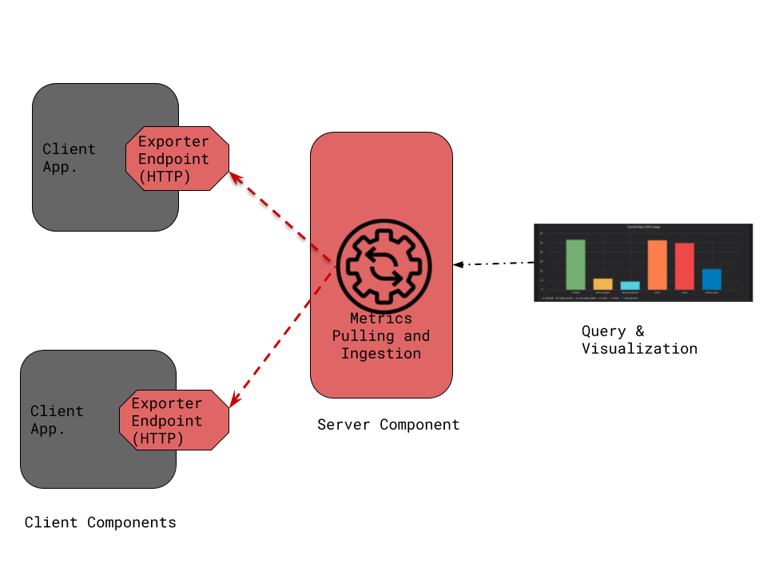

* We need to **tell Prometheus about this new Exporter**
* For that, **ServiceMonitor** (custom K8s resource) needs to be deployed

</div> <!-- Intro -->

## Deploy Redis Exporter

<div id="Monitor-Third-Party-Applications-Deploy-Redis-Exporter">

Now that we understand what an Exporter is let's deploy a Redis Exporter.

If you still have the [online shop](https://github.com/alifiroozi80/CKA/tree/main/Helm#Demo-Online-Boutique-overview)
sample application in your cluster from previous sections is excellent, and we will go with it. If not, we will create a
Redis Deployment from scratch. I'm going with option number 2 (Deploy Redis from scratch and only Redis) for the rest of
this tutorial.

---

### Deploy Redis

First, let's create a simple Redis Deployment and a Service for that, all in the `redis` namespace.

```yaml
---
apiVersion: v1
kind: Namespace
metadata:
  name: redis
---
apiVersion: apps/v1
kind: Deployment
metadata:
  namespace: redis
  name: redis
spec:
  replicas: 1
  selector:
    matchLabels:
      app: redis
  template:
    metadata:
      labels:
        app: redis
    spec:
      containers:
        - name: redis
          image: redis
          resources:
            requests:
              cpu: 100m
              memory: 100Mi
          ports:
            - containerPort: 6379
---
apiVersion: v1
kind: Service
metadata:
  name: redis
  namespace: redis
spec:
  selector:
    app: redis
  type: ClusterIP
  ports:
    - name: redis
      protocol: TCP
      port: 6379
      targetPort: 6379
```

Apply the file and see that everything is OK!

---

### Deploy Redis Exporter

* First of all, many exporters that Prometheus documentation has mentioned them.
* Check [EXPORTERS AND INTEGRATIONS](https://prometheus.io/docs/instrumenting/exporters/#exporters-and-integrations).
* In that docs, search for `Redis exporter`. You'll find it under
  the [Databases](https://prometheus.io/docs/instrumenting/exporters/#databases) section.
* It'll redirect you to [this Github page](https://github.com/oliver006/redis_exporter).
* That's the way you find and use Prometheus Exporters.
* But, we will not use this method. We will deploy it via Helm charts!
* The [Prometheus community](https://github.com/prometheus-community) has a
  helpful [Github page](https://github.com/prometheus-community/helm-charts/tree/main/charts) that provides Helm Charts
  for many of [those Exporters](https://prometheus.io/docs/instrumenting/exporters).
* We will use [this](https://github.com/prometheus-community/helm-charts/tree/main/charts/prometheus-redis-exporter)
  Chart for the rest of the tutorial.
* Also, I have to mention that I have a [Helm tutorial](https://github.com/alifiroozi80/CKA/tree/main/Helm) too, but we
  will not use Helm that much here!

---

Let's look
at [values.yaml](https://github.com/prometheus-community/helm-charts/blob/main/charts/prometheus-redis-exporter/values.yaml)
and re-write those we want.

* Re-write the Redis Service: `redisAddress: redis://redis:6379`.
* Re-write the `serviceMonitor` section like this:
  ```yaml
  serviceMonitor:
    enabled: true
  ```
* We also have to add two more things to the `serviceMonitor`. (It describes the set of targets to be monitored by
  Prometheus)

1) `namespace`. It is optional, but I want to deploy this in the `monitoring` namespace because all of my
   other `serviceMonitor`s are there.
2) `labels`: It is required because we want to Prometheus Operator to find out about this. (same as the Alert Rules)

Here is the complete file:

```yaml
redisAddress: redis://redis:6379
serviceMonitor:
  enabled: true
  namespace: monitoring
  labels:
    release: prometheus
```

Note: How did I know about the `release: prometheus` label?
Well, if you look at one of the already deployed `serviceMonitor`s, you'll see that.

E.g.,

```shell
kubectl -n monitoring get serviceMonitor/prometheus-prometheus-node-exporter -o yaml
```

```yaml
apiVersion: monitoring.coreos.com/v1
kind: ServiceMonitor
metadata:
  annotations:
    meta.helm.sh/release-name: prometheus
    meta.helm.sh/release-namespace: monitoring
  creationTimestamp: "2022-10-02T08:22:45Z"
  generation: 1
  labels:
    app: prometheus-node-exporter
    app.kubernetes.io/managed-by: Helm
    chart: prometheus-node-exporter-3.3.1
    heritage: Helm
    jobLabel: node-exporter
    release: prometheus
  name: prometheus-prometheus-node-exporter
  namespace: monitoring
  resourceVersion: "432508"
  uid: 25536aeb-f52b-4c48-bd58-db891ccfc364
spec:
  endpoints:
    - port: http-metrics
      scheme: http
  jobLabel: jobLabel
  selector:
    matchLabels:
      app: prometheus-node-exporter
      release: prometheus # Here it is
```

Alright, let's deploy this, baby!

```shell
helm repo add prometheus-community https://prometheus-community.github.io/helm-charts
helm repo update
```

```shell
helm install redis-exporter prometheus-community/prometheus-redis-exporter -f redis-exporter-value.yaml -n redis
```

---

Everything seems good

Let's take a look at some components and Prometheus UI.

* See The Redis and its Exporter.
  ```shell
  kubectl -n redis get pod
  ```
* See the `serviceMonitor`s
  ```shell
  kubectl -n monitoring get serviceMonitor
  ```
* See the Redis `serviceMonitor`
  ```shell
  kubectl -n monitoring get serviceMonitor/redis-exporter-prometheus-redis-exporter -o yaml
  ```
  ```yaml
  apiVersion: monitoring.coreos.com/v1
  kind: ServiceMonitor
  metadata:
    annotations:
      meta.helm.sh/release-name: redis-exporter
      meta.helm.sh/release-namespace: redis
    creationTimestamp: "2022-10-11T09:36:13Z"
    generation: 1
    labels:
      app.kubernetes.io/managed-by: Helm
      release: prometheus # Notice
    name: redis-exporter-prometheus-redis-exporter
    namespace: monitoring # Notice
    resourceVersion: "532453"
    uid: 9e90939f-5b24-4f81-b290-5d29d370e8c3
  spec:
    endpoints:
    - port: redis-exporter # Notice
    jobLabel: redis-exporter-prometheus-redis-exporter
    namespaceSelector:
      matchNames:
      - redis # Notice
    selector:
      matchLabels:
        app.kubernetes.io/instance: redis-exporter
        app.kubernetes.io/name: prometheus-redis-exporter
  ```

---

And now, if you head over to [localhost:9090/targets](http://localhost:9090/targets) or In Prometheus UI, click
on `Status/Targets`, you'll see that my newly Redis Exporter has been added here!

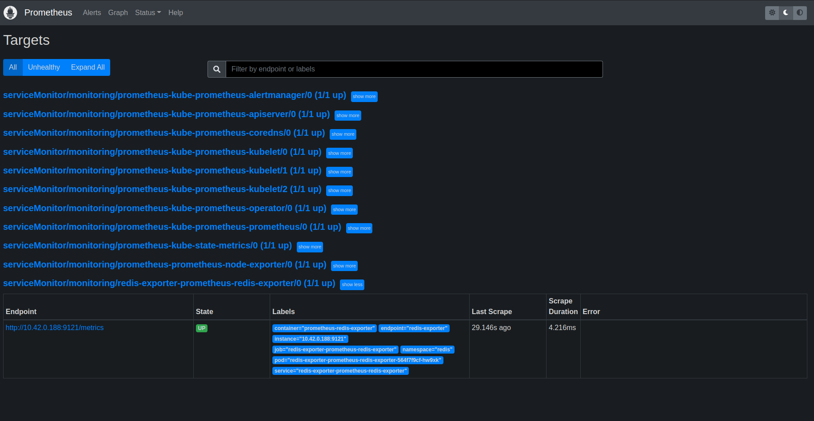

And now the Redis Exporter PromQL queries are here!

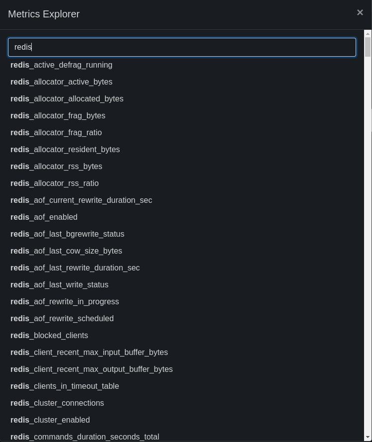

</div> <!-- Deploy Redis Exporter -->

## Alert Rules & Grafana dashboard for Redis

<div id="Monitor-Third-Party-Applications-Alert-Rules-Grafana-dashboard-for-Redis">

### Create Alert Rules for Redis

<div id="Deploy-Redis-Exporter-Create-Alert-Rules-for-Redis">

Alright, it's time to write some rules for our Redis application.

The syntax is the same. Here is a starting point:

```yaml
apiVersion: monitoring.coreos.com/v1
kind: PrometheusRule
metadata:
  name: redis-rules
  namespace: monitoring
  labels:
    app: kube-prometheus-stack
    release: prometheus
spec:
  groups:
    - name: redis.rules
      rules: 
```

* For the `rules` section, you can write PromQL queries as before or
  use [Awesome Prometheus alerts](https://awesome-prometheus-alerts.grep.to).
* The [Awesome Prometheus alerts](https://awesome-prometheus-alerts.grep.to) is
  a [open-source](https://github.com/samber/awesome-prometheus-alerts) that basically is a **Collection of Prometheus
  alerting rules**.
* It is a fantastic project, and I love it a lot. (Remember that I said you don't need that deep PromQL knowledge?
  That's why!)
* Under the `Databases and brokers`, you'll find the Redis.
* We'll need the [Redis down](https://awesome-prometheus-alerts.grep.to/rules#rule-redis-1-1)
  and [Redis too many connections](https://awesome-prometheus-alerts.grep.to/rules#rule-redis-1-10) rules.
* Just copy and paste them under the `rules` same as before.

Your file now should look like this:

```yaml
apiVersion: monitoring.coreos.com/v1
kind: PrometheusRule
metadata:
  name: redis-rules
  namespace: monitoring
  labels:
    app: kube-prometheus-stack
    release: prometheus
spec:
  groups:
    - name: redis.rules
      rules:
        - alert: RedisDown
          expr: redis_up == 0
          for: 0m
          labels:
            severity: critical
          annotations:
            summary: Redis down (instance {{ $labels.instance }})
            description: "Redis instance is down\n  VALUE = {{ $value }}\n  LABELS = {{ $labels }}"
        - alert: RedisTooManyConnections
          expr: redis_connected_clients > 100
          for: 2m
          labels:
            severity: warning
          annotations:
            summary: Redis too many connections (instance {{ $labels.instance }})
            description: "Redis instance has too many connections\n  VALUE = {{ $value }}\n  LABELS = {{ $labels }}"
```

Apply the file, and after a few seconds, you'll see the rules under the `Alerts` in Prometheus UI. (Or head over
to [localhost:9090/alerts](http://localhost:9090/alerts)).

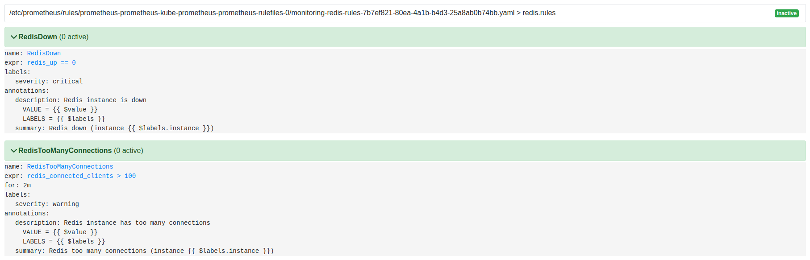

</div> <!-- Create Alert Rules for Redis -->

### Trigger the 'Redis is Down'

<div id="Deploy-Redis-Exporter-Trigger-Redis-is-Down">

* Let's test one of our Rules (`RedisDown`).
* We can edit the YAML file, change the `replicas` to `0`, and re-apply the file.
* Or delete the Redis service.
* After a while (30 seconds), the alert would be in a `Firing` state.

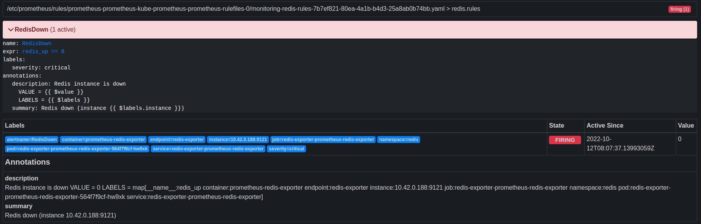

---

Why it took 30 seconds to alert finds out?

If you look at the Redis Exporter chart's
default [values.yaml](https://github.com/prometheus-community/helm-charts/blob/main/charts/prometheus-redis-exporter/values.yaml#L92)
, you'll see that the `interval` attribute is set to `30s`.

It means the Redis Exporter should scrape the Redis data every 30 seconds.

That's why.

</div> <!-- Trigger the 'Redis is Down' -->

### Create Redis Dashboard in Grafana

<div id="Deploy-Redis-Exporter-Create-Redis-Dashboard-in-Grafana">

* Wouldn't it be nice if we had a dashboard for the Redis application too?
* Well, we can, and we will!
* We are going to:
    * Create a Grafana dashboard with Redis metrics ourselves
    * Use **existing Redis dashboard**

---

* If you head over to [Grafana Dashboards](https://grafana.com/grafana/dashboards) page, you'll see a bunch of
  pre-created dashboards almost for everything!
* That's super awesome! (Remember, I said you don't need to have deep knowledge of PromQL).
* You can search for a dashboard and use it in your Grafana Dashboards.

Every dashboard in Grafana has a Dashboard ID and a Dashboard JSON file.

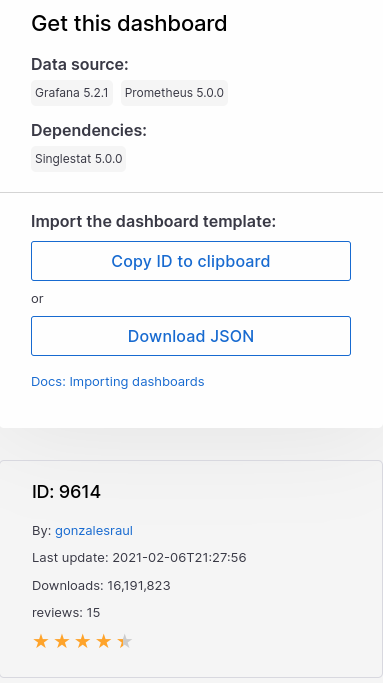

We'll use this ID or JSON file to import the dashboard to our Dashboards.

---

If we look at the Redis Exporter [GitHub page](https://github.com/oliver006/redis_exporter), you'll see
the [Grafana](https://github.com/oliver006/redis_exporter#what-it-looks-like) section for Grafana Dashboard.

As you see, the author put the Dashboard ID (`763`)
and [Dashboard JSON file](https://github.com/oliver006/redis_exporter/blob/master/contrib/grafana_prometheus_redis_dashboard.json)
.

So, let's add it.

---

In Grafana UI, click on `Dashboards/Import` or head over
to [localhost:8080/dashboard/import](http://localhost:8080/dashboard/import).

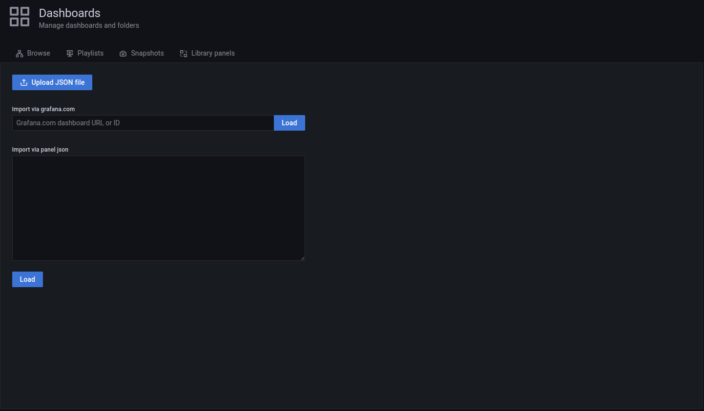

Paste the Dashboard ID here, or upload the JSON file, and click on the `Load` button.

* Select `Prometheus` as the data source
* Select a folder that our dashboard should be on it (Here `General`)

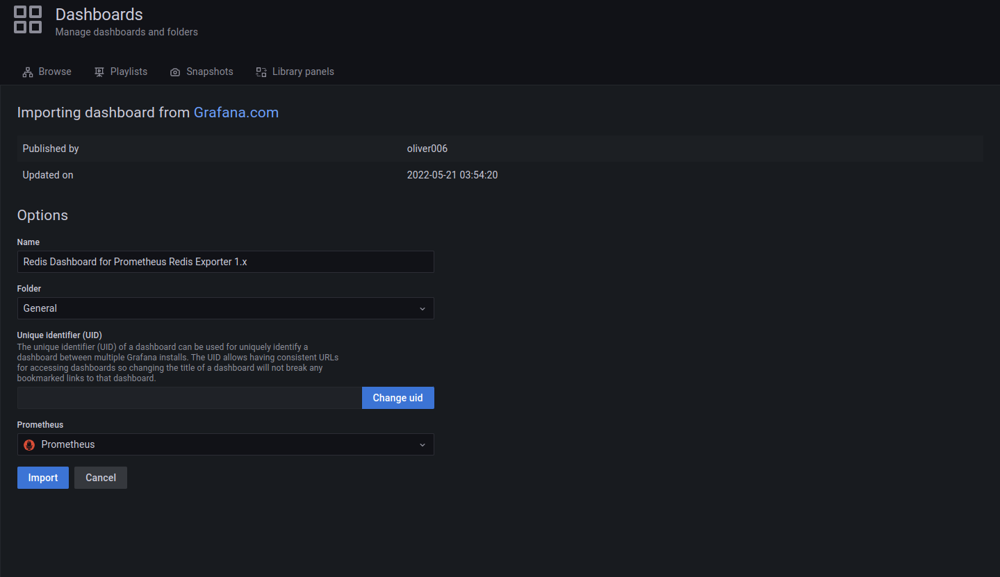

Click on the `Import` button.

---

First, you may see nothing. That's because probably the `instance` is wrong.

To select the correct one:

1) See the endpoint (or describe the service):
    ```shell
    $ kubectl -n redis get ep/redis-exporter-prometheus-redis-exporter
    NAME                                       ENDPOINTS       
    redis-exporter-prometheus-redis-exporter   10.42.0.188:9121 <--- Here it is! 
    ```

2) Select this endpoint as the instance

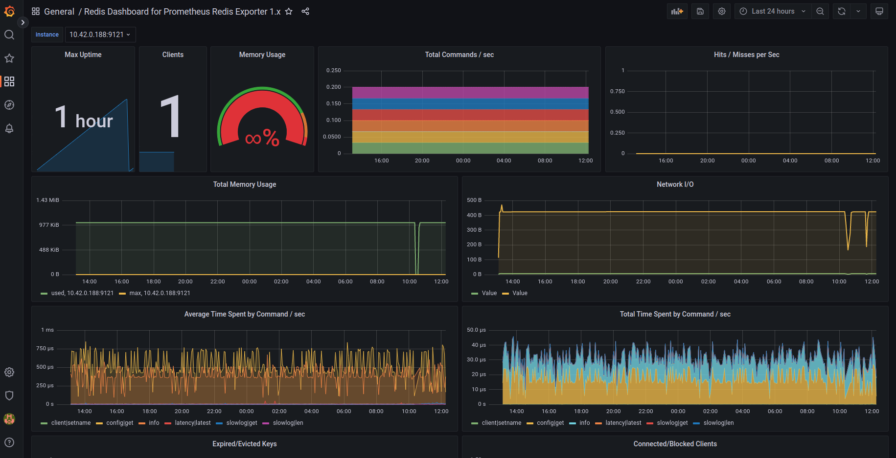

That's it.

Know you know how to manage a third-party application completely.

Congrats 🍻

</div> <!-- Create Redis Dashboard in Grafana -->
</div> <!-- Alert Rules & Grafana dashboard for Redis -->
<p align="right">(<a href="#top">back to top</a>)</p>

# Monitor own App

## Collect & Expose Metrics

<div id="Monitor-own-App-Collect-and-Expose-Metrics">

### Intro

<div id="Collect-and-Expose-Metrics-Intro">

Till now, we've learned:

* [X] **Monitor** Resource Consumption on the Nodes
* [X] **Monitor** Kubernetes components
* [X] **Monitor** Prometheus itslef
* [X] **Monitor** third-party applications (Redis)
* [ ] **Monitor** Own Application (NodeJS)

It's time to monitor our applications.

* No Exporter available for our application
* We have to define the metrics

Solution?

* Client Libraries

What are Client Libraries?

* Choose a Prometheus client library that **matches** the **language in which your application is written**
* Abstract interface to expose your metrics
* Libraries implement the Prometheus metric types
    * Counter
    * Gauge
    * Histogram
    * Summary

---

Steps to Monitor Own Application

1) **Expose metrics** for our NodeJS application using **NodeJS client library**
2) **Deploy** NodeJS app in the cluster
3) Configure Prometheus to **scrape new target (ServiceMonitor)**
4) **Visualize** scraped metrics in Grafana Dashboard

---

* **REMEMBER:** This (Expose metrics for Applications) is **Developers** responsibility, not yours (DevOps Engineer)!
  As a DevOps Engineer, it's your responsibility to deploy and monitor their applications (via metrics), NOT implement
  metrics in Developer applications.

</div> <!-- Intro -->

### Expose Metrics

<div id="Collect-and-Expose-Metrics-Expose-Metrics">

* OK, for the sake of this demo, let's keep it clean and simple.
* We will use a sample [NodeJS App](https://github.com/alifiroozi80/nodejs-prometheus) in this demo.

---

* Look at [Prometheus Client Libraries](https://prometheus.io/docs/instrumenting/clientlibs/#client-libraries). You'll
  see a bunch of libraries which every library belongs to a language.
* Click on NodeJS, redirecting you to [Prometheus client for node.js](https://github.com/siimon/prom-client).
* We use this page as documentation.

---

Here is the `server.js` file:

```js
const express = require('express');
const app = express();
const client = require('prom-client');


// --------------- Default Metrics ---------------
const collectDefaultMetrics = client.collectDefaultMetrics;
// Probe every 5th second.
collectDefaultMetrics({timeout: 5000});


// --------------- Custom Metrics ---------------
const httpRequestsTotal = new client.Counter({
    name: 'http_request_operations_total',
    help: 'Total number of Http requests'
})

const httpRequestDurationSeconds = new client.Histogram({
    name: 'http_request_duration_seconds',
    help: 'Duration of Http requests in seconds',
    buckets: [0.1, 0.5, 2, 5, 10]
})


// --------------- Default Metrics ---------------
app.get('/metrics', async (req, res) => {
    res.set('Content-Type', client.register.contentType)
    res.end(await client.register.metrics())
})

app.get('/', function (req, res) {
    // Simulate sleep for a random number of milliseconds
    var start = new Date()
    var simulateTime = Math.floor(Math.random() * (10000 - 500 + 1) + 500)

    setTimeout(function (argument) {
        // Simulate execution time
        var end = new Date() - start
        httpRequestDurationSeconds.observe(end / 1000); //convert to seconds
    }, simulateTime)

    httpRequestsTotal.inc();
    res.send('<h1>Hello World!</h1>')
});


// --------------- Start the App ---------------
app.listen(3000, function () {
    console.log("app listening on port 3000!");
});
```

What is hell is that?!!!

Well, as I said earlier, writing this file is **Developer** responsibility, NOT yours (DevOps Engineer), But for the
sake of the demo, let's walk through this file very briefly.

* [Default Metrics](https://github.com/siimon/prom-client#default-metrics)
    * Prometheus itself recommends default metrics
    * In addition, NodeJS [custom metrics](https://github.com/siimon/prom-client#custom-metrics) are included
* [Custom Metrics](https://github.com/siimon/prom-client#custom-metrics)
    * All metric types have two mandatory parameters: `name` and `help`

* `httpRequestsTotal`
    * It is a [Counter](https://github.com/siimon/prom-client#counter) type
    * A cumulative metric, whose **value can only increase**
    * Resets to `0` when the process restarts
* `httpRequestDurationSeconds`
    * It is [Histogram](https://github.com/siimon/prom-client#histogram) type
    * Sample observations and counts them in configurable buckets
    * Track sizes and frequency of events

Now, if you start the app and head over to [localhost:3000/metrics](http://localhost:3000/metrics), you'll see the
exposed metrics.

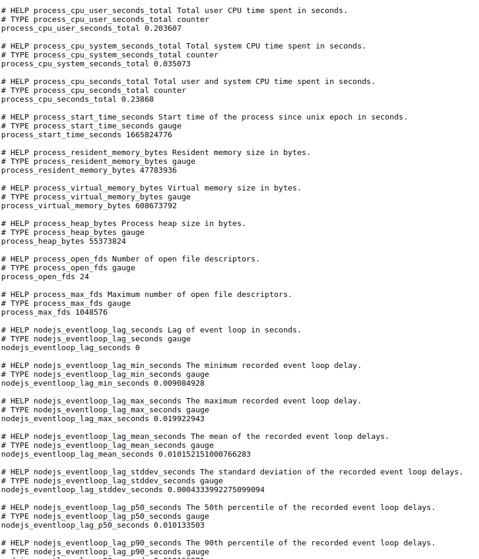

</div> <!-- Expose Metrics -->

### Build Docker Image & Push it to a Repo

<div id="Collect-and-Expose-Metrics-Build-Docker-Image-Push-it-to-a-Repo">

Alright, we've seen the NodeJS app locally.

Now it's time to build and push it to a registry to use in the K8s cluster.

Here is the `Dockerfile`:

```Dockerfile
FROM node:13-alpine

RUN mkdir -p /usr/app

COPY package.json /usr/app/
COPY app /usr/app/

WORKDIR /usr/app

EXPOSE 3000

RUN npm install

CMD ["node", "server.js"]
```

* Build it
  ```shell
  docker build -t alifiroozizamani/nodejs-demo:1.0.0 .
  ```
* Push it
  ```shell
  docker push alifiroozizamani/nodejs-demo:1.0.0
  ```
* See it on the [DockerHub](https://hub.docker.com/r/alifiroozizamani/nodejs-demo)

It's now ready to be deployed in a K8s cluster.

</div> <!-- Build Docker Image & Push it to a Repo -->

### Deploy App into K8s cluster

<div id="Collect-and-Expose-Metrics-Deploy-App-into-K8s-cluster">

This is the YAML file.

This is a simple Deployment and Service component file.

```yaml
apiVersion: v1
kind: Namespace
metadata:
  name: node-demo
---
apiVersion: apps/v1
kind: Deployment
metadata:
  name: nodeapp
  labels:
    app: nodeapp
  namespace: node-demo
spec:
  selector:
    matchLabels:
      app: nodeapp
  template:
    metadata:
      labels:
        app: nodeapp
    spec:
      containers:
        - name: nodeapp
          image: alifiroozizamani/nodejs-demo:1.0.0
          ports:
            - containerPort: 3000
          resources:
            requests:
              cpu: 100m
              memory: 100Mi
            limits:
              cpu: 100m
              memory: 100Mi
---
apiVersion: v1
kind: Service
metadata:
  name: nodeapp
  labels:
    app: nodeapp
  namespace: node-demo
spec:
  type: ClusterIP
  selector:
    app: nodeapp
  ports:
    - name: service
      protocol: TCP
      port: 3000
      targetPort: 3000
```

Apply the file.

* Make sure everything is OK
  ```shell
  kubectl get all -n node-demo 
  ```
* Get the `serviceIP:port` and see our app in the browser
  ```shell
  kubectl -n node-demo get svc/nodeapp -o jsonpath='{ .spec.clusterIP }:{ .spec.ports[0].port }'
  ```

</div> <!-- Deploy App into K8s cluster -->
</div> <!-- Collect & Expose Metrics -->

## Configure Monitoring

<div id="Monitor-own-App-Configure-Monitoring">

### Create ServiceMonitor

<div id="Configure-Monitoring-Create-ServiceMonitor">

* Let's tell Prometheus about our app.
* For that, we have `ServiceMonitor`. So, let's create one.
* We've already seen the `ServiceMonitor's and have talked about them.
* So, here we aren't walking through them.
* If it's unclear to you, review <a href="#Monitor-Third-Party-Applications-Intro">here</a>.

This is the `ServiceMonitor` configuration.

```yaml
apiVersion: monitoring.coreos.com/v1
kind: ServiceMonitor
metadata:
  name: monitoring-demo-node-app
  labels:
    release: prometheus
    app: nodeapp
  namespace: monitoring # Optional
spec:
  endpoints:
    - path: /metrics
      port: service
      targetPort: 3000
  namespaceSelector:
    matchNames:
      - node-demo
  selector:
    matchLabels:
      app: nodeapp
```

You can create or add a new file to our previous YAML file.

After that, apply the file, and after a couple of minutes, you'll see it in Prometheus UI under `Status/Targets`.

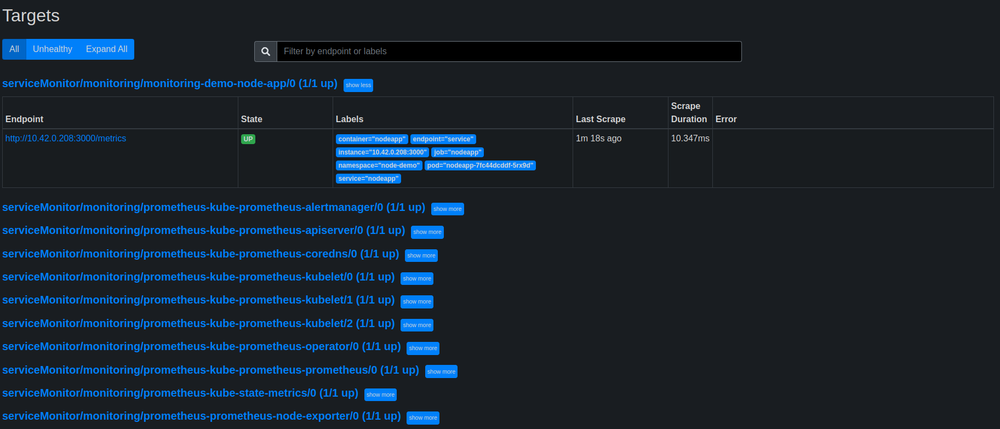

Also, you'll see that our NodeJS has been added to the configuration. (Under `Status/Configuration
or [localhost:9090/config](http://localhost:9090/config)

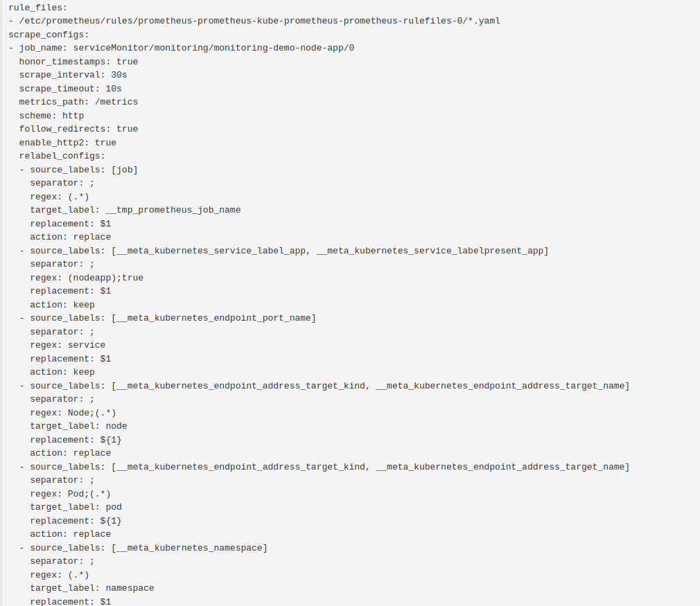

</div> <!-- Create ServiceMonitor -->

### Create Grafana Dashboard

<div id="Configure-Monitoring-Create-Grafana-Dashboard">

Alright. It's time to Create a Dashboard for our NodeJS App in Grafana.

First, In Grafana UI, click on `Dashboards/New Dashboard` or head over
to [localhost:8080/dashboard/new](http://localhost:8080/dashboard/new).

Click on `Add a new panel`.

Here we should provide a PromQL query.

The first query we want to see is `http_request_operations_total`.

We combine it with [rate](https://prometheus.io/docs/prometheus/latest/querying/functions/#rate) function.

So, the query would be like `rate(http_request_operations_total[2m])`.

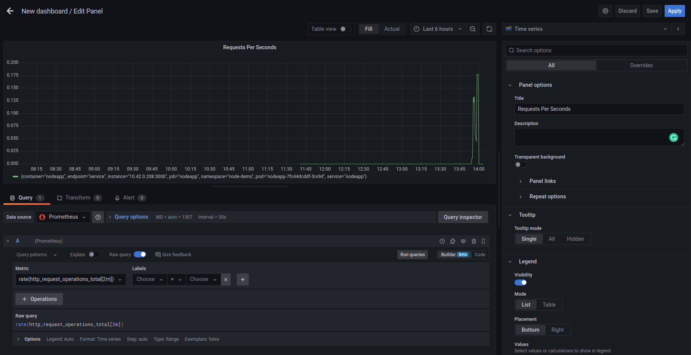

The second query we want to see is `http_request_duration_seconds_sum`.

We combine it with [rate](https://prometheus.io/docs/prometheus/latest/querying/functions/#rate) function.

So, the query would be like `rate(http_request_duration_seconds_sum[2m])`.

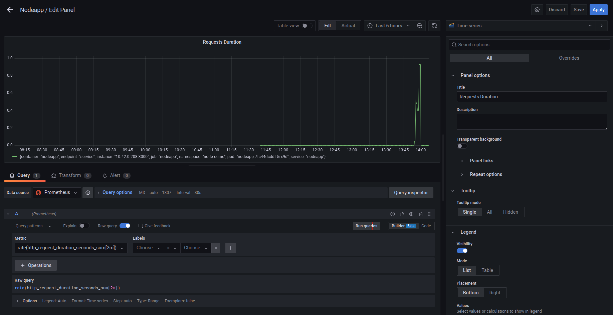

By the way, you can see these queries in Prometheus UI too.

Finally, save the dashboard.

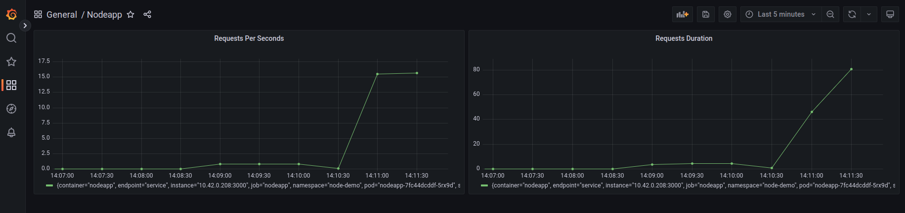

You can use this command to curl your Node app for a while and see a better view of your Dashboards:

```shell
while true; do curl http://SERVICEIP:3000; done;
```

That's it.

I hope you guys have enjoyed it as much as I do🍻

</div> <!-- Create Grafana Dashboard -->
</div> <!-- Configure Monitoring -->
<p align="right">(<a href="#top">back to top</a>)</p>